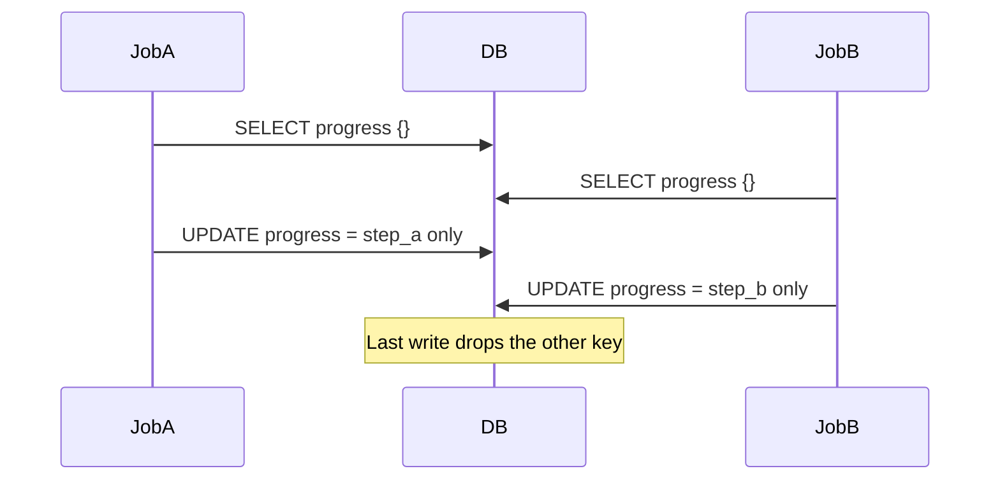

Hi, I'm **Tony Duong**, a Rails backend engineer at [Spacely](https://corp.spacely.co.jp/). I work on the Spacely platform day to day. This post walks through a **lost update** problem we hit in our `spacely_web` Rails application: what it is, how it showed up in our code, how we fixed it, and how we covered it with RSpec—including what failing and passing runs look like.

The story uses a **`json` / `jsonb` column** on one row (`WorkflowRun` + **`progress`**). Two jobs each add a **different key** to the same object. At Spacely, `spacely_web` uses **MySQL** as the primary database, so the isolation behavior discussed here is based on MySQL InnoDB.

---

## What is a lost update?

A **lost update** is a concurrency anomaly where two transactions both **read** the same row, each **computes** a new value from what they read, and both **write** back. In MySQL InnoDB, the default isolation level is **REPEATABLE READ** ([docs](https://dev.mysql.com/doc/refman/8.4/en/innodb-transaction-isolation-levels.html#isolevel_repeatable-read)); PostgreSQL defaults to **READ COMMITTED**. In both cases, if your code does non-locking read-modify-write and then saves the full value, **the last writer can still win** and drop the other change.

### Why REPEATABLE READ can still lose updates

`REPEATABLE READ` gives each transaction a stable snapshot for **non-locking reads**. That helps repeatable queries, but it does **not** automatically serialize application-level read-modify-write unless you use locking reads (`FOR UPDATE`) or another concurrency control strategy.

### When does it happen?

Typical for us: **parallel jobs** each do **read → merge a Hash in Ruby → `update!(json_column: …)`** on the **same** row **without** locking—especially when the column holds **structured JSON** and each job only "adds its own key."

### What are the consequences?

- **Missing keys** in the JSON: one job's merge disappears from the stored document.
- **Intermittent bugs**: hard to reproduce because timing-dependent.
- **No error by default**: unlike an optimistic locking conflict, nothing raises unless you add checks—so monitoring may stay green while data is wrong.

---

## How it showed up: two jobs, one JSON column, different keys

Suppose `WorkflowRun` has a **`progress`** column (Rails **`json`** on MySQL, **`jsonb`** on PostgreSQL). Two jobs finish different branches of work and each records a **distinct** key: `"step_a"` and `"step_b"`.

The naive pattern is **read the Hash, merge one key, write the whole JSON back**:

```ruby
class WorkflowRun < ApplicationRecord
  # progress: json / jsonb — serialized as a Hash in Ruby
end

# Called from job A — adds its own key
def record_step_done!(workflow_run_id, key, value)
  run = WorkflowRun.find(workflow_run_id)
  data = run.progress.presence || {}
  run.update!(progress: data.merge(key => value))
end
```

Start from **`progress == {}`**. Job A merges `{"step_a" => "done"}` and Job B merges `{"step_b" => "done"}`. The document **should** contain **both** keys.

Under a lost update:

1. Job A reads **`{}`**.
2. Job B reads **`{}`**.
3. Job A writes **`{"step_a" => "done"}`**.
4. Job B writes **`{"step_b" => "done"}`** from its stale copy—**dropping** `step_a`.

The final row has **only one** of the two keys. (Which one wins depends on commit order.)



---

## How to fix it

| Approach | Idea in Rails | Good when |
|----------|----------------|-----------|
| **Pessimistic lock on the row** | `WorkflowRun.find(id).with_lock { reload; merge; save }` | You keep merging in Ruby; updates are short |
| **Optimistic locking** | `lock_version` + rescue `StaleObjectError` + **retry** with a fresh read | You want fewer exclusive locks; jobs can retry |
| **DB-native JSON merge** | e.g. PostgreSQL `UPDATE … SET progress = COALESCE(progress, '{}')::jsonb \|\| $fragment::jsonb` | You can express each job's change as **one** SQL update (vendor-specific; still design carefully) |

Reference for optimistic locking in Rails: [ActiveRecord::Locking::Optimistic](https://api.rubyonrails.org/classes/ActiveRecord/Locking/Optimistic.html).

In our production fix, we adopted **pessimistic locking** with `with_lock` for this code path.

**Smallest fix in application code**—serialize merges on the parent row:

```ruby
def record_step_done!(workflow_run_id, key, value)
  WorkflowRun.find(workflow_run_id).with_lock do |run|
    data = run.progress.presence || {}
    run.update!(progress: data.merge(key => value))
  end
end
```

(`with_lock` uses `SELECT … FOR UPDATE`, so only one job mutates `progress` at a time. See Rails docs: [ActiveRecord::Locking::Pessimistic](https://api.rubyonrails.org/classes/ActiveRecord/Locking/Pessimistic.html).)

---

## How to test it with RSpec

You want a test that:

1. **Fails** when both threads use the **naive** read-merge-save **without** `with_lock`—the final JSON is **missing one key** even though both jobs ran.
2. **Passes** once **`with_lock`** (or equivalent) wraps the merge.

### Controlling timing with two `Queue`s

- Each thread **`WorkflowRun.find`s** the row, signals **`ready`**, then blocks on **`go.pop`**.
- Release both with **`2.times { go << true }`** so both merges contend.
- Use **`threads.each(&:value)`** to wait and surface exceptions.

### Threaded example (illustrative)

```ruby
context "when two workers add different keys to the same JSON column concurrently" do
  it "keeps both keys" do
    workflow_run = create(:workflow_run, progress: {})
    id = workflow_run.id
    ready = Queue.new
    go = Queue.new

    threads = [
      Thread.new do
        run = WorkflowRun.find(id)
        ready << true
        go.pop
        data = run.progress.presence || {}
        run.update!(progress: data.merge("step_a" => "done"))
      end,
      Thread.new do
        run = WorkflowRun.find(id)
        ready << true
        go.pop
        data = run.progress.presence || {}
        run.update!(progress: data.merge("step_b" => "done"))
      end
    ]
    2.times { ready.pop }
    2.times { go << true }
    threads.each(&:value)

    final = WorkflowRun.find(id).progress
    expect(final).to include("step_a" => "done", "step_b" => "done")
  end
end
```

With the **buggy** pattern above, **`include("step_a" => …, "step_b" => …)`** often **fails** because only one key remains. After **`with_lock`** inside `record_step_done!` (or equivalent), the **same expectation passes**.

If threaded specs do not see each other's data, your suite may need **per-example truncation** (or similar) instead of only transactional fixtures.

---

## RSpec output: when the bug is still present (failure)

```
Failures:

  1) WorkflowRun when two workers add different keys ... keeps both keys
     Failure/Error: expect(final).to include("step_a" => "done", "step_b" => "done")

       expected {"step_b" => "done"} to include {"step_a" => "done", "step_b" => "done"}
```

(The exact **missing key** may be `step_a` or `step_b` depending on ordering—the point is **one** merge was lost.)

---

## RSpec output: when the fix works (success)

After wrapping the merge in **`with_lock`** (or using optimistic retry / a safe DB-level merge), the example passes:

```
WorkflowRun
  when two workers add different keys to the same JSON column concurrently
    keeps both keys

Finished in 0.42 seconds (files took 2.1 seconds to load)
1 example, 0 failures
```

---

## Takeaways

- **Read → merge Hash in Ruby → `update!`** on a **JSON column** loses concurrent updates when two jobs each add a **different key** from a stale snapshot.
- This is **not** fixed by `increment_counter`; use **`with_lock`**, **retry on stale rows**, or a **database-specific** single-statement merge you have verified under concurrency.
- **Two `Queue`s** and **`threads.each(&:value)`** reproduce the race in specs; adjust **fixtures** if threads cannot see each other's commits.

---

We're hiring engineers at Spacely. If this kind of backend work sounds interesting, check out our [recruit page](https://corp.spacely.co.jp/recruit/).
