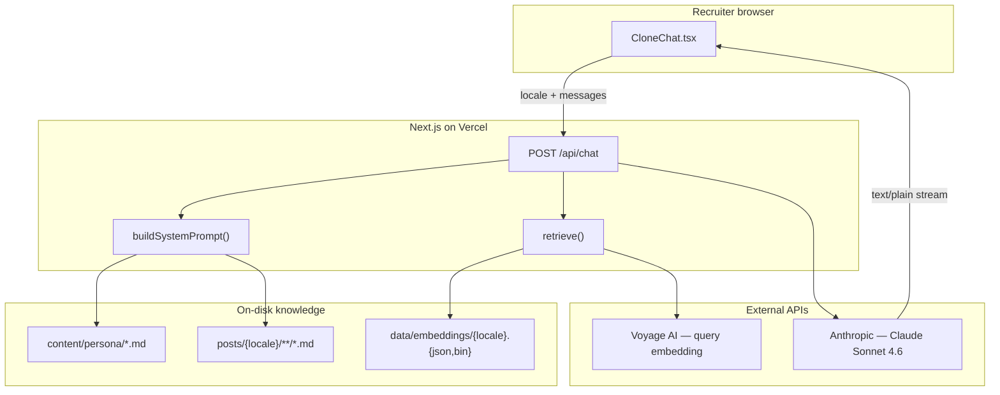
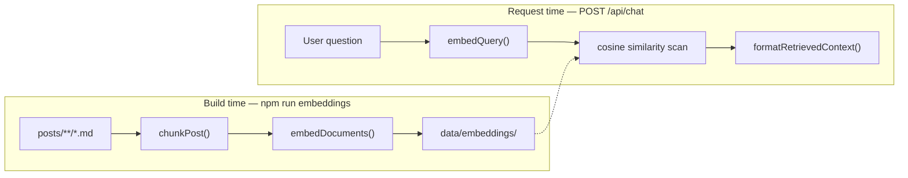
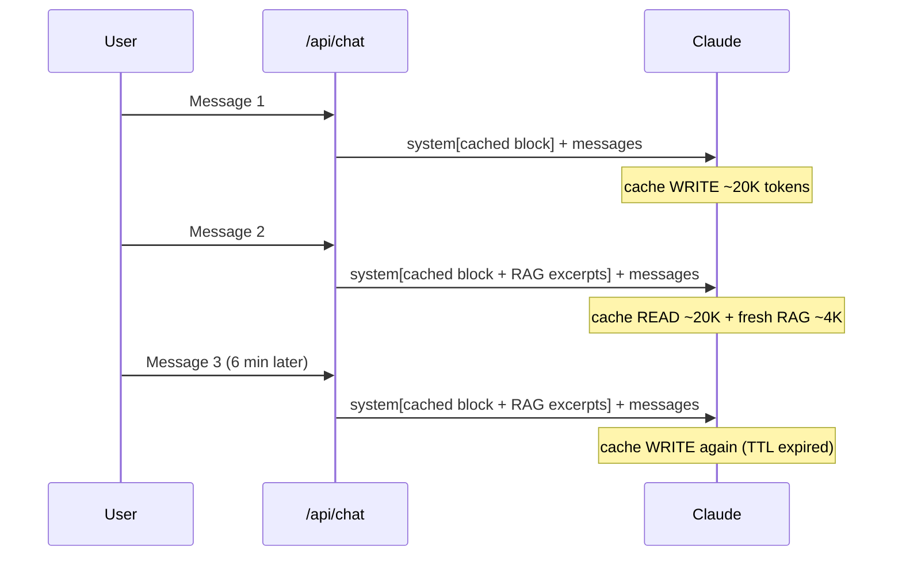

> 🤖 **Try it live:** open the [About page](/en/about#ask-my-clone) and chat with my AI clone in the sidebar. Ask about my stack, what I'm looking for, or what I've written about Kafka — then read on to see exactly how it works.

Recruiters landing on this blog often want a quick answer: *What roles are you open to? What's your stack? Have you written about X?* Email works, but it's slow. A chat widget that talks like me, in French, English, or Japanese, felt like the right UX.

This post is a deep dive into how that chatbot is built — not as a generic "build a chatbot" tutorial, but as an honest account of the architecture, libraries, and trade-offs behind a feature that runs entirely inside a Next.js app, with Markdown as the source of truth.

## What it is (and what it isn't)

The **AI Clone** is a streaming chat on the About page (`/[locale]/about#ask-my-clone`). It answers in first person as Tony, using:

1. A hand-curated **persona file** (`content/persona/{locale}.md`) — CV facts, contact info, what I'm looking for.
2. A **blog post digest** — title, date, category, tags, and excerpt for every post in the current locale.
3. **RAG retrieval** — full text of the most relevant post sections for the user's question.

It is **not** the realtime visitor chat (the floating bubble in the bottom-right corner). That feature is a separate Rails + ActionCable WebSocket system for human-to-human messaging. The AI Clone is stateless, LLM-powered, and reads from files on disk.



The whole feature fits in roughly six source files plus Markdown content. No Redis, no Postgres for chat history, no background workers at request time.

## The request lifecycle

When someone presses Enter, this happens:

```
Browser                    Next.js API route              Anthropic / Voyage
-------                    -----------------              -----------------
CloneChat posts
{ locale, messages }
        ─────────────────► Zod validates body
                           retrieve(locale, lastUserMsg) ──► embed query (Voyage)
                           buildSystemPrompt(locale)
                             ├─ readPersona (fs)
                             ├─ formatPostsDigest (blog.ts)
                             └─ formatTodos (data/todos.json)
                           formatRetrievedContext(top-k chunks)
                           messages.stream({
                             system: [cached block, RAG block],
                             messages
                           }) ─────────────────────────────►
                           ◄────────────────────────────── text deltas
        ◄───────────────── ReadableStream (text/plain)
TextDecoder + setState
ReactMarkdown re-renders
```

Three properties worth internalising:

- **The API key never reaches the browser.** The client only talks to `/api/chat`; Anthropic and Voyage credentials live in server environment variables.
- **Context is assembled per request.** Persona and digest are read from disk on every call (no restart needed when you edit `content/persona/en.md`).
- **Responses stream.** The UI reads the fetch body incrementally and re-renders the assistant bubble as tokens arrive.

## Layer 1: Persona files — facts the blog never writes

Blog posts capture *what I've been thinking about*. They rarely say "my email is X" or "I'm looking for remote roles in Europe." Recruiters ask factual questions; the persona file answers them.

Each locale has its own Markdown brief at `content/persona/{fr,en,ja}.md`:

```markdown
## Quick facts

- **Name**: Tony Duong
- **Location**: Toulouse, France
- **Email**: tony.duong.102@gmail.com
- **Languages spoken**: French (native), English (fluent), Japanese (business)
```

The server reads it synchronously:

```typescript
function readPersona(locale: Locale): string {
  const file = path.join(personaDir, `${locale}.md`);
  if (fs.existsSync(file)) return fs.readFileSync(file, 'utf8');
  return fs.readFileSync(path.join(personaDir, `${defaultLocale}.md`), 'utf8');
}
```

**Why Markdown, not a database row?** I already version content as Markdown in this repo. Editing a file is zero-friction, diff-friendly, and works offline. For a personal site with one author, a CMS table would be infrastructure without benefit.

**Why separate from blog posts?** Mixing recruiter-facing facts into daily memos would dilute both. The persona is the contract: *these are the things the bot is allowed to state as fact.*

## Layer 2: Post digest — breadth without blowing the context window

For "vibes" questions — *what have you been working on? what topics do you write about?* — the bot needs a map of the entire blog, not full article bodies.

`formatPostsDigest()` calls `getAllPosts(locale)` from `src/lib/blog.ts`, which walks `posts/{locale}/`, parses YAML frontmatter with **gray-matter**, and returns metadata. Each post becomes one line:

```
- 2026-06-11 ・ note/tech ・ Kafka vs RabbitMQ [system-design, kafka, rabbitmq] — Hello Interview on choosing between Kafka and RabbitMQ…
```

With ~300 posts per locale, this digest is roughly 15–20K tokens — large, but manageable with prompt caching (more on that below).

| Approach | Tokens (300 posts) | Can list topics? | Can quote a paragraph? |
|---|---|---|---|
| Full post bodies in prompt | 200K+ | Yes | Yes |
| Digest (title + excerpt only) | ~20K | Yes | No — paraphrase excerpt only |
| Digest + RAG (this project) | ~20K stable + ~4K retrieved | Yes | Yes, for matched sections |

The digest answers *breadth*. RAG answers *depth*. Keeping both was deliberate — retrieval is bad at "list everything I've ever written about databases."

## Layer 3: RAG — full post text, only when relevant

As the blog grew past ~80 posts, the digest-only approach hit a ceiling. A recruiter asking *"what did you conclude about message queues?"* could get the post title and one-sentence excerpt, but not the actual analysis.

RAG (retrieval-augmented generation) fixes that without stuffing every post body into every request.

### Two clocks: build offline, serve online



**Build time** (`npm run embeddings`):

1. Read each post's raw Markdown body (`getRawPostBody`).
2. Split into chunks at `##` headings (`src/lib/rag-chunk.ts`).
3. Window oversized sections (~4000 chars, 400-char overlap).
4. Embed each chunk with **Voyage AI** (`voyage-3.5`, multilingual).
5. Write `data/embeddings/{locale}.json` (metadata + chunk text) and `{locale}.bin` (packed Float32 vectors).

**Request time**:

1. Embed the user's latest message (`embedQuery`).
2. Brute-force cosine similarity against the pre-built index.
3. Take top 8 chunks, format into a second system-prompt block.

The index files are **committed to the repo**. Deploys don't need a Voyage key to *read* vectors — only to embed new queries at runtime (~one cheap API call per message).

### Chunking strategy

Posts on this blog are authored as `## Section` blocks. Splitting on h2 headings gives semantically coherent chunks — one idea per section. Content before the first heading becomes an "intro" chunk.

For embedding, each chunk is prefixed with title and heading so terse bullet lists still carry topic signal:

```
Kafka vs RabbitMQ › The technical trade-offs

### Ordering
- RabbitMQ queues are strictly ordered…
```

### Why brute-force search, not pgvector?

At ~300 posts → a few thousand chunks, a linear scan over normalized Float32 vectors is sub-millisecond in Node. A hosted vector database would add:

- Another service to deploy and monitor
- Connection pooling and auth
- A re-indexing pipeline tied to deploys

The `retrieve()` function is intentionally swappable — if the corpus hits tens of thousands of chunks, sqlite-vec or an ANN index can sit behind the same interface. For a personal blog, YAGNI wins.

### Graceful degradation

If `data/embeddings/` is missing or Voyage fails, `retrieve()` returns `[]` and the chat falls back to persona + digest only. Nothing breaks; answers are just less detailed. This made it safe to merge RAG before the first index was generated in CI.

## Assembling the system prompt

`buildSystemPrompt(locale)` in `src/lib/clone-context.ts` fuses everything into one string:

```
[role line — in target language]
[reply language instruction — in target language]

# Style
- Talk in first person…
- Never invent employment history…

# Recruiter brief (English)
{persona markdown}

# Goals & learning list (optional, from data/todos.json)
{todo items}

# Blog posts index
{digest — one line per post}
```

Per-locale role lines are written *in* the target language. Models follow instructions more reliably when the language instruction itself is in French/Japanese, not `"Respond in ja"`.

After RAG, a **second** system block may append:

```
# Relevant excerpts (full text, retrieved for this question)
### Kafka vs RabbitMQ — The technical trade-offs
(source: /posts/kafka-vs-rabbitmq)

{full section markdown}
```

The API route sends two system blocks to Claude:

```typescript
const system = [
  { type: 'text', text: stableSystem, cache_control: { type: 'ephemeral' } },
  ...(retrievedContext ? [{ type: 'text', text: retrievedContext }] : []),
];
```

The stable block is cached; the RAG block varies per question and sits *after* the cache breakpoint.

## The streaming API route

`src/app/api/chat/route.ts` is a Next.js Route Handler — not a Server Action.

| Option | Streaming | Filesystem | Callable from curl |
|---|---|---|---|
| Server Action | Awkward (single payload) | Possible with workarounds | No |
| Route Handler | Native `ReadableStream` | Yes (`fs` on Node runtime) | Yes |

Input validation uses **Zod**:

```typescript
const BodySchema = z.object({
  locale: z.string().refine(hasLocale),
  messages: z.array(z.object({
    role: z.enum(['user', 'assistant']),  // no client-supplied system role
    content: z.string().min(1).max(4000),
  })).min(1).max(40),
});
```

Notably, there is **no `system` role** in client messages. Letting the browser send system prompts would be a prompt-injection vector.

The handler streams Anthropic text deltas into a plain-text response:

```typescript
for await (const event of messageStream) {
  if (event.type === 'content_block_delta' && event.delta.type === 'text_delta') {
    controller.enqueue(encoder.encode(event.delta.text));
  }
}
```

Plain `text/plain` instead of Server-Sent Events — one fewer protocol to debug; the deltas are already plain text.

`export const runtime = 'nodejs'` is explicit because `clone-context.ts` uses `fs.readFileSync`. Edge runtime has no filesystem.

## The chat UI

`CloneChat.tsx` is a client component on the About page. It:

1. Keeps `messages` in React state (stateless server — full history sent on every request).
2. POSTs to `/api/chat` with `{ locale, messages }`.
3. Reads `res.body.getReader()` and appends decoded chunks to the assistant message.
4. Renders assistant replies with **react-markdown** + **remark-gfm** (tables, strikethrough, task lists).

Streaming Markdown on the client means re-parsing partial strings on every delta. For short chat replies that's fine; for essay-length output you'd buffer until a paragraph boundary.

User bubbles are plain text; assistant bubbles get full Markdown styling (links open in new tabs, code blocks, lists).

## Libraries and why each one

| Library | Role | Why this, not something else |
|---|---|---|
| **@anthropic-ai/sdk** | Stream Claude responses | First-party SDK with native streaming iterator and prompt-cache support |
| **zod** | Validate POST body | Already in the stack; catches malformed/large payloads before hitting the API |
| **gray-matter** | Parse post frontmatter | Same parser the blog renderer uses — one source of truth for metadata |
| **react-markdown** + **remark-gfm** | Render assistant replies | Safe React rendering (no `dangerouslySetInnerHTML` in chat); GFM matches blog authoring |
| **Voyage AI** (fetch, no SDK) | Embeddings at build + query time | Anthropic's recommended partner; `voyage-3.5` is multilingual (fr/en/ja corpus, cross-locale retrieval) |
| **tsx** | Run `scripts/build-embeddings.ts` | TypeScript ingestion script outside Next.js runtime |
| **server-only** | Guard `clone-context.ts`, `rag.ts` | Prevents accidental client imports of `fs`-using modules |

No LangChain, no Vercel AI SDK, no vector DB client. The retrieval loop is ~30 lines of dot products. The streaming loop is ~15 lines. Dependencies you don't import are dependencies you don't debug at 11pm.

## Design decisions vs alternatives

This table is the honest "why not X?" summary. Your constraints may differ — a product with 10K daily users would flip several of these.

| Decision | What I picked | What I skipped | Why |
|---|---|---|---|
| **Backend** | Next.js API route | Separate Rails/Python service | One deploy on Vercel, no CORS, no second auth boundary |
| **Knowledge store** | Markdown files + committed embedding index | Postgres + pgvector | Content already lives in git; ~3K chunks don't need a database |
| **Retrieval** | Brute-force cosine on Float32 binary | Pinecone, Weaviate, OpenSearch | Sub-ms at this scale; zero ops |
| **Context strategy** | Hybrid: digest (breadth) + RAG (depth) + persona (facts) | Full-corpus prompt OR pure RAG | Digest lists topics RAG can't; persona holds facts posts don't contain |
| **Response transport** | `ReadableStream` of `text/plain` | SSE, WebSocket | Simplest path from Anthropic deltas to fetch reader |
| **Conversation state** | Client sends full history each turn | Server-side session DB | Stateless API, no DB writes, refresh = fresh start |
| **Markdown rendering** | Client-side `react-markdown` | Server-rendered HTML chunks | Streaming HTML safely is painful; chat replies are short |
| **Model** | Claude Sonnet 4.6 | Haiku (cheaper), Opus (smarter) | Good balance of quality and cost for recruiter-facing answers |
| **Prompt caching** | `cache_control: ephemeral` on stable system block | Re-send full prompt at full price every turn | ~20K token system prompt would be expensive without caching |

## Prompt caching — what makes the large digest affordable

The stable system prompt is ~15–20K tokens. Without caching, every message in a multi-turn conversation would re-pay full input cost for that prefix.

Anthropic's prompt caching treats the system block as a cacheable prefix:

- **First message** in a session: cache **write** (~1.25× input price for cached tokens).
- **Subsequent turns** within ~5 minutes: cache **read** (~0.1× input price).
- **RAG block** sits after the cache marker — it changes every question, so it is not cached.

Critical gotcha: caching is a **prefix match**. One byte of drift in the stable block invalidates the cache. Never interpolate `new Date()` or session IDs into `buildSystemPrompt()`.



For low recruiter traffic on a personal blog, this is essentially free. Haiku 4.5 would cut cost further if volume grew.

## Multilingual behaviour

Three locales: `fr`, `en`, `ja`. Each has:

- Its own persona file
- Its own post directory (`posts/{locale}/`)
- Its own embedding index

The UI locale controls **reply language** (instructions in the system prompt). The digest pulls posts for that locale only. Voyage's multilingual embeddings mean a French question can still retrieve relevant English post sections if the indices were cross-linked — today they're per-locale, which matches how the blog is structured (translations exist but aren't always 1:1).

Adding a fourth locale means: extend `i18n-config.ts`, add `content/persona/es.md`, dictionary strings, and optionally `posts/es/` + run `npm run embeddings -- es`.

## Cost and ops shape

| When | What costs money | Approximate trigger |
|---|---|---|
| Build | Voyage document embeddings | New/edited posts → `npm run embeddings` |
| Serve | Voyage query embedding | Every user message |
| Serve | Anthropic input + output | Every user message |
| Serve | Prompt cache write | First message after idle / TTL expiry |
| Serve | Prompt cache read | Follow-up messages within ~5 min |

No always-on GPU, no vector DB bill, no embedding re-run on deploy (index is in git).

Incremental embedding cache (`data/embeddings/.cache.json`, gitignored) skips unchanged posts by content hash — day-to-day Voyage cost stays near zero unless you've been writing.

## Customising the bot

| Goal | Where to edit |
|---|---|
| Update CV facts, contact, looking-for | `content/persona/{locale}.md` |
| Change tone, refusals, length rules | `# Style` block in `src/lib/clone-context.ts` |
| Change model or max tokens | `src/app/api/chat/route.ts` |
| UI strings, example prompts | `chat` block in `src/dictionaries/{fr,en,ja}.json` |
| Rebuild search index after new posts | `npm run embeddings` |
| Tune chunk size / overlap | `src/lib/rag-chunk.ts` |
| Change number of retrieved sections | `retrieve(locale, query, k)` default in `src/lib/rag.ts` |

Changes to persona and digest take effect on the next request — no rebuild. New posts need a digest refresh automatically (runtime read) plus an embedding rebuild for RAG depth.

## What I'd do differently at scale

This architecture is tuned for a personal blog with low traffic and Markdown-native content. Signals that you'd outgrow it:

- **500+ posts, digest alone exceeds ~50K tokens** → drop digest to "last N posts" or tag-filtered subset; rely more on RAG.
- **Thousands of concurrent sessions** → server-side conversation store, rate limiting, abuse detection.
- **Tens of thousands of chunks** → swap brute-force scan for sqlite-vec or a hosted ANN index behind `retrieve()`.
- **Strict citation requirements** → add explicit source URLs in retrieved chunks (partially there via `/posts/{slug}`) and post-process to verify claims against chunks only.

For where this site is today — a few hundred posts, a handful of recruiter conversations a week — the Markdown-in, stream-out, file-backed RAG approach is the right amount of machinery.

## File map

```
content/persona/
  en.md, fr.md, ja.md          ← recruiter brief (edit this)

posts/{locale}/**/*.md         ← blog source (frontmatter + body)

data/embeddings/
  {locale}.json                ← chunk metadata + text
  {locale}.bin                 ← packed Float32 vectors

src/
  app/api/chat/route.ts        ← streaming POST handler
  app/[locale]/about/page.tsx  ← embeds CloneChat
  components/CloneChat.tsx     ← client UI
  lib/
    clone-context.ts           ← system prompt assembly
    rag.ts                     ← retrieval
    rag-chunk.ts               ← Markdown chunking
    voyage.ts                  ← embeddings client
    blog.ts                    ← getAllPosts, getRawPostBody

scripts/build-embeddings.ts    ← offline ingestion
```

## Try it yourself

If you're running this repo locally:

```bash
cp .env.local.example .env.local
# Add ANTHROPIC_API_KEY (required)
# Add VOYAGE_API_KEY (optional — needed for RAG query embedding + building index)

npm run dev
# Open http://localhost:3000/en/about#ask-my-clone
```

Without `ANTHROPIC_API_KEY`, the UI renders but the API returns 500. Without `VOYAGE_API_KEY` or index files, chat works on persona + digest only.

To inspect what Claude actually sees:

```typescript
// scripts/dump-prompt.ts
import { buildSystemPrompt } from '@/lib/clone-context';
console.log(buildSystemPrompt('en'));
```

Run with `npx tsx scripts/dump-prompt.ts`. Reading the assembled prompt is the highest-leverage debugging step for any prompt-driven system.

---

The AI Clone is a small feature with a clear shape: **Markdown in, retrieved context in the middle, streamed text out.** No vector database, no second backend, no conversation database — just files, a pre-built index, and two API calls per message. For a blog that already treats content as code, that felt less like a chatbot project and more like another way to read the same repository.
