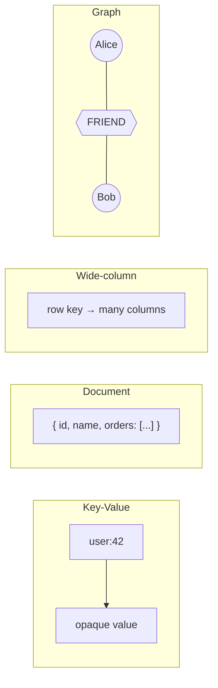
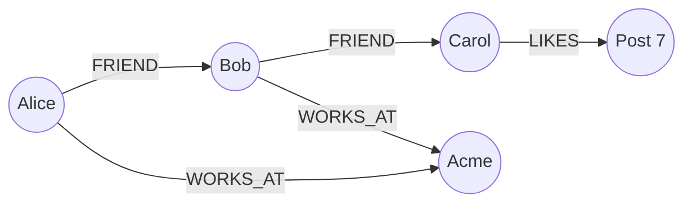

Notes from *System Design Interview* — NoSQL databases are often grouped into **four categories**: key-value stores, document stores, column (wide-column) stores, and graph stores. Same non-relational label; very different access patterns.



## 1. Key-value stores

**Idea:** a giant dictionary. Give a key, get a value. That is the primary API.

| | |
|---|---|
| **Strengths** | Fast lookups, simple scaling, great for cache/session |
| **Weaknesses** | Little or no querying by fields inside the value |
| **Examples** | Redis, DynamoDB (simple PK), Memcached, etcd |

```python
# Redis-style mental model
SET session:abc123 '{"userId":42,"cart":["sku-9"]}'
GET session:abc123
# → {"userId":42,"cart":["sku-9"]}

# You generally do NOT ask:
# "find all sessions where cart contains sku-9"
```

**Use when:** sessions, feature flags, rate limits, caches, shopping carts keyed by ID.

## 2. Document stores

**Idea:** values are structured documents (usually JSON/BSON). You can query *inside* them.

| | |
|---|---|
| **Strengths** | Flexible schema, nested data, rich queries/indexes |
| **Weaknesses** | Cross-document joins are awkward; schema drift if unmanaged |
| **Examples** | MongoDB, CouchDB, Firestore |

```javascript
// MongoDB
db.users.insertOne({
  _id: "u42",
  name: "Tony",
  address: { city: "Paris", country: "FR" },
  tags: ["backend", "systems"]
})

db.users.find({ "address.city": "Paris", tags: "systems" })
```

**Vs key-value:** both can store JSON, but documents let you index and query fields. Key-value mostly treats the value as opaque.

**Use when:** user profiles, CMS content, product catalogs, event payloads with evolving fields.

## 3. Column stores (wide-column)

**Idea:** data organized by **row key + columns**. Strong for sparse, high-write, time-oriented access. (Not the same as analytical “columnar” OLAP engines like ClickHouse — same word, different job.)

| | |
|---|---|
| **Strengths** | Huge write throughput, sparse tables, range scans by key |
| **Weaknesses** | Modeling is access-path driven; ad-hoc queries are hard |
| **Examples** | Cassandra, HBase, ScyllaDB, Bigtable |

```text
Row key: user:42
  profile:name     → "Tony"
  profile:email    → "tony@example.com"
  metrics:2026-08-01 → 120   # sparse: many days may be absent
  metrics:2026-08-02 → 95
```

```cql
-- Cassandra: design tables for the query you need
CREATE TABLE page_views (
  page_id text,
  day date,
  views counter,
  PRIMARY KEY (page_id, day)
);

SELECT views FROM page_views
WHERE page_id = '/blog/nosql'
  AND day >= '2026-07-01';
```

**Vs document:** documents are “one nested object per entity.” Wide-column is “many named cells under a key,” often optimized for write-heavy, key-range workloads.

**Use when:** IoT metrics, activity feeds, messaging timelines, multi-tenant high-write logs.

## 4. Graph stores

**Idea:** first-class **nodes** and **relationships**. Queries walk edges — friends of friends, fraud rings, recommendations.

| | |
|---|---|
| **Strengths** | Multi-hop relationship queries stay natural and fast |
| **Weaknesses** | Overkill for simple CRUD; global graph sharding is hard |
| **Examples** | Neo4j, Amazon Neptune, JanusGraph |



```cypher
-- Neo4j: who are friends-of-friends of Alice?
MATCH (a:Person {name:'Alice'})-[:FRIEND*2]->(fof)
WHERE NOT (a)-[:FRIEND]->(fof) AND a <> fof
RETURN DISTINCT fof.name
```

In a document DB you often embed friend IDs and fan out N queries. Graphs make the *relationship* the data model.

**Use when:** social graphs, knowledge graphs, recommendations, access-control hierarchies, fraud detection.

## Quick comparison

| Category | Lookup unit | Best question | Weak at |
|---|---|---|---|
| **Key-value** | `key → value` | “Get this ID” | “Find by attribute” |
| **Document** | JSON document | “Find users in Paris with tag X” | Deep multi-hop joins |
| **Wide-column** | row key + columns | “Scan metrics for entity over time” | Flexible ad-hoc analytics |
| **Graph** | node + edge | “How are A and B connected?” | Simple key lookups as the only need |

## One rule of thumb

Pick the store that matches your **primary access pattern**:

1. **By ID only** → key-value
2. **By nested fields / flexible docs** → document
3. **By partition key + time/range, huge writes** → wide-column
4. **By relationships / multi-hop paths** → graph

Many real systems mix them (Redis cache + MongoDB documents + Neo4j for recommendations). The categories are design lenses, not mutually exclusive religions.
