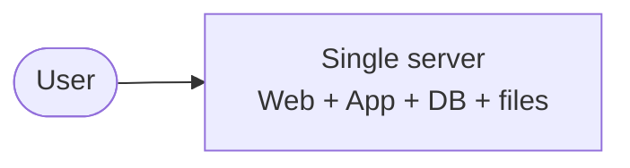
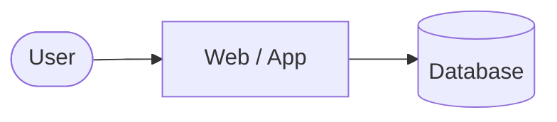
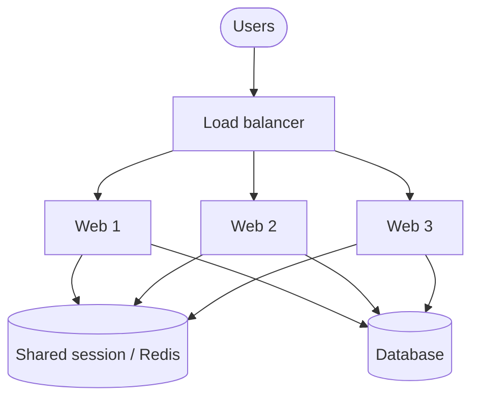
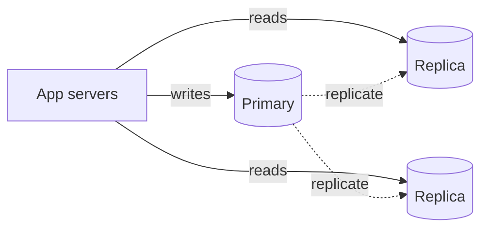
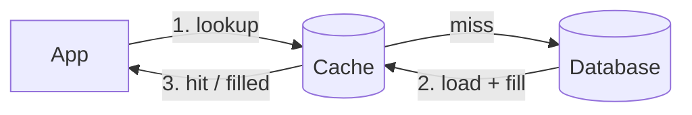
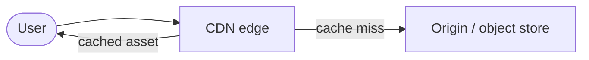
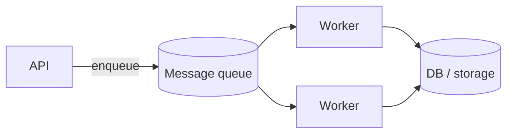
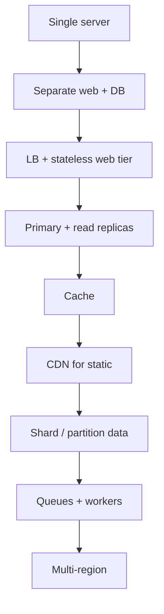

Notes from *System Design Interview – An Insider’s Guide* (Alex Xu), Chapter 1. The chapter is a tour of **vertical → horizontal scaling**: start with one box, then add the pieces you need as traffic grows.

## Start simple: one server

Everything on one machine — web, app, database, static files.

Fine for a prototype. Breaks when:

- CPU / memory / disk max out
- One process crash takes the whole product down
- You cannot deploy without downtime

## Separate web tier and data tier

First real split:

- **Web/app servers** — stateless request handling
- **Database** — durable state

Why it matters: you can scale and fail each tier independently. The app talks to the DB over the network; the DB is no longer “just another folder on the same box.”

## Vertical vs horizontal scaling

| Approach | Idea | Limit |
|----------|------|--------|
| **Vertical** (scale up) | Bigger CPU/RAM/disk on one machine | Hardware ceiling, single point of failure, expensive |
| **Horizontal** (scale out) | More machines | Needs load balancing, shared-nothing design, operational complexity |

Interview default at internet scale: **scale out**, keep servers **stateless**.

## Load balancer

Put a load balancer in front of multiple web servers.

- Clients hit a single VIP / hostname
- LB spreads traffic (round-robin, least connections, etc.)
- One web server dies → LB stops sending it traffic

Web tier should store **no session on disk of a specific machine**. Sessions go to a shared store (Redis, DB) so any server can handle any request.

## Database replication

Typical pattern: **one primary (writes) + read replicas**.

- Writes → primary
- Reads → replicas
- Replication lag is real — design for it (read-your-writes when needed)

Failing over the primary is an ops problem; mention it in interviews even if you do not design the full HA story.

## Cache

Database is expensive for hot reads. Add a cache (Redis/Memcached) in front of slow queries or computed results.

Practical rules:

- Cache **hot** data with a clear TTL / invalidation story
- Watch for **cache stampede** and **thundering herd**
- Prefer cache-aside unless you have a reason for write-through

## CDN for static content

Images, JS, CSS, videos → CDN edge nodes close to users.

- Lower latency
- Less load on origin
- Cache invalidation / versioned URLs when assets change

## Stateless web tier (again, louder)

If a request requires sticky sessions tied to one machine, you cannot freely autoscale or replace nodes. Push session/state to Redis or the DB. Treat web servers as cattle.

## Multi-datacenter / geographic distribution

At larger scale:

- Users in different regions → geo-DNS or global LB
- Data residency and replication across DCs
- Higher complexity for consistency and failover

Mention when the prompt implies worldwide traffic.

## Message queues and async work

Not every request should do heavy work inline.

- API accepts work → enqueue → workers process
- Decouples spikes from processing capacity
- Retries, DLQs, and idempotency become part of the design

Examples: image processing, emails, feed fan-out, billing jobs.

## Logging, metrics, automation

Scaling without observability is flying blind:

- Centralized logs
- Metrics + alerts (latency, error rate, saturation)
- Automation for deploys, scaling, failover drills

## The evolution path (cheat sheet)

## Interview takeaway

Chapter 1 is not one design — it is a **menu of scaling levers**. In a real interview you pick the next lever when a bottleneck appears (CPU, DB reads, static latency, write throughput, async fan-out), and you say *why* that lever fits the bottleneck.
