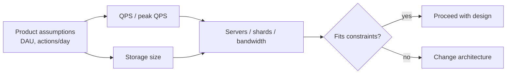

Notes from *System Design Interview*, Chapter 2. Interviewers care less about exact arithmetic and more about whether you can **size a system** with rough, defensible numbers.

## Why estimate at all?

Back-of-the-envelope math answers:

- How many servers / shards do we need?
- Is the DB the bottleneck or the network?
- Does this design even fit in RAM / disk / budget?

Wrong by 2–3× is often fine. Wrong by 100× means the architecture is wrong.



## Powers of two (memory / storage)

Know approximate sizes:

| Power | Approx value | Rough meaning |
|-------|--------------|---------------|
| 10 | ~1 thousand | |
| 20 | ~1 million | |
| 30 | ~1 billion | |
| 40 | ~1 trillion | |

Bytes:

```text
1 KB  ≈ 10^3 bytes
1 MB  ≈ 10^6 bytes
1 GB  ≈ 10^9 bytes
1 TB  ≈ 10^12 bytes
1 PB  ≈ 10^15 bytes
```

Handy: `2^10 ≈ 10^3`, so binary prefixes track decimal ones closely enough for interviews.

## Latency numbers that should be in your head

Order-of-magnitude intuition (classic Jeff Dean / systems table — memorize the *shape*, not every digit):

```text
L1 cache reference          ~   1 ns
Branch mispredict           ~   3 ns
L2 cache reference          ~   4 ns
Mutex lock/unlock           ~  17 ns
Main memory reference       ~ 100 ns
Compress 1KB with Zippy     ~  2 µs
Send 2KB over 1 Gbps        ~ 20 µs
Read 1MB sequentially RAM   ~250 µs
Round trip same datacenter  ~500 µs
Disk seek                   ~ 10 ms
Read 1MB sequential disk    ~ 20 ms
Send packet CA → Netherlands ~150 ms
```

Practical translation:

- Memory ≫ disk for random access
- Same-DC RPC is cheap compared to cross-region
- Avoid disk seeks in hot paths; prefer sequential / SSD / memory

## Traffic estimates (QPS)

Typical interview flow:

1. Ask for DAU / MAU (or assume with the interviewer)
2. Estimate requests per user per day
3. Convert to QPS, then peak QPS

```text
QPS ≈ (DAU × actions_per_user_per_day) / 86400

Peak QPS ≈ QPS × peak_factor   # often 2×–5×, confirm with interviewer
```

Example:

```text
10M DAU
each user does 20 reads/day
→ 200M reads/day
→ ~2,300 QPS average
→ ~5,000–10,000 QPS at peak (if 2–4×)
```

Always say assumptions out loud.

## Storage estimates

```text
storage ≈ users × data_per_user × retention × replication_factor
```

Break objects into fields:

```text
Tweet ≈ 300 bytes metadata + media pointers
Photo ≈ 200 KB average
5 years × 3 replicas → multiply carefully
```

Round aggressively. Show the formula, then the rounded result.

## Bandwidth

```text
bandwidth ≈ QPS × average_payload_size
```

Useful when deciding CDN vs origin, or whether a single NIC is absurd for the load.

## Tips that sound senior

- **State assumptions** before calculating
- **Round** to 1 significant digit early (`3.14 → 3`, `86400 → 10^5`)
- **Sanity-check** against known products (“Instagram-scale?”)
- Use estimates to **drive design choices** (shard count, cache size), not as decoration
- If the interviewer gives numbers, **use theirs**

## Cheat sheet

| Question | Rough approach |
|----------|----------------|
| QPS | DAU × actions/day / 86,400 × peak factor |
| Storage | records × size × retention × replicas |
| Cache size | working set (often ≪ total data) |
| Shards | write QPS or data size / per-node capacity |

## Interview takeaway

Estimation is a **communication tool**. You are showing you can translate product scale into machine constraints — and catch designs that cannot possibly work.
