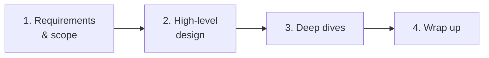
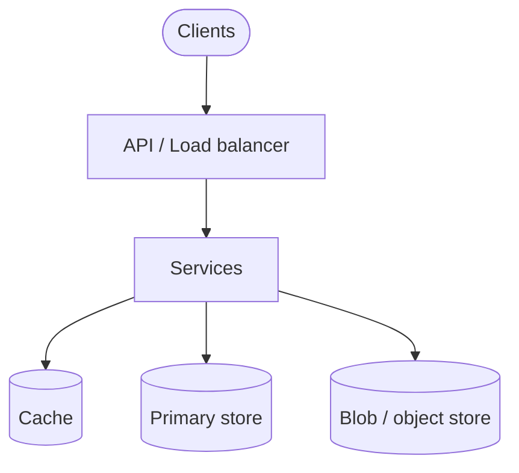

Notes from *System Design Interview*, Chapter 3. The book’s process for any design question — reuse this skeleton until it is muscle memory.

## The 4-step framework



```text
1. Understand the problem and establish design scope
2. Propose high-level design and get buy-in
3. Design deep dives (the hard parts)
4. Wrap up
```

Time-box roughly: ~5 min requirements, ~10–15 min high-level, rest on deep dives + trade-offs.

## Step 1 — Requirements and scope

Do **not** jump to boxes and arrows.

Ask:

- **Functional:** What exact features? Who are the users? Mobile/web? Upload? Search? Realtime?
- **Non-functional:** Scale (DAU, QPS), latency, consistency, availability, durability
- **Out of scope:** Auth details? GDPR? Exact UI? Confirm what to skip

Translate fuzzy asks into numbers:

```text
"Design Twitter"
→ post tweets, follow, home timeline
→ 100M DAU, read-heavy, eventual OK for fan-out, strong-ish for posting?
```

Write constraints on the whiteboard. Revisit them when you trade off.

## Step 2 — High-level design

Sketch the **minimum** architecture that satisfies functional requirements:

- Clients → API / load balancer → services
- Storage choices (SQL vs NoSQL, blob store)
- Major flows (write path, read path)

Get the interviewer to nod before you dig into consistent hashing internals.



Good habits:

- Label APIs (`POST /tweets`, `GET /feed`)
- Separate read path vs write path if they differ
- Call out 1–2 scale assumptions that drive the shape

## Step 3 — Deep dives

This is where seniors separate from juniors. Pick bottlenecks the scale implies:

- Hot keys / celebrity fan-out
- Consistency under partition
- Cache invalidation
- Rate limiting, backpressure
- Shard strategy, rebalancing
- Delivery guarantees for queues

Go deep on **2–3** areas the interviewer cares about — not every component equally.

Talk in trade-offs:

```text
"Push fan-out is great for active users, expensive for celebrities —
 so hybrid: push for normal, pull for mega-followers."
```

## Step 4 — Wrap up

In the last minutes:

- Recap the design against original requirements
- Call out bottlenecks and what you would monitor
- Mention what you would do with more time (multi-region, stricter consistency, cost)
- Ask if they want a different deep dive

## What interviewers look for

Not a perfect diagram. They score:

| Signal | What it looks like |
|--------|---------------------|
| Communication | Clarifying questions, structured narrative |
| Scope control | Explicit in/out of scope |
| Trade-off thinking | “Option A vs B, I pick A because…” |
| Fundamentals | Caching, sharding, replication, queues used correctly |
| Adaptation | Adjust when the interviewer pushes back |

## Anti-patterns

- Diving into Kafka config before APIs exist
- Ignoring scale numbers you just estimated
- Silent whiteboard drawing for 10 minutes
- Treating CAP / “we’ll use microservices” as magic words
- Never stating assumptions

## Interview takeaway

The framework is a **conversation protocol**. Requirements → shape → hard parts → recap. Every later chapter in the book is an instance of this loop on a concrete problem.
