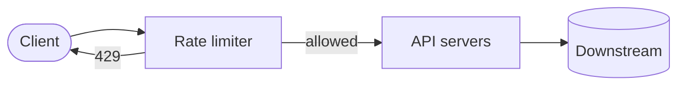
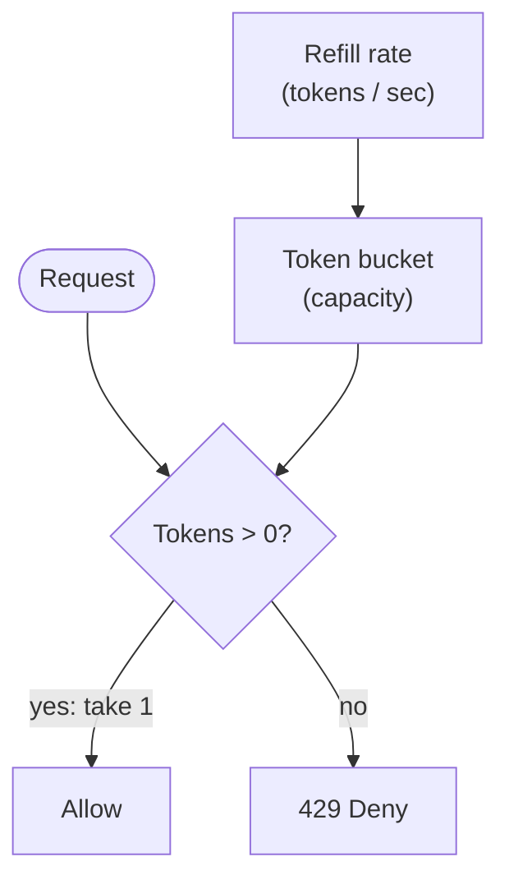
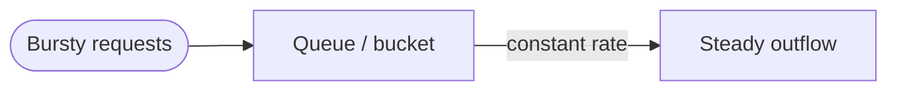
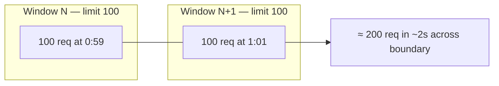
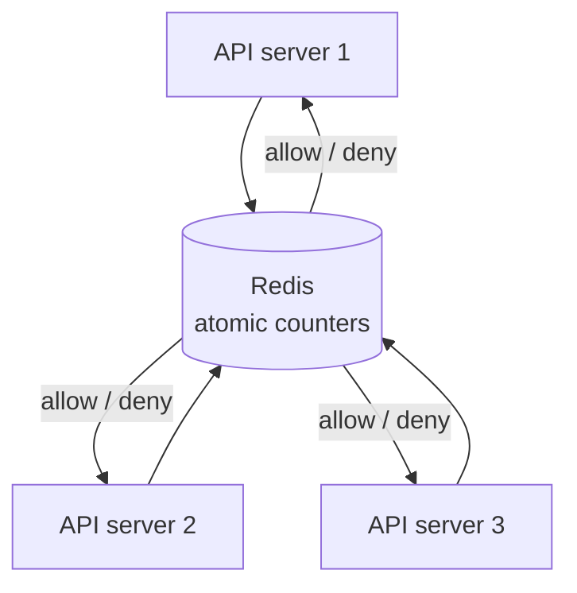

Notes from *System Design Interview*, Chapter 4 — design a **rate limiter**: control how many requests a client can send in a time window.

## Why rate limit?

- Protect APIs from abuse and accidental floods
- Enforce business tiers (free vs paid QPS)
- Reduce cost (downstream DB / third-party APIs)
- Improve fairness across tenants

Typical response when over limit: `429 Too Many Requests` (+ optional `Retry-After`).

## Requirements to clarify

- Who is limited? IP, user ID, API key, endpoint?
- Limits: e.g. 1000 req/min soft, 10k/day hard?
- Distributed across many API servers?
- Approximate OK, or must be exact?
- Where does it sit: gateway, middleware, service mesh?

## High-level placement



Often at the **API gateway** so every service does not reinvent it. Rules can be config-driven (per route, per tenant).

## Algorithms

### Token bucket

- Bucket holds up to `capacity` tokens
- Refills at `rate` tokens/sec
- Each request costs 1 token; reject if empty



**Pros:** allows short bursts; simple mental model  
**Cons:** burstiness may still hurt backends if capacity is large

Widely used in practice (including cloud API gateways).

### Leaking bucket

- Requests enter a queue; processed at fixed rate
- Smooths traffic to a constant outflow



**Pros:** predictable egress rate  
**Cons:** bursty clients wait or drop; queue size is a tuning knob

### Fixed window counter

- Count requests in window `[0:00–1:00)`, reset at boundary
- Cheap (one counter per key per window)

**Problem:** boundary spike — 100 at `0:59` + 100 at `1:01` ≈ 200 in two seconds with a “100/min” limit.



### Sliding window log

- Store timestamp of each request
- On new request, drop timestamps outside the window, count the rest

**Pros:** accurate  
**Cons:** memory heavy at high QPS

### Sliding window counter

- Hybrid: weighted count of previous window + current window
- Softens fixed-window boundary spikes with less memory than a full log

Good interview default when you want accuracy without unbounded timestamp lists.

## Distributed rate limiting

Many API servers → local in-memory counters **diverge**. Centralize counters:



Trade-offs:

| Approach | Notes |
|----------|--------|
| Redis central store | Simple; Redis becomes critical path |
| Sticky sessions + local | Fragile; avoid |
| Approximate / eventual | Higher throughput, occasional overshoot |

Use atomic ops or Lua so check-and-decrement is race-safe.

## HTTP headers (nice interview detail)

```text
X-RateLimit-Limit: 1000
X-RateLimit-Remaining: 42
X-RateLimit-Reset: 1700000000
```

Plus `Retry-After` on 429. Clients can back off intelligently.

## Soft vs hard limits, multi-layer

Real systems often combine:

- Edge / WAF limits (IP floods)
- Gateway per-API-key limits
- Per-service limits for expensive endpoints

## Deep-dive talking points

- Race conditions without atomic Redis ops
- Hot keys (one celebrity API key) → shard keys or local + sync
- Rules stored in config service, hot-reloaded
- Monitoring: reject rate, latency of limiter itself
- Fail-open vs fail-closed if Redis is down (product decision)

## Interview takeaway

Name the **algorithm**, place the limiter at the **edge**, store counters in a **shared atomic store** for multi-node correctness, and return **429 + headers**. Then discuss burstiness vs accuracy vs cost — that is the real design.
