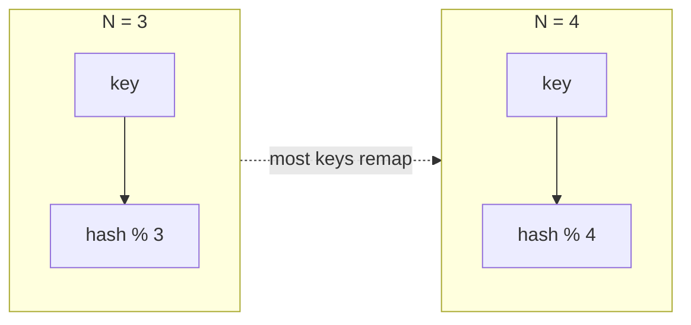
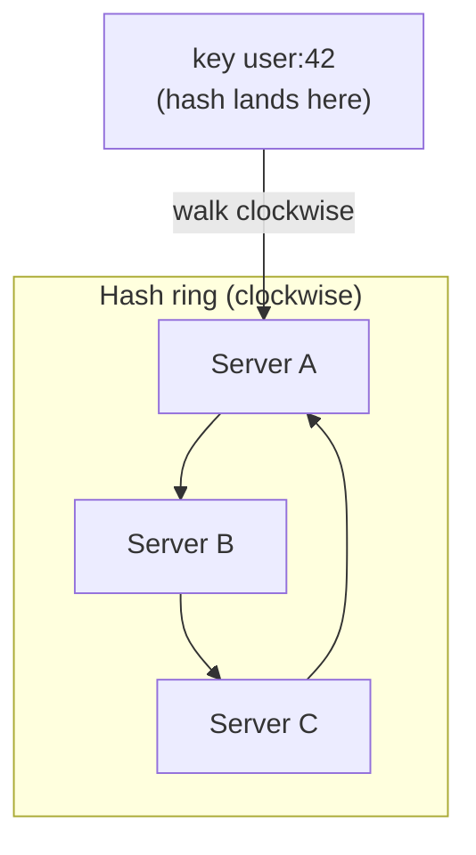
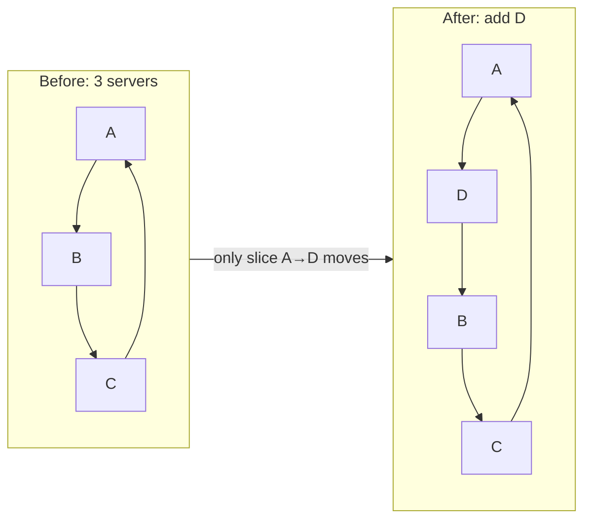
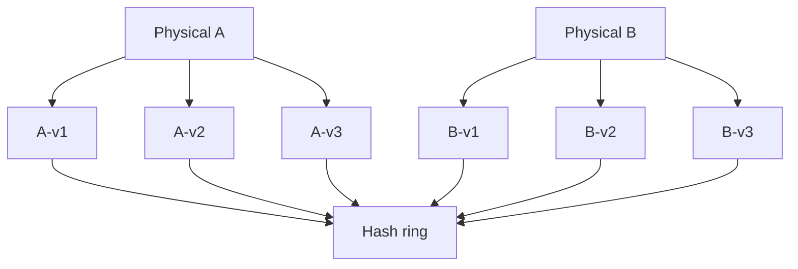
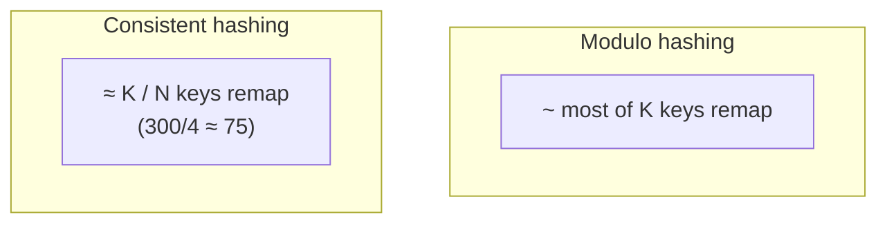

Notes from *System Design Interview*, Chapter 5 — **consistent hashing**: map keys to servers so that adding/removing a node moves only a small fraction of keys.

## The naive approach: `hash(key) % N`

```text
server = hash(key) % N
```

Works until `N` changes.

When you go from 3 servers to 4, **almost every key** remaps. Cache hit ratio collapses; databases reshuffle nearly all partitions. That is the pain consistent hashing fixes.



## Goal

When nodes change:

```text
keys remapped ≈ K / N
```

- `K` = number of keys
- `N` = number of nodes (after the change)

Only about **1/N** of keys should move — not most of them.

## The hash ring

1. Hash both **servers** and **keys** onto a fixed ring (e.g. `0 … 2^32-1`)
2. To place a key: hash it, walk clockwise, assign to the **first server** encountered
3. Add a server: it takes keys from its clockwise neighbor’s range — only that slice moves
4. Remove a server: its keys fall to the next clockwise server



```text
Ring positions (simplified):

  0 ── A ──────── B ──────── C ── 2^32
           ↑
      hash(user:42)  →  next clockwise server = A
```

When **Server D** is added between A and B, only keys in `(A → D]` move to D. Everything else stays put.



## Virtual nodes (the part that makes it production-ready)

One physical server → many positions on the ring (“virtual nodes” / vnodes).

Why:

- With few physical nodes, a single ring position creates **uneven** key ranges
- Many vnodes per server → load spreads more evenly
- Heterogeneous hardware: give bigger boxes more vnodes



Trade-off: more metadata to store/replicate about ring membership.

## Rebalancing intuition

Example from the usual teaching story:

- 300 keys, 3 nodes, add a 4th
- **Without** consistent hashing: large fraction of keys reshuffle across many nodes
- **With** consistent hashing: roughly `300/4 ≈ 75` keys move onto the new node



That `K/N` bound is the interview punchline.

## Where it shows up

- Distributed caches (Memcached clients, some Redis cluster modes conceptually)
- Dynamo-style partitioned stores
- Load balancing sticky affinity (sometimes)
- CDN / edge assignment variants

Anywhere you partition by key and expect **elastic** membership.

## Issues to mention

| Issue | Mitigation |
|-------|------------|
| Hot keys | Separate handling; not fixed by hashing alone |
| Uneven load | Virtual nodes; monitor range sizes |
| Ring membership changes | Gossip / coordination so all clients see the same ring |
| Request during rebalance | Often dual-read / copy ranges carefully |

## Interview takeaway

Contrast **`% N` (everything moves)** with **ring + virtual nodes (~K/N moves)**. Draw the ring, place a key clockwise, then show adding one node stealing a slice. That diagram usually scores the point.
