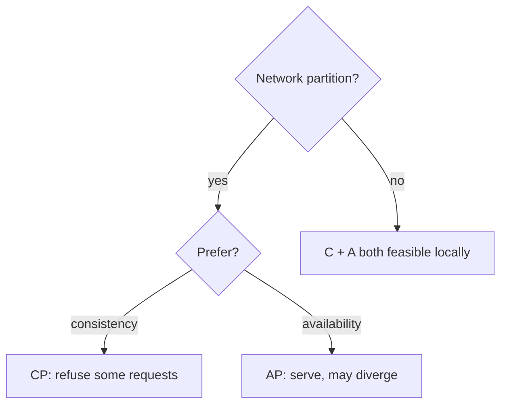
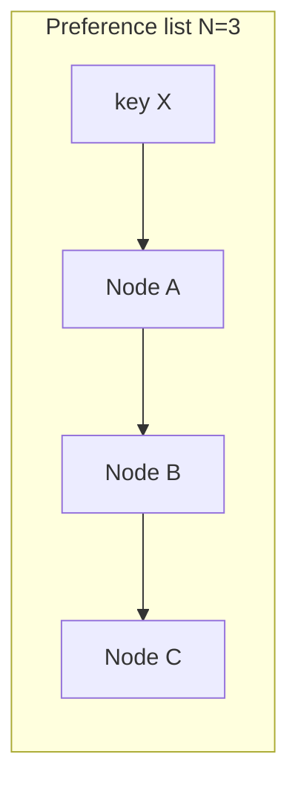
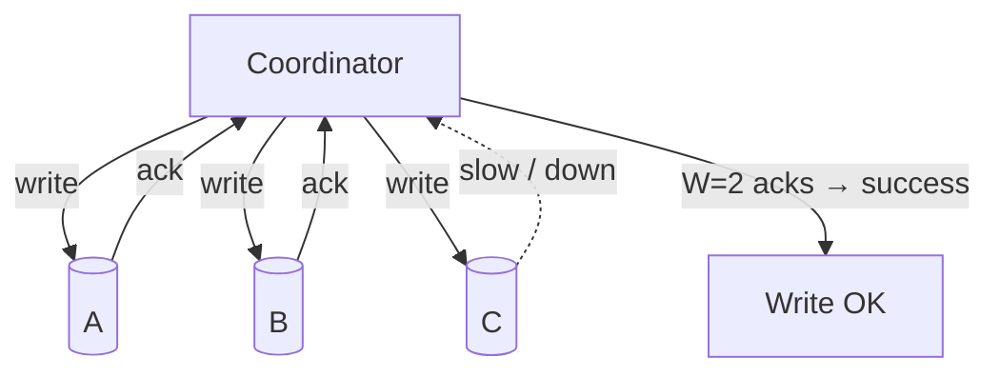
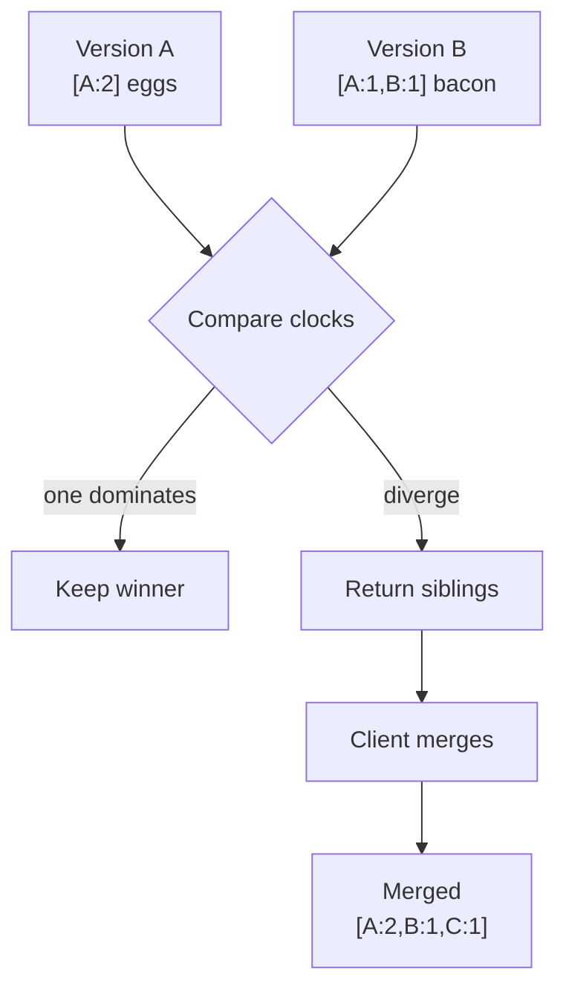
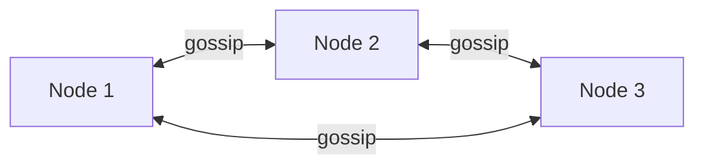
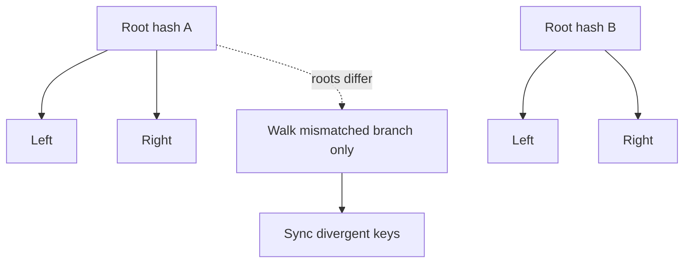
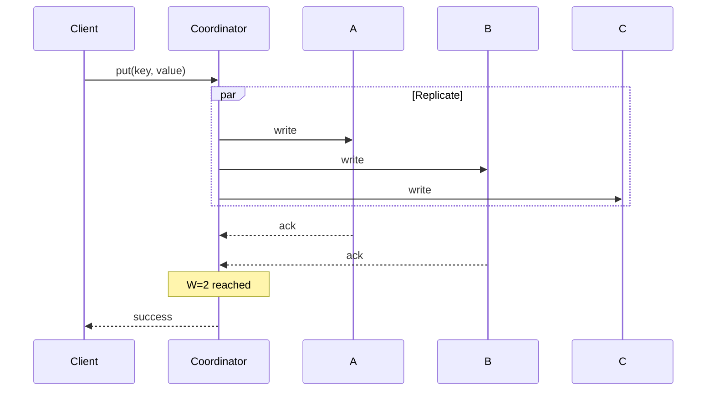
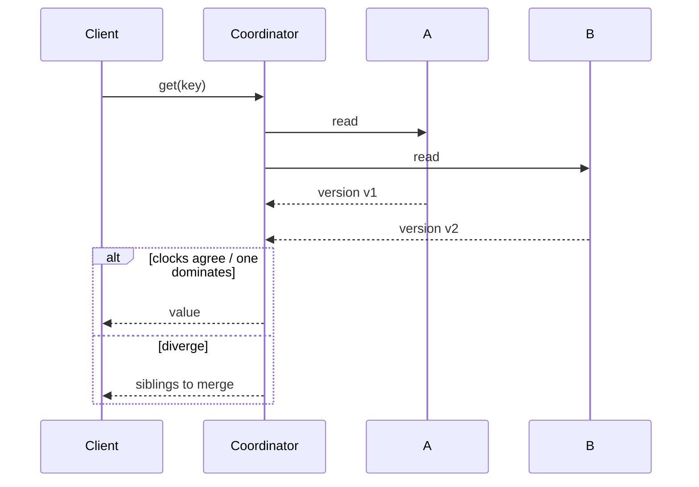

Notes from *System Design Interview*, Chapter 6 — design a distributed **key-value store** (Dynamo-inspired): `put(key, value)` / `get(key)` at massive scale with high availability.

Deeper dive on conflict detection: [Vector Clocks and Inconsistency Resolution](/en/posts/vector-clocks-and-inconsistency-resolution). Related data-model context: [NoSQL in Four Categories](/en/posts/nosql-four-categories-key-value-document-column-graph).

## Requirements (typical)

- Put / get by key
- Millions of keys, high QPS
- Highly available (AP-leaning in the classic Dynamo telling)
- Tunable consistency
- Handle node failure and network partitions

## CAP theorem (interview framing)

Under a **network partition**, you choose:

| Choice | Meaning |
|--------|---------|
| **CP** | Refuse some requests to keep a single up-to-date value |
| **AP** | Keep serving; replicas may diverge temporarily |

**CA** without partition tolerance is not a real option for distributed stores — partitions happen. Design for them.



This chapter leans **AP + eventual consistency**, with knobs (quorum) to trade latency vs freshness.

## Building blocks

### 1. Data layout

Keys hashed onto a ring ([consistent hashing](/en/posts/system-design-interview-chapter-5-design-consistent-hashing)), often with **virtual nodes**. Each key lives on a **preference list** of N replicas (the next N distinct nodes clockwise).



### 2. Replication

Write to multiple replicas for durability/availability. Replication factor `N` is a config (commonly 3 in examples).

### 3. Quorum

```text
N = replica count
W = write quorum (acks needed for a successful write)
R = read quorum (responses needed for a successful read)
```

Rule of thumb:

```text
W + R > N  →  read and write quorums overlap → strong-ish consistency for that key
W + R ≤ N  →  possible stale reads; higher availability / lower latency
```

Classic example: `N=3, W=2, R=2`.



### 4. Consistency models

| Model | Meaning |
|-------|---------|
| Strong | After a successful write, every subsequent read sees it |
| Weak | No hard guarantee on when readers see updates |
| Eventual | If writes stop, replicas converge to the same value |

AP stores usually target **eventual** consistency and let clients reconcile conflicts.

## Handling conflicts: versioning

Concurrent writes to different replicas create **siblings**. Wall-clock “last write wins” can **silently drop data** when clocks skew.

**Vector clocks** track causal history per node (`[A:2, B:1]`). On read:

- One version’s clock dominates → safe to keep that version
- Clocks diverge → return **both** versions to the client to merge (e.g. shopping-cart union)

See the [vector clocks note](/en/posts/vector-clocks-and-inconsistency-resolution) for the full cart walkthrough.



## Membership and failure detection

- Nodes learn about each other via **gossip**
- Failure detection via heartbeats / suspicion (not always perfect — distinguish temporary slowdown from death)
- Preference lists and hinted handoff keep writes available when a target replica is down



## Anti-entropy: Merkle trees

Gossip catches “who is alive.” **Merkle trees** catch “whose data drifted.”

- Each replica builds a tree of hashes over key ranges
- Compare roots → only walk mismatched branches
- Sync only the divergent ranges instead of scanning everything



Used for background repair after partitions or prolonged isolation.

## Read/write path (sketch)

**Write** (`N=3`, `W=2`)



**Read** (`R=2`)



## Other pieces worth naming

- **Sloppy quorum + hinted handoff** — write to healthy nodes temporarily; hand hints back when the intended replica returns
- **Tunable consistency** — clients or APIs choose `R`/`W` per call
- **Local persistence** — commit log + memtable / SSTable-style storage on each node (implementation detail; mention briefly)

## Interview takeaway

A Dynamo-style KV store is a **stack of techniques**, not one trick:

```text
consistent hashing
  + N-way replication
  + quorum (R, W)
  + vector clocks for concurrency
  + gossip for membership
  + Merkle trees for repair
```

Lead with CAP and API, then deepen on quorum + conflict resolution — that is where most interview discussion lands.
