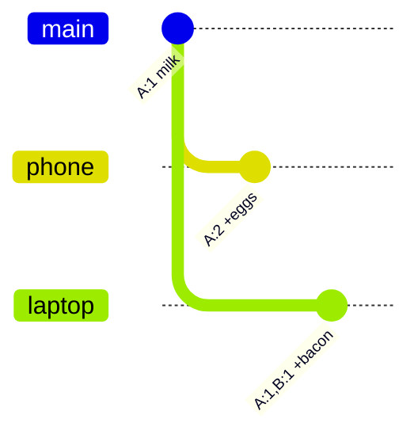

In distributed systems, two writes can happen at the "same time" on different machines — and if you resolve them with ordinary timestamps, you will quietly throw one away. Vector clocks exist so you can tell **happened-before** from **actually concurrent**, and hand real conflicts to the application instead of guessing.

## The problem: wall-clock time lies

The naive approach to concurrent writes:

1. Each replica stamps a write with `now()`
2. On conflict, keep the version with the later timestamp
3. Drop the other one ("last write wins")

That fails in production for a boring reason: **server clocks drift**.

- NTP sync is imperfect; machines can be milliseconds or seconds apart
- A write that *logically* happened first can get a *later* timestamp
- The system then keeps the wrong version and **silently loses data**

Example of silent loss:

- Replica A (clock slightly ahead) saves cart: `{ eggs }` at `T=100`
- Replica B (clock slightly behind) saves cart: `{ bacon }` at `T=99`
- Merge rule: keep A → bacon disappears
- Nobody throws an error. The item is just gone.

You cannot safely order events across machines with wall-clock time alone. You need a way to track **causality** — which writes knew about which other writes.

## The solution: vector clocks ("Git for data")

A **vector clock** does not ask "what time is it on the wall?" It asks: **"what version of history has each node seen?"**

Mental model: **Git for data**.

- Each replica is like a branch contributor
- Each write increments that node's counter
- Comparing clocks is like comparing commit histories:
  - One history contains the other → fast-forward
  - Histories branched → merge conflict

### Format

A vector clock is a map of `NodeName → VersionNumber`:

```text
[A: 1, B: 2, C: 1]
```

Rules of thumb:

- On a write handled by node `X`, increment `X`'s counter
- When replicas sync, take the **element-wise max** of the two clocks
- Omit nodes at version `0` for readability (same meaning)

This tracks causal history, not UTC.

## A real-world scenario: the shopping cart

Classic Dynamo-style example. A user has a shopping cart. The network is spotty. Writes land on different replicas before they sync.

Replicas: **A**, **B**, **C**.

### Step 1 — Create the cart (on A)

User creates an empty cart (or first item). Replica **A** handles the write.

```text
Cart: { milk }
Clock: [A: 1]
```

Only A has written. Everyone else is at zero for this key.

### Step 2 — Add eggs from the phone (on A)

Still talking to A. User adds eggs.

```text
Cart: { milk, eggs }
Clock: [A: 2]
```

`[A: 2]` **descends from** `[A: 1]`. Safe overwrite — A already knew about the previous version.

### Step 3 — Concurrent update: bacon from the laptop (on B)

The laptop hits replica **B** before B has seen A's latest cart. B only knows about an older (or empty) state — or receives a stale client context. For the interview story, treat B's write as concurrent with A's eggs update.

B adds bacon based on what it believes is current:

```text
# What B writes (concurrent with [A: 2])
Cart: { milk, bacon }
Clock: [A: 1, B: 1]
```

Why `[A: 1, B: 1]`?

- B knew about the cart after A's first write (`A: 1`)
- B had **not** seen the eggs write (`A: 2`)
- B increments its own counter → `B: 1`

You now have two versions in the system:

| Version | Cart | Vector clock |
|---------|------|----------------|
| V2 (from A) | `{ milk, eggs }` | `[A: 2]` |
| V3 (from B) | `{ milk, bacon }` | `[A: 1, B: 1]` |

Neither clock is a descendant of the other. History **branched** — exactly like two Git branches from the same commit.



### Step 4 — Sync / read across replicas

When a client reads (or replicas gossip), the system compares clocks instead of timestamps.

## Resolving the conflict

When two versions meet, compare their vector clocks component-wise.

### Outcome 1 — Direct descendant (safe overwrite)

Clock `X` **dominates** clock `Y` if every counter in `X` is ≥ the same node's counter in `Y`, and at least one is strictly greater.

Example:

```text
Old: [A: 1]
New: [A: 2]
```

`[A: 2]` dominates `[A: 1]` → New is a **direct descendant**. Keep New. Discard Old. No conflict.

Another:

```text
Old: [A: 2, B: 1]
New: [A: 2, B: 2]
```

Same story — New saw everything Old saw, plus one more write on B.

### Outcome 2 — Divergence (return siblings)

Neither clock dominates the other:

```text
[A: 2]          vs  [A: 1, B: 1]
```

- A is ahead on itself (`2 > 1`)
- B is ahead on itself (`1 > 0`)

Histories **diverged**. The database must **not** invent a merge:

- Do **not** last-write-wins on wall time
- Do **not** silently pick eggs *or* bacon
- Return **both versions** (siblings) to the client

The application merges with domain rules. For a shopping cart, union is usually correct:

```text
# Client / app merge
Version A: { milk, eggs }     clock [A: 2]
Version B: { milk, bacon }    clock [A: 1, B: 1]

Merged:    { milk, eggs, bacon }
```

Write the merge back through a coordinator (say C), which advances the clock by taking the element-wise max, then incrementing itself:

```text
Cart:  { milk, eggs, bacon }
Clock: [A: 2, B: 1, C: 1]
```

That new clock dominates both parents. Future reads can treat it as the resolved tip — until the next concurrent fork.

### Comparison cheat sheet

```text
Compare X and Y element-wise across all nodes:

1. X ≥ Y on every node, and X > Y on at least one
   → X descends from Y → keep X

2. Y ≥ X on every node, and Y > X on at least one
   → Y descends from X → keep Y

3. Otherwise
   → concurrent / divergent → return both to the app
```

## Why this matters in real systems

Vector clocks (and close cousins like dotted version vectors) show up wherever you accept **eventual consistency** and concurrent updates:

- Dynamo / Riak-style key-value stores
- Shopping carts, counters, presence, multi-device edits
- Any CRDT-adjacent design where the DB detects conflict and the app (or a merge function) resolves it

Practical takeaways:

- **Timestamps order events on one machine; they do not prove causality across machines**
- **Vector clocks detect concurrency; they do not merge business data**
- **Conflict resolution is an application concern** — union for carts, "keep both and ask the user" for docs, custom rules for money (often: avoid this model for money)

## Recap

| Approach | What it tracks | Concurrent write risk |
|----------|----------------|------------------------|
| Wall-clock LWW | `now()` | Silent data loss under clock skew |
| Vector clocks | Per-node causal history | Detects forks; client merges siblings |

If you remember one line for interviews: **vector clocks are version history, not time** — and when histories branch, the database returns both versions instead of guessing.
