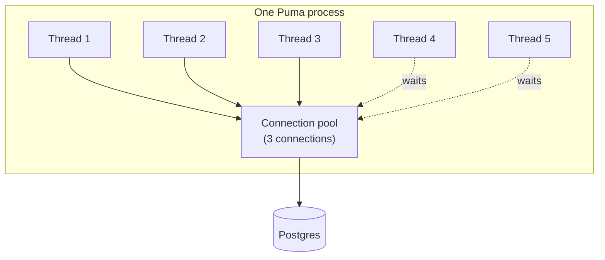

A simple mental model for how **threads**, **workers**, **processes**, and the **DB connection pool** fit together in Rails (Puma + ActiveRecord).

## The pieces

Imagine a **restaurant**.

| Word | Baby meaning | Restaurant |
|------|----------------|------------|
| **Process** | One whole kitchen building | The restaurant building |
| **Worker** | One kitchen inside that building (Puma often runs several) | A kitchen station |
| **Thread** | One cook who can take an order | A cook |
| **DB connection** | One phone line to the warehouse (Postgres) | A phone to suppliers |
| **Connection pool** | The box of phone lines that kitchen is allowed to use | Limited phone lines |

ActiveRecord does not share one phone between two cooks at the same time.  
**Each cook who talks to the DB needs their own phone.**

## Picture

```text
One Puma process (one kitchen)
├── Worker / thread pool: cook 1, cook 2, cook 3, cook 4, cook 5
└── DB connection pool:   phone, phone, phone   ← only 3 phones!

If 5 cooks all need the warehouse at once → 2 cooks wait (or explode with timeout)
```



## Tiny story

1. A user hits your Rails app → a **thread** (cook) handles the request.
2. The code does `User.find(1)` → that cook must grab a **connection** (phone) from the **pool**.
3. Query runs → cook **puts the phone back** in the box.
4. Next request can reuse that phone.

If you have **5 threads** that might all query the DB at once, you need about **5 connections** in that process’s pool (plus a little spare is nice).

## Why “not just workers/processes”?

People sometimes think:

> “I have 2 processes, so pool = 2 is enough.”

Wrong.

Each **process** has its **own** pool.

```text
2 processes × 5 threads each × need DB
= you may need ~5 connections PER process
= ~10 connections on Postgres total
```

Formula people use:

```text
DB max connections ≳  (processes × threads_per_process)  +  extras
                      (Sidekiq, console, migrations, …)
```

And in `database.yml`:

```yaml
pool: <%= ENV.fetch("RAILS_MAX_THREADS") { 5 } %>
```

That `pool` is **per process**: “how many phones this kitchen may hold.”

It should be **≥ number of threads in that process** that might use ActiveRecord at the same time.

## One sentence to remember

**Process = kitchen. Threads = cooks. Pool = phones. Every cook who talks to the DB needs a phone; size the pool for concurrent cooks, then multiply by how many kitchens (processes) you run.**
