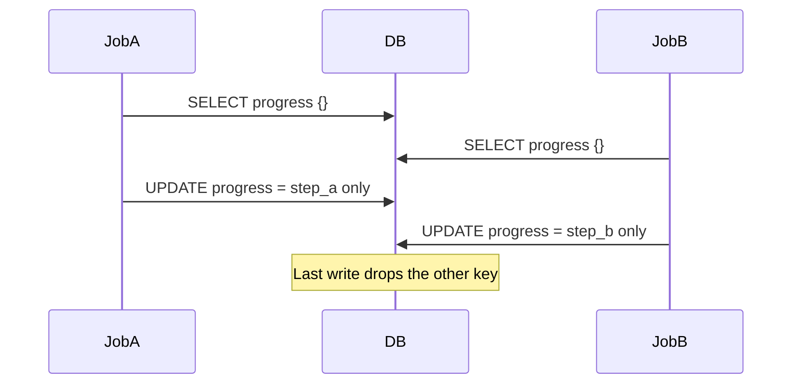

Salut, je suis **Tony Duong**, ingénieur backend Rails chez [Spacely](https://corp.spacely.co.jp/). Je travaille au quotidien sur la plateforme Spacely. Cet article retrace un problème de **lost update** qu'on a rencontré dans notre application Rails `spacely_web` : ce que c'est, comment il s'est manifesté dans notre code, comment on l'a corrigé, et comment on l'a couvert avec RSpec — y compris à quoi ressemblent les exécutions en échec et en succès.

L'histoire utilise une **colonne `json` / `jsonb`** sur une seule ligne (`WorkflowRun` + **`progress`**). Deux jobs ajoutent chacun une **clé différente** au même objet. Chez Spacely, `spacely_web` utilise **MySQL** comme base de données principale, donc le comportement d'isolation discuté ici est basé sur MySQL InnoDB.

---

## Qu'est-ce qu'un lost update ?

Un **lost update** est une anomalie de concurrence où deux transactions **lisent** toutes les deux la même ligne, **calculent** chacune une nouvelle valeur à partir de ce qu'elles ont lu, et **écrivent** toutes les deux le résultat. Dans MySQL InnoDB, le niveau d'isolation par défaut est **REPEATABLE READ** ([docs](https://dev.mysql.com/doc/refman/8.4/en/innodb-transaction-isolation-levels.html#isolevel_repeatable-read)) ; PostgreSQL est par défaut en **READ COMMITTED**. Dans les deux cas, si votre code fait un read-modify-write non-locking puis sauvegarde la valeur complète, **le dernier writer peut quand même gagner** et écraser l'autre changement.

### Pourquoi REPEATABLE READ peut quand même perdre des updates

`REPEATABLE READ` donne à chaque transaction un snapshot stable pour les **lectures non-locking**. Cela aide pour les requêtes répétées, mais cela ne sérialise **pas** automatiquement les read-modify-write au niveau application, sauf si vous utilisez des lectures locking (`FOR UPDATE`) ou une autre stratégie de contrôle de concurrence.

### Quand cela arrive-t-il ?

Typique chez nous : **des jobs parallèles** qui font chacun **read → merge d'un Hash en Ruby → `update!(json_column: …)`** sur la **même** ligne **sans** lock — surtout quand la colonne contient du **JSON structuré** et que chaque job ne fait qu'« ajouter sa propre clé ».

### Quelles sont les conséquences ?

- **Clés manquantes** dans le JSON : le merge d'un job disparaît du document stocké.
- **Bugs intermittents** : difficiles à reproduire car dépendants du timing.
- **Pas d'erreur par défaut** : contrairement à un conflit d'optimistic locking, rien ne lève d'exception sauf si vous ajoutez des vérifications — donc le monitoring peut rester vert pendant que les données sont fausses.

---

## Comment ça s'est manifesté : deux jobs, une colonne JSON, des clés différentes

Supposons que `WorkflowRun` ait une colonne **`progress`** (Rails **`json`** sur MySQL, **`jsonb`** sur PostgreSQL). Deux jobs terminent des branches de travail différentes et enregistrent chacun une clé **distincte** : `"step_a"` et `"step_b"`.

Le pattern naïf est de **lire le Hash, merger une clé, réécrire tout le JSON** :

```ruby
class WorkflowRun < ApplicationRecord
  # progress: json / jsonb — sérialisé comme un Hash en Ruby
end

# Appelé depuis le job A — ajoute sa propre clé
def record_step_done!(workflow_run_id, key, value)
  run = WorkflowRun.find(workflow_run_id)
  data = run.progress.presence || {}
  run.update!(progress: data.merge(key => value))
end
```

Partez de **`progress == {}`**. Le job A merge `{"step_a" => "done"}` et le job B merge `{"step_b" => "done"}`. Le document **devrait** contenir **les deux** clés.

Sous un lost update :

1. Le job A lit **`{}`**.
2. Le job B lit **`{}`**.
3. Le job A écrit **`{"step_a" => "done"}`**.
4. Le job B écrit **`{"step_b" => "done"}`** depuis sa copie périmée — **droppant** `step_a`.

La ligne finale ne contient **qu'une** des deux clés. (Laquelle gagne dépend de l'ordre de commit.)



---

## Comment le corriger

| Approche | Idée en Rails | Bon quand |
|----------|----------------|-----------|
| **Lock pessimiste sur la ligne** | `WorkflowRun.find(id).with_lock { reload; merge; save }` | Vous gardez le merge en Ruby ; les updates sont courts |
| **Locking optimiste** | `lock_version` + rescue `StaleObjectError` + **retry** avec une lecture fraîche | Vous voulez moins de locks exclusifs ; les jobs peuvent retry |
| **Merge JSON natif DB** | ex. PostgreSQL `UPDATE … SET progress = COALESCE(progress, '{}')::jsonb \|\| $fragment::jsonb` | Vous pouvez exprimer le changement de chaque job en **un seul** UPDATE SQL (vendor-specific ; à concevoir avec soin) |

Référence pour l'optimistic locking en Rails : [ActiveRecord::Locking::Optimistic](https://api.rubyonrails.org/classes/ActiveRecord/Locking/Optimistic.html).

Dans notre fix en production, nous avons adopté le **locking pessimiste** avec `with_lock` pour ce code path.

**Le plus petit fix dans le code applicatif** — sérialiser les merges sur la ligne parente :

```ruby
def record_step_done!(workflow_run_id, key, value)
  WorkflowRun.find(workflow_run_id).with_lock do |run|
    data = run.progress.presence || {}
    run.update!(progress: data.merge(key => value))
  end
end
```

(`with_lock` utilise `SELECT … FOR UPDATE`, donc un seul job mute `progress` à la fois. Voir la doc Rails : [ActiveRecord::Locking::Pessimistic](https://api.rubyonrails.org/classes/ActiveRecord/Locking/Pessimistic.html).)

---

## Comment le tester avec RSpec

Vous voulez un test qui :

1. **Échoue** quand les deux threads utilisent le pattern **naïf** read-merge-save **sans** `with_lock` — le JSON final a **une clé manquante** alors que les deux jobs ont tourné.
2. **Passe** une fois que **`with_lock`** (ou équivalent) entoure le merge.

### Contrôler le timing avec deux `Queue`s

- Chaque thread fait **`WorkflowRun.find`** sur la ligne, signale **`ready`**, puis se bloque sur **`go.pop`**.
- Libérez les deux avec **`2.times { go << true }`** pour que les deux merges se disputent la ligne.
- Utilisez **`threads.each(&:value)`** pour attendre et faire remonter les exceptions.

### Exemple multi-thread (à titre indicatif)

```ruby
context "when two workers add different keys to the same JSON column concurrently" do
  it "keeps both keys" do
    workflow_run = create(:workflow_run, progress: {})
    id = workflow_run.id
    ready = Queue.new
    go = Queue.new

    threads = [
      Thread.new do
        run = WorkflowRun.find(id)
        ready << true
        go.pop
        data = run.progress.presence || {}
        run.update!(progress: data.merge("step_a" => "done"))
      end,
      Thread.new do
        run = WorkflowRun.find(id)
        ready << true
        go.pop
        data = run.progress.presence || {}
        run.update!(progress: data.merge("step_b" => "done"))
      end
    ]
    2.times { ready.pop }
    2.times { go << true }
    threads.each(&:value)

    final = WorkflowRun.find(id).progress
    expect(final).to include("step_a" => "done", "step_b" => "done")
  end
end
```

Avec le pattern **buggy** ci-dessus, **`include("step_a" => …, "step_b" => …)`** **échoue** souvent parce qu'il ne reste qu'une clé. Après **`with_lock`** dans `record_step_done!` (ou équivalent), la **même expectation passe**.

Si vos specs multi-thread ne voient pas les données les unes des autres, votre suite peut nécessiter une **truncation par exemple** (ou similaire) au lieu de seulement des fixtures transactionnelles.

---

## Sortie RSpec : quand le bug est encore présent (échec)

```
Failures:

  1) WorkflowRun when two workers add different keys ... keeps both keys
     Failure/Error: expect(final).to include("step_a" => "done", "step_b" => "done")

       expected {"step_b" => "done"} to include {"step_a" => "done", "step_b" => "done"}
```

(La **clé manquante** exacte peut être `step_a` ou `step_b` selon l'ordre — l'important est qu'**un** des deux merges a été perdu.)

---

## Sortie RSpec : quand le fix marche (succès)

Après avoir entouré le merge avec **`with_lock`** (ou utilisé un retry optimiste / un merge sûr au niveau DB), l'exemple passe :

```
WorkflowRun
  when two workers add different keys to the same JSON column concurrently
    keeps both keys

Finished in 0.42 seconds (files took 2.1 seconds to load)
1 example, 0 failures
```

---

## À retenir

- **Read → merge Hash en Ruby → `update!`** sur une **colonne JSON** perd des updates concurrents quand deux jobs ajoutent chacun une **clé différente** depuis un snapshot périmé.
- Cela n'est **pas** corrigé par `increment_counter` ; utilisez **`with_lock`**, du **retry sur lignes périmées**, ou un merge en une seule instruction **spécifique à la base** que vous avez vérifié sous concurrence.
- **Deux `Queue`s** et **`threads.each(&:value)`** reproduisent la race dans les specs ; ajustez les **fixtures** si les threads ne voient pas les commits l'un de l'autre.

---

Nous recrutons des ingénieurs chez Spacely. Si ce genre de travail backend vous intéresse, jetez un œil à notre [page recrutement](https://corp.spacely.co.jp/recruit/).

---
*Traduit par Claude*
