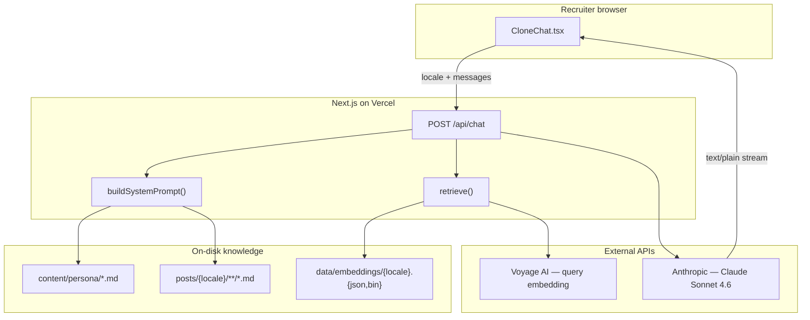
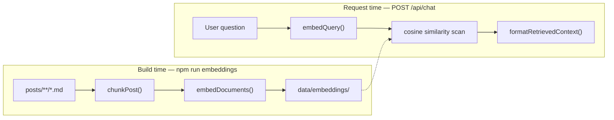
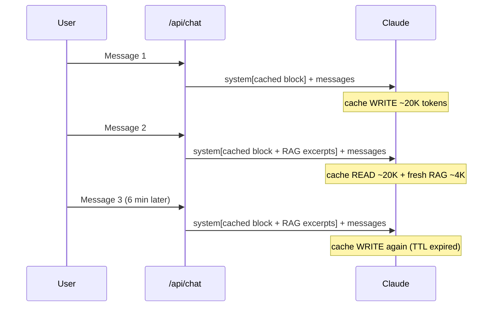

> 🤖 **Essayez en direct :** ouvrez la [page À propos](/fr/about#ask-my-clone) et discutez avec mon clone IA dans la barre latérale. Posez des questions sur ma stack, ce que je recherche, ou ce que j'ai écrit sur Kafka — puis lisez la suite pour voir exactement comment ça fonctionne.

Les recruteurs qui atterrissent sur ce blog veulent souvent une réponse rapide : *Quels postes vous intéressent ? Quelle est votre stack ? Avez-vous écrit sur X ?* L'e-mail fonctionne, mais c'est lent. Un widget de chat qui parle comme moi, en français, anglais ou japonais, me semblait être la bonne UX.

Cet article est une plongée dans la construction de ce chatbot — pas un tutoriel générique « comment créer un chatbot », mais un compte rendu honnête de l'architecture, des bibliothèques et des compromis derrière une fonctionnalité qui tourne entièrement dans une app Next.js, avec Markdown comme source de vérité.

## De quoi il s'agit (et de quoi il ne s'agit pas)

Le **AI Clone** est un chat en streaming sur la page À propos (`/[locale]/about#ask-my-clone`). Il répond à la première personne en tant que Tony, en s'appuyant sur :

1. Un **fichier persona** soigneusement rédigé (`content/persona/{locale}.md`) — faits du CV, coordonnées, ce que je recherche.
2. Un **résumé des articles du blog** — titre, date, catégorie, tags et extrait pour chaque article dans la locale courante.
3. Une **récupération RAG** — texte intégral des sections d'articles les plus pertinentes pour la question de l'utilisateur.

Ce n'est **pas** le chat visiteur en temps réel (la bulle flottante en bas à droite). Cette fonctionnalité est un système WebSocket Rails + ActionCable distinct, pour la messagerie humain-à-humain. L'AI Clone est sans état, alimenté par un LLM, et lit des fichiers sur le disque.



L'ensemble de la fonctionnalité tient dans environ six fichiers source plus le contenu Markdown. Pas de Redis, pas de Postgres pour l'historique du chat, pas de workers en arrière-plan au moment de la requête.

## Le cycle de vie d'une requête

Quand quelqu'un appuie sur Entrée, voici ce qui se passe :

```
Browser                    Next.js API route              Anthropic / Voyage
-------                    -----------------              -----------------
CloneChat posts
{ locale, messages }
        ─────────────────► Zod validates body
                           retrieve(locale, lastUserMsg) ──► embed query (Voyage)
                           buildSystemPrompt(locale)
                             ├─ readPersona (fs)
                             ├─ formatPostsDigest (blog.ts)
                             └─ formatTodos (data/todos.json)
                           formatRetrievedContext(top-k chunks)
                           messages.stream({
                             system: [cached block, RAG block],
                             messages
                           }) ─────────────────────────────►
                           ◄────────────────────────────── text deltas
        ◄───────────────── ReadableStream (text/plain)
TextDecoder + setState
ReactMarkdown re-renders
```

Trois propriétés à retenir :

- **La clé API n'atteint jamais le navigateur.** Le client ne parle qu'à `/api/chat` ; les identifiants Anthropic et Voyage vivent dans les variables d'environnement du serveur.
- **Le contexte est assemblé à chaque requête.** Le persona et le résumé sont lus depuis le disque à chaque appel (pas besoin de redémarrer quand vous modifiez `content/persona/en.md`).
- **Les réponses sont streamées.** L'interface lit le corps de la réponse fetch de façon incrémentale et re-rend la bulle assistant au fur et à mesure de l'arrivée des tokens.

## Couche 1 : Fichiers persona — les faits que le blog n'écrit jamais

Les articles du blog capturent *ce à quoi j'ai pensé*. Ils disent rarement « mon e-mail est X » ou « je cherche des postes en remote en Europe ». Les recruteurs posent des questions factuelles ; le fichier persona y répond.

Chaque locale a son propre brief Markdown à `content/persona/{fr,en,ja}.md` :

```markdown
## Quick facts

- **Name**: Tony Duong
- **Location**: Toulouse, France
- **Email**: tony.duong.102@gmail.com
- **Languages spoken**: French (native), English (fluent), Japanese (business)
```

Le serveur le lit de façon synchrone :

```typescript
function readPersona(locale: Locale): string {
  const file = path.join(personaDir, `${locale}.md`);
  if (fs.existsSync(file)) return fs.readFileSync(file, 'utf8');
  return fs.readFileSync(path.join(personaDir, `${defaultLocale}.md`), 'utf8');
}
```

**Pourquoi Markdown, et pas une ligne en base de données ?** Je versionne déjà le contenu en Markdown dans ce dépôt. Éditer un fichier est sans friction, diff-friendly, et fonctionne hors ligne. Pour un site personnel avec un seul auteur, une table CMS serait de l'infrastructure sans bénéfice.

**Pourquoi séparer des articles du blog ?** Mélanger des faits orientés recruteurs dans des mémos quotidiens diluerait les deux. Le persona est le contrat : *voici ce que le bot a le droit d'affirmer comme fait.*

## Couche 2 : Résumé des articles — la couverture sans exploser la fenêtre de contexte

Pour les questions « d'ambiance » — *sur quoi avez-vous travaillé ? quels sujets abordez-vous ?* — le bot a besoin d'une carte de tout le blog, pas des corps d'articles complets.

`formatPostsDigest()` appelle `getAllPosts(locale)` depuis `src/lib/blog.ts`, qui parcourt `posts/{locale}/`, parse le frontmatter YAML avec **gray-matter**, et renvoie les métadonnées. Chaque article devient une ligne :

```
- 2026-06-11 ・ note/tech ・ Kafka vs RabbitMQ [system-design, kafka, rabbitmq] — Hello Interview on choosing between Kafka and RabbitMQ…
```

Avec ~300 articles par locale, ce résumé fait environ 15–20K tokens — volumineux, mais gérable avec le prompt caching (voir plus bas).

| Approche | Tokens (300 articles) | Peut lister les sujets ? | Peut citer un paragraphe ? |
|---|---|---|---|
| Corps complets des articles dans le prompt | 200K+ | Oui | Oui |
| Résumé (titre + extrait seulement) | ~20K | Oui | Non — paraphrase de l'extrait seulement |
| Résumé + RAG (ce projet) | ~20K stable + ~4K récupérés | Oui | Oui, pour les sections correspondantes |

Le résumé répond à la *couverture*. Le RAG répond à la *profondeur*. Garder les deux était délibéré — la récupération est mauvaise pour « listez tout ce que j'ai jamais écrit sur les bases de données ».

## Couche 3 : RAG — texte intégral des articles, seulement quand c'est pertinent

Quand le blog a dépassé ~80 articles, l'approche résumé seule a atteint un plafond. Un recruteur demandant *« qu'avez-vous conclu sur les files de messages ? »* pouvait obtenir le titre de l'article et un extrait d'une phrase, mais pas l'analyse réelle.

Le RAG (retrieval-augmented generation) corrige cela sans fourrer chaque corps d'article dans chaque requête.

### Deux horloges : build offline, serve online



**Build time** (`npm run embeddings`) :

1. Lire le corps Markdown brut de chaque article (`getRawPostBody`).
2. Découper en chunks aux titres `##` (`src/lib/rag-chunk.ts`).
3. Fenêtrer les sections trop grandes (~4000 caractères, chevauchement de 400 caractères).
4. Embedder chaque chunk avec **Voyage AI** (`voyage-3.5`, multilingue).
5. Écrire `data/embeddings/{locale}.json` (métadonnées + texte des chunks) et `{locale}.bin` (vecteurs Float32 packés).

**Request time** :

1. Embedder le dernier message de l'utilisateur (`embedQuery`).
2. Similarité cosinus en force brute contre l'index pré-construit.
3. Prendre les 8 meilleurs chunks, les formater dans un second bloc du system prompt.

Les fichiers d'index sont **commités dans le dépôt**. Les déploiements n'ont pas besoin d'une clé Voyage pour *lire* les vecteurs — seulement pour embedder les nouvelles requêtes au runtime (~un appel API bon marché par message).

### Stratégie de chunking

Les articles sur ce blog sont rédigés en blocs `## Section`. Découper sur les titres h2 donne des chunks sémantiquement cohérents — une idée par section. Le contenu avant le premier titre devient un chunk « intro ».

Pour l'embedding, chaque chunk est préfixé avec le titre et le heading pour que des listes à puces laconiques portent quand même le signal du sujet :

```
Kafka vs RabbitMQ › The technical trade-offs

### Ordering
- RabbitMQ queues are strictly ordered…
```

### Pourquoi une recherche en force brute, pas pgvector ?

À ~300 articles → quelques milliers de chunks, un scan linéaire sur des vecteurs Float32 normalisés prend moins d'une milliseconde en Node. Une base vectorielle hébergée ajouterait :

- Un autre service à déployer et surveiller
- Du connection pooling et de l'auth
- Un pipeline de ré-indexation lié aux déploiements

La fonction `retrieve()` est volontairement interchangeable — si le corpus atteint des dizaines de milliers de chunks, sqlite-vec ou un index ANN peut se placer derrière la même interface. Pour un blog personnel, YAGNI gagne.

> 💡 **sqlite-vec, index ANN, YAGNI — en bref**
>
> - **sqlite-vec** : extension de SQLite qui stocke et recherche des vecteurs (embeddings) directement dans un fichier `.db`. Comme SQLite, pas de serveur séparé — pratique quand le corpus grossit mais qu'on veut éviter Pinecone ou un autre service hébergé.
> - **Index ANN** (*Approximate Nearest Neighbor*, « plus proche voisin approximatif ») : structure de données (HNSW, IVF, etc.) qui trouve les vecteurs les plus similaires à une requête **sans** comparer la requête à *tous* les chunks un par un. Utile quand le scan linéaire actuel devient trop lent (dizaines ou centaines de milliers de chunks).
> - **YAGNI** (*You Ain't Gonna Need It*, « tu n'en auras pas besoin ») : principe de développement — n'ajoute pas une complexité (base vectorielle, index ANN, microservice) tant que le problème ne se pose pas vraiment. Ici, quelques milliers de chunks se scannent en moins d'une milliseconde ; l'infrastructure lourde peut attendre.

### Dégradation gracieuse

Si `data/embeddings/` est absent ou si Voyage échoue, `retrieve()` renvoie `[]` et le chat retombe sur persona + résumé seulement. Rien ne casse ; les réponses sont juste moins détaillées. Cela a permis de merger le RAG avant que le premier index soit généré en CI.

## Assembler le system prompt

`buildSystemPrompt(locale)` dans `src/lib/clone-context.ts` fusionne tout en une seule chaîne :

```
[role line — in target language]
[reply language instruction — in target language]

# Style
- Talk in first person…
- Never invent employment history…

# Recruiter brief (English)
{persona markdown}

# Goals & learning list (optional, from data/todos.json)
{todo items}

# Blog posts index
{digest — one line per post}
```

Les lignes de rôle par locale sont écrites *dans* la langue cible. Les modèles suivent les instructions plus fiablement quand l'instruction de langue elle-même est en français/japonais, pas `"Respond in ja"`.

Après le RAG, un **second** bloc system peut s'ajouter :

```
# Relevant excerpts (full text, retrieved for this question)
### Kafka vs RabbitMQ — The technical trade-offs
(source: /posts/kafka-vs-rabbitmq)

{full section markdown}
```

La route API envoie deux blocs system à Claude :

```typescript
const system = [
  { type: 'text', text: stableSystem, cache_control: { type: 'ephemeral' } },
  ...(retrievedContext ? [{ type: 'text', text: retrievedContext }] : []),
];
```

Le bloc stable est mis en cache ; le bloc RAG varie par question et se place *après* le point de rupture du cache.

## La route API en streaming

`src/app/api/chat/route.ts` est un Route Handler Next.js — pas une Server Action.

| Option | Streaming | Filesystem | Callable from curl |
|---|---|---|---|
| Server Action | Awkward (single payload) | Possible with workarounds | No |
| Route Handler | Native `ReadableStream` | Yes (`fs` on Node runtime) | Yes |

La validation d'entrée utilise **Zod** :

```typescript
const BodySchema = z.object({
  locale: z.string().refine(hasLocale),
  messages: z.array(z.object({
    role: z.enum(['user', 'assistant']),  // no client-supplied system role
    content: z.string().min(1).max(4000),
  })).min(1).max(40),
});
```

Notamment, il n'y a **pas de rôle `system`** dans les messages client. Laisser le navigateur envoyer des system prompts serait un vecteur d'injection de prompt.

Le handler streame les deltas texte Anthropic dans une réponse plain-text :

```typescript
for await (const event of messageStream) {
  if (event.type === 'content_block_delta' && event.delta.type === 'text_delta') {
    controller.enqueue(encoder.encode(event.delta.text));
  }
}
```

Du `text/plain` simple au lieu de Server-Sent Events — un protocole de moins à déboguer ; les deltas sont déjà du texte brut.

`export const runtime = 'nodejs'` est explicite car `clone-context.ts` utilise `fs.readFileSync`. Le runtime Edge n'a pas de filesystem.

## L'interface du chat

`CloneChat.tsx` est un composant client sur la page À propos. Il :

1. Garde `messages` dans l'état React (serveur sans état — historique complet envoyé à chaque requête).
2. POST vers `/api/chat` avec `{ locale, messages }`.
3. Lit `res.body.getReader()` et ajoute les chunks décodés au message assistant.
4. Rend les réponses assistant avec **react-markdown** + **remark-gfm** (tableaux, barré, listes de tâches).

Streamer du Markdown côté client signifie re-parser des chaînes partielles à chaque delta. Pour de courtes réponses de chat, c'est acceptable ; pour des sorties longues, on bufferiserait jusqu'à une limite de paragraphe.

Les bulles utilisateur sont en texte brut ; les bulles assistant ont le style Markdown complet (liens en nouvel onglet, blocs de code, listes).

## Bibliothèques et pourquoi chacune

| Bibliothèque | Rôle | Pourquoi celle-ci, pas autre chose |
|---|---|---|
| **@anthropic-ai/sdk** | Streamer les réponses Claude | SDK officiel avec itérateur de streaming natif et support du prompt cache |
| **zod** | Valider le corps POST | Déjà dans la stack ; intercepte les payloads malformés/volumineux avant d'atteindre l'API |
| **gray-matter** | Parser le frontmatter des articles | Même parseur que le renderer du blog — une seule source de vérité pour les métadonnées |
| **react-markdown** + **remark-gfm** | Rendre les réponses assistant | Rendu React sûr (pas de `dangerouslySetInnerHTML` dans le chat) ; GFM correspond à la rédaction du blog |
| **Voyage AI** (fetch, pas de SDK) | Embeddings au build et à la requête | Partenaire recommandé par Anthropic ; `voyage-3.5` est multilingue (corpus fr/en/ja, récupération cross-locale) |
| **tsx** | Exécuter `scripts/build-embeddings.ts` | Script d'ingestion TypeScript hors runtime Next.js |
| **server-only** | Protéger `clone-context.ts`, `rag.ts` | Empêche les imports client accidentels de modules utilisant `fs` |

Pas de LangChain, pas de Vercel AI SDK, pas de client de base vectorielle. La boucle de récupération fait ~30 lignes de produits scalaires. La boucle de streaming fait ~15 lignes. Les dépendances que vous n'importez pas sont celles que vous ne déboguez pas à 23h.

## Décisions de conception vs alternatives

Ce tableau est le résumé honnête « pourquoi pas X ? ». Vos contraintes peuvent différer — un produit avec 10K utilisateurs quotidiens inverserait plusieurs de ces choix.

| Décision | Ce que j'ai choisi | Ce que j'ai évité | Pourquoi |
|---|---|---|---|
| **Backend** | Route API Next.js | Service Rails/Python séparé | Un seul déploiement sur Vercel, pas de CORS, pas de seconde frontière d'auth |
| **Stockage de connaissances** | Fichiers Markdown + index d'embeddings commité | Postgres + pgvector | Le contenu vit déjà dans git ; ~3K chunks n'ont pas besoin d'une base de données |
| **Récupération** | Cosinus en force brute sur binaire Float32 | Pinecone, Weaviate, OpenSearch | Sub-ms à cette échelle ; zéro ops |
| **Stratégie de contexte** | Hybride : résumé (couverture) + RAG (profondeur) + persona (faits) | Prompt corpus complet OU RAG pur | Le résumé liste les sujets que le RAG ne peut pas ; le persona contient des faits absents des articles |
| **Transport des réponses** | `ReadableStream` de `text/plain` | SSE, WebSocket | Chemin le plus simple des deltas Anthropic vers le reader fetch |
| **État de conversation** | Le client envoie l'historique complet à chaque tour | Session DB côté serveur | API sans état, pas d'écritures DB, refresh = nouveau départ |
| **Rendu Markdown** | `react-markdown` côté client | Chunks HTML rendus côté serveur | Streamer du HTML proprement est pénible ; les réponses de chat sont courtes |
| **Modèle** | Claude Sonnet 4.6 | Haiku (moins cher), Opus (plus intelligent) | Bon équilibre qualité/coût pour des réponses orientées recruteurs |
| **Prompt caching** | `cache_control: ephemeral` sur le bloc system stable | Renvoyer le prompt complet au prix plein à chaque tour | Un system prompt de ~20K tokens serait coûteux sans cache |

## Prompt caching — ce qui rend le grand résumé abordable

Le system prompt stable fait ~15–20K tokens. Sans cache, chaque message d'une conversation multi-tours re-payerait le coût d'entrée complet pour ce préfixe.

Le prompt caching d'Anthropic traite le bloc system comme un préfixe cacheable :

- **Premier message** d'une session : cache **write** (~1,25× le prix d'entrée pour les tokens mis en cache).
- **Tours suivants** dans les ~5 minutes : cache **read** (~0,1× le prix d'entrée).
- Le **bloc RAG** se place après le marqueur de cache — il change à chaque question, donc il n'est pas mis en cache.

Piège critique : le caching est une **correspondance de préfixe**. Un octet de dérive dans le bloc stable invalide le cache. Ne jamais interpoler `new Date()` ou des IDs de session dans `buildSystemPrompt()`.



Pour le faible trafic recruteur d'un blog personnel, c'est essentiellement gratuit. Haiku 4.5 réduirait encore le coût si le volume augmentait.

## Comportement multilingue

Trois locales : `fr`, `en`, `ja`. Chacune a :

- Son propre fichier persona
- Son propre répertoire d'articles (`posts/{locale}/`)
- Son propre index d'embeddings

La locale de l'UI contrôle la **langue de réponse** (instructions dans le system prompt). Le résumé tire les articles de cette locale uniquement. Les embeddings multilingues de Voyage signifient qu'une question en français peut quand même récupérer des sections d'articles anglais pertinents si les index étaient cross-liés — aujourd'hui ils sont par locale, ce qui correspond à la structure du blog (des traductions existent mais ne sont pas toujours 1:1).

Ajouter une quatrième locale signifie : étendre `i18n-config.ts`, ajouter `content/persona/es.md`, les chaînes du dictionnaire, et optionnellement `posts/es/` + lancer `npm run embeddings -- es`.

## Forme des coûts et de l'exploitation

| Quand | Ce qui coûte de l'argent | Déclencheur approximatif |
|---|---|---|
| Build | Embeddings de documents Voyage | Nouveaux articles modifiés → `npm run embeddings` |
| Serve | Embedding de requête Voyage | Chaque message utilisateur |
| Serve | Entrée + sortie Anthropic | Chaque message utilisateur |
| Serve | Écriture du prompt cache | Premier message après inactivité / expiration TTL |
| Serve | Lecture du prompt cache | Messages de suivi dans les ~5 min |

Pas de GPU toujours actif, pas de facture de base vectorielle, pas de re-run d'embeddings au déploiement (l'index est dans git).

Le cache d'embeddings incrémental (`data/embeddings/.cache.json`, gitignored) saute les articles inchangés par hash de contenu — le coût Voyage quotidien reste proche de zéro sauf si vous avez beaucoup écrit.

## Personnaliser le bot

| Objectif | Où éditer |
|---|---|
| Mettre à jour les faits CV, contact, recherches | `content/persona/{locale}.md` |
| Changer le ton, les refus, les règles de longueur | Bloc `# Style` dans `src/lib/clone-context.ts` |
| Changer le modèle ou les max tokens | `src/app/api/chat/route.ts` |
| Chaînes UI, exemples de prompts | Bloc `chat` dans `src/dictionaries/{fr,en,ja}.json` |
| Reconstruire l'index de recherche après de nouveaux articles | `npm run embeddings` |
| Ajuster la taille / le chevauchement des chunks | `src/lib/rag-chunk.ts` |
| Changer le nombre de sections récupérées | Défaut de `retrieve(locale, query, k)` dans `src/lib/rag.ts` |

Les changements au persona et au résumé prennent effet à la prochaine requête — pas de rebuild. Les nouveaux articles nécessitent un rafraîchissement automatique du résumé (lecture au runtime) plus un rebuild d'embeddings pour la profondeur RAG.

## Ce que je ferais différemment à grande échelle

Cette architecture est calibrée pour un blog personnel à faible trafic et contenu natif Markdown. Signaux que vous la dépasseriez :

- **500+ articles, le résumé seul dépasse ~50K tokens** → réduire le résumé aux « N derniers articles » ou à un sous-ensemble filtré par tag ; s'appuyer davantage sur le RAG.
- **Milliers de sessions concurrentes** → stockage de conversation côté serveur, rate limiting, détection d'abus.
- **Dizaines de milliers de chunks** → remplacer le scan en force brute par sqlite-vec ou un index ANN hébergé derrière `retrieve()`.
- **Exigences strictes de citation** → ajouter des URLs sources explicites dans les chunks récupérés (partiellement là via `/posts/{slug}`) et post-traiter pour vérifier les affirmations contre les chunks uniquement.

Pour là où en est ce site aujourd'hui — quelques centaines d'articles, une poignée de conversations recruteur par semaine — l'approche Markdown-in, stream-out, RAG file-backed est la bonne quantité de machinerie.

## Carte des fichiers

```
content/persona/
  en.md, fr.md, ja.md          ← recruiter brief (edit this)

posts/{locale}/**/*.md         ← blog source (frontmatter + body)

data/embeddings/
  {locale}.json                ← chunk metadata + text
  {locale}.bin                 ← packed Float32 vectors

src/
  app/api/chat/route.ts        ← streaming POST handler
  app/[locale]/about/page.tsx  ← embeds CloneChat
  components/CloneChat.tsx     ← client UI
  lib/
    clone-context.ts           ← system prompt assembly
    rag.ts                     ← retrieval
    rag-chunk.ts               ← Markdown chunking
    voyage.ts                  ← embeddings client
    blog.ts                    ← getAllPosts, getRawPostBody

scripts/build-embeddings.ts    ← offline ingestion
```

## Essayez vous-même

Si vous exécutez ce dépôt en local :

```bash
cp .env.local.example .env.local
# Add ANTHROPIC_API_KEY (required)
# Add VOYAGE_API_KEY (optional — needed for RAG query embedding + building index)

npm run dev
# Open http://localhost:3000/en/about#ask-my-clone
```

Sans `ANTHROPIC_API_KEY`, l'UI s'affiche mais l'API renvoie 500. Sans `VOYAGE_API_KEY` ou fichiers d'index, le chat fonctionne sur persona + résumé seulement.

Pour inspecter ce que Claude voit réellement :

```typescript
// scripts/dump-prompt.ts
import { buildSystemPrompt } from '@/lib/clone-context';
console.log(buildSystemPrompt('en'));
```

Lancez avec `npx tsx scripts/dump-prompt.ts`. Lire le prompt assemblé est l'étape de débogage à plus fort levier pour tout système piloté par prompt.

---

L'AI Clone est une petite fonctionnalité à la forme claire : **Markdown en entrée, contexte récupéré au milieu, texte streamé en sortie.** Pas de base vectorielle, pas de second backend, pas de base de conversation — juste des fichiers, un index pré-construit, et deux appels API par message. Pour un blog qui traite déjà le contenu comme du code, cela ressemblait moins à un projet chatbot qu'à une autre façon de lire le même dépôt.

---

> 🌐 *Traduit par Claude*
