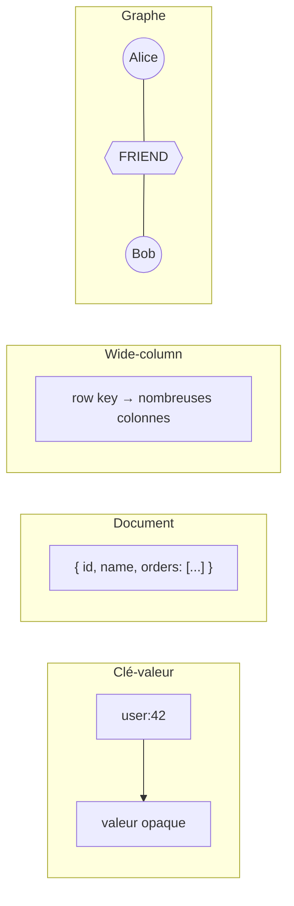
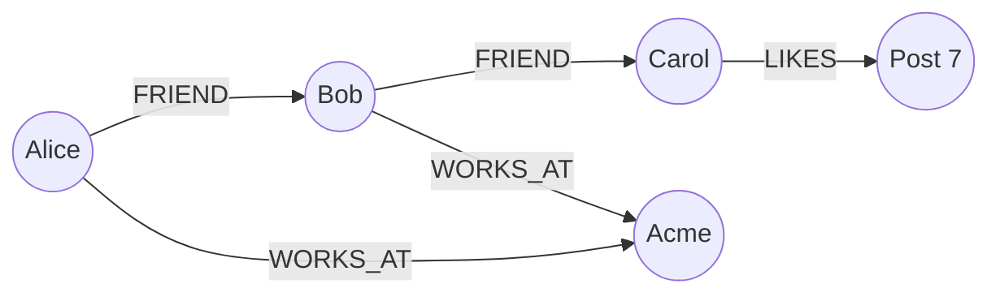

Notes tirées de *System Design Interview* — les bases NoSQL sont souvent regroupées en **quatre catégories** : stores clé-valeur, document, colonne (wide-column) et graphe. Même étiquette « non relationnel » ; des modèles d’accès très différents.



## 1. Stores clé-valeur

**Idée :** un dictionnaire géant. Tu donnes une clé, tu récupères une valeur. C’est l’API principale.

| | |
|---|---|
| **Forces** | Lookups très rapides, scaling simple, idéal cache/session |
| **Faiblesses** | Peu ou pas de requêtes sur les champs *dans* la valeur |
| **Exemples** | Redis, DynamoDB (PK simple), Memcached, etcd |

```python
# Modèle mental façon Redis
SET session:abc123 '{"userId":42,"cart":["sku-9"]}'
GET session:abc123
# → {"userId":42,"cart":["sku-9"]}

# Tu ne demandes en général PAS :
# « toutes les sessions dont le panier contient sku-9 »
```

**Quand l’utiliser :** sessions, feature flags, rate limits, caches, paniers indexés par ID.

## 2. Stores document

**Idée :** les valeurs sont des documents structurés (souvent JSON/BSON). Tu peux interroger *à l’intérieur*.

| | |
|---|---|
| **Forces** | Schéma flexible, données imbriquées, requêtes/index riches |
| **Faiblesses** | Joins entre documents maladroits ; dérive de schéma si mal gérée |
| **Exemples** | MongoDB, CouchDB, Firestore |

```javascript
// MongoDB
db.users.insertOne({
  _id: "u42",
  name: "Tony",
  address: { city: "Paris", country: "FR" },
  tags: ["backend", "systems"]
})

db.users.find({ "address.city": "Paris", tags: "systems" })
```

**Vs clé-valeur :** les deux peuvent stocker du JSON, mais les documents permettent d’indexer et de filtrer des champs. Le clé-valeur traite surtout la valeur comme opaque.

**Quand l’utiliser :** profils utilisateurs, CMS, catalogues produits, payloads d’événements aux champs évolutifs.

## 3. Stores colonnes (wide-column)

**Idée :** données organisées par **row key + colonnes**. Fort sur les tables sparses, écritures massives, accès orientés temps. (Ce n’est pas la même chose que les moteurs OLAP « columnaires » type ClickHouse — même mot, autre métier.)

| | |
|---|---|
| **Forces** | Débit d’écriture énorme, tables sparses, scans par plage de clé |
| **Faiblesses** | Modélisation pilotée par le chemin d’accès ; requêtes ad hoc difficiles |
| **Exemples** | Cassandra, HBase, ScyllaDB, Bigtable |

```text
Row key: user:42
  profile:name     → "Tony"
  profile:email    → "tony@example.com"
  metrics:2026-08-01 → 120   # sparse : beaucoup de jours absents
  metrics:2026-08-02 → 95
```

```cql
-- Cassandra : concevoir les tables pour la requête dont tu as besoin
CREATE TABLE page_views (
  page_id text,
  day date,
  views counter,
  PRIMARY KEY (page_id, day)
);

SELECT views FROM page_views
WHERE page_id = '/blog/nosql'
  AND day >= '2026-07-01';
```

**Vs document :** le document = « un objet imbriqué par entité ». Le wide-column = « beaucoup de cellules nommées sous une clé », souvent optimisé pour l’écriture et les plages de clés.

**Quand l’utiliser :** métriques IoT, activity feeds, timelines de messagerie, logs multi-tenant à fort débit.

## 4. Stores graphe

**Idée :** **nœuds** et **relations** de première classe. Les requêtes marchent sur les arêtes — amis d’amis, fraudes, recommandations.

| | |
|---|---|
| **Forces** | Requêtes multi-sauts naturelles et rapides |
| **Faiblesses** | Surdimensionné pour du CRUD simple ; shard global du graphe difficile |
| **Exemples** | Neo4j, Amazon Neptune, JanusGraph |



```cypher
-- Neo4j : qui sont les amis d'amis d'Alice ?
MATCH (a:Person {name:'Alice'})-[:FRIEND*2]->(fof)
WHERE NOT (a)-[:FRIEND]->(fof) AND a <> fof
RETURN DISTINCT fof.name
```

Dans une DB document, on embed souvent des IDs d’amis puis on fan-out N requêtes. Le graphe fait de la *relation* le modèle de données.

**Quand l’utiliser :** graphes sociaux, knowledge graphs, recommandations, hiérarchies de droits, détection de fraude.

## Comparaison rapide

| Catégorie | Unité de lookup | Meilleure question | Faible pour |
|---|---|---|---|
| **Clé-valeur** | `clé → valeur` | « Donne-moi cet ID » | « Trouve par attribut » |
| **Document** | document JSON | « Users à Paris avec le tag X » | Joins multi-sauts profonds |
| **Wide-column** | row key + colonnes | « Scan des métriques dans le temps » | Analytique ad hoc flexible |
| **Graphe** | nœud + arête | « Comment A et B sont-ils liés ? » | Lookups par clé seuls |

## Une règle simple

Choisir le store qui colle au **chemin d’accès principal** :

1. **Par ID uniquement** → clé-valeur
2. **Par champs imbriqués / docs flexibles** → document
3. **Par partition key + temps/plage, écritures massives** → wide-column
4. **Par relations / chemins multi-sauts** → graphe

Beaucoup de systèmes réels les mélangent (cache Redis + documents MongoDB + Neo4j pour les recommandations). Ce sont des lentilles de design, pas des religions exclusives.
