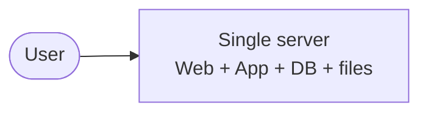
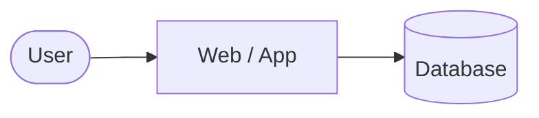
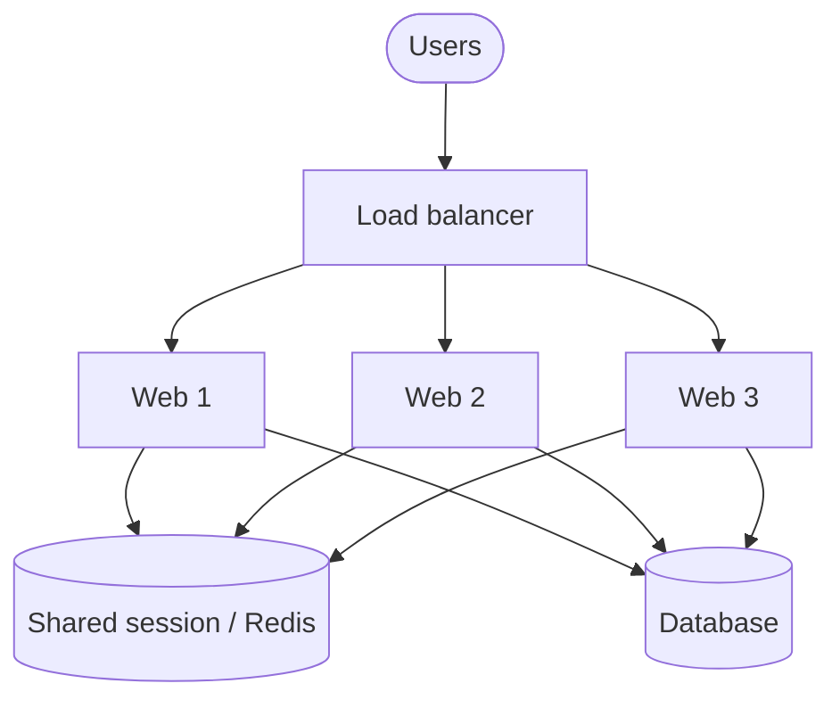
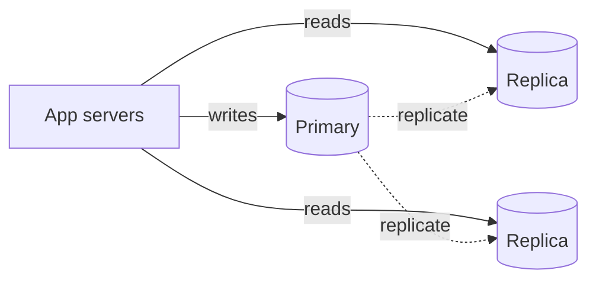
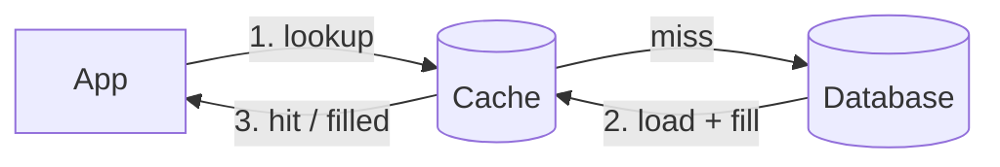
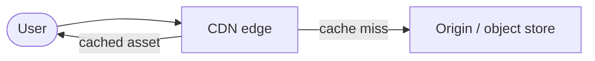
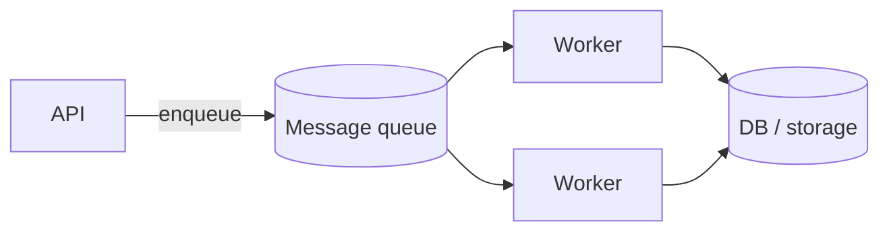
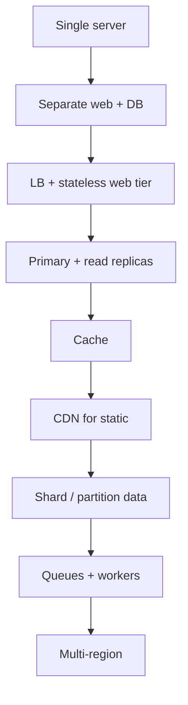

Notes tirées de *System Design Interview – An Insider's Guide* (Alex Xu), chapitre 1. Le chapitre est un tour d'horizon du **scaling vertical → horizontal** : on commence avec une seule machine, puis on ajoute les briques nécessaires au fur et à mesure que le trafic augmente.

## Commencer simple : un seul serveur

Tout sur une machine — web, app, base de données, fichiers statiques.

Ça convient pour un prototype. Ça casse quand :

- CPU / mémoire / disque sont saturés
- Un crash de processus fait tomber tout le produit
- On ne peut pas déployer sans downtime

## Séparer la couche web et la couche données

Premier vrai découpage :

- **Serveurs web/app** — traitement des requêtes stateless
- **Base de données** — état durable

Pourquoi c'est important : on peut scaler et faire échouer chaque couche indépendamment. L'app parle à la DB via le réseau ; la DB n'est plus « juste un dossier sur la même machine ».

## Scaling vertical vs horizontal

| Approche | Idée | Limite |
|----------|------|--------|
| **Vertical** (scale up) | Plus de CPU/RAM/disque sur une machine | Plafond matériel, single point of failure, coûteux |
| **Horizontal** (scale out) | Plus de machines | Nécessite load balancing, design shared-nothing, complexité opérationnelle |

Réflexe par défaut en entretien à l'échelle internet : **scale out**, garder les serveurs **stateless**.

## Load balancer

Placer un load balancer devant plusieurs serveurs web.

- Les clients frappent un seul VIP / hostname
- Le LB répartit le trafic (round-robin, least connections, etc.)
- Un serveur web tombe → le LB arrête de lui envoyer du trafic

La couche web ne doit stocker **aucune session sur le disque d'une machine précise**. Les sessions vont dans un store partagé (Redis, DB) pour que n'importe quel serveur puisse traiter n'importe quelle requête.

## Réplication de base de données

Pattern typique : **un primary (écritures) + read replicas**.

- Écritures → primary
- Lectures → replicas
- Le replication lag est réel — concevoir en conséquence (read-your-writes quand nécessaire)

Le failover du primary est un problème ops ; le mentionner en entretien même si on ne conçoit pas toute l'histoire HA.

## Cache

La base de données est coûteuse pour les lectures chaudes. Ajouter un cache (Redis/Memcached) devant les requêtes lentes ou les résultats calculés.

Règles pratiques :

- Cacher les données **chaudes** avec un TTL / une stratégie d'invalidation claire
- Surveiller le **cache stampede** et le **thundering herd**
- Préférer cache-aside sauf raison pour du write-through

## CDN pour le contenu statique

Images, JS, CSS, vidéos → nœuds edge CDN proches des utilisateurs.

- Latence réduite
- Moins de charge sur l'origin
- Invalidation de cache / URLs versionnées quand les assets changent

## Couche web stateless (encore, plus fort)

Si une requête nécessite des sticky sessions liées à une machine, on ne peut pas autoscale ou remplacer les nœuds librement. Pousser session/état vers Redis ou la DB. Traiter les serveurs web comme du bétail.

## Multi-datacenter / distribution géographique

À plus grande échelle :

- Utilisateurs dans différentes régions → geo-DNS ou global LB
- Data residency et réplication entre DCs
- Complexité accrue pour la cohérence et le failover

À mentionner quand le prompt implique un trafic mondial.

## Message queues et travail asynchrone

Toutes les requêtes ne doivent pas faire du travail lourd en ligne.

- L'API accepte le travail → enqueue → les workers traitent
- Découple les pics de la capacité de traitement
- Retries, DLQs et idempotency font partie du design

Exemples : traitement d'images, emails, fan-out de feed, jobs de facturation.

## Logging, métriques, automatisation

Scaler sans observabilité, c'est piloter à l'aveugle :

- Logs centralisés
- Métriques + alertes (latence, taux d'erreur, saturation)
- Automatisation pour les déploiements, le scaling, les drills de failover

## Le chemin d'évolution (aide-mémoire)

## À retenir pour l'entretien

Le chapitre 1 n'est pas un design unique — c'est un **menu de leviers de scaling**. En entretien réel, on choisit le prochain levier quand un goulot apparaît (CPU, lectures DB, latence statique, débit d'écriture, fan-out async), et on explique *pourquoi* ce levier correspond au goulot.
