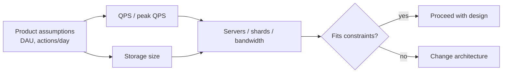

Notes tirées de *System Design Interview*, chapitre 2. Les interviewers se soucient moins de l'arithmétique exacte que de savoir si on peut **dimensionner un système** avec des chiffres approximatifs mais défendables.

## Pourquoi estimer ?

Le calcul back-of-the-envelope répond à :

- Combien de serveurs / shards faut-il ?
- Le goulot est-il la DB ou le réseau ?
- Ce design tient-il en RAM / disque / budget ?

Se tromper d'un facteur 2–3× est souvent acceptable. Se tromper d'un facteur 100× signifie que l'architecture est fausse.



## Puissances de deux (mémoire / stockage)

Connaître les ordres de grandeur :

| Puissance | Valeur approx. | Signification grossière |
|-----------|----------------|-------------------------|
| 10 | ~1 millier | |
| 20 | ~1 million | |
| 30 | ~1 milliard | |
| 40 | ~1 trillion | |

Octets :

```text
1 KB  ≈ 10^3 bytes
1 MB  ≈ 10^6 bytes
1 GB  ≈ 10^9 bytes
1 TB  ≈ 10^12 bytes
1 PB  ≈ 10^15 bytes
```

Utile : `2^10 ≈ 10^3`, donc les préfixes binaires suivent assez bien les décimaux pour un entretien.

## Ordres de grandeur de latence à avoir en tête

Intuition d'ordre de grandeur (table classique Jeff Dean / systems — mémoriser la *forme*, pas chaque chiffre) :

```text
L1 cache reference          ~   1 ns
Branch mispredict           ~   3 ns
L2 cache reference          ~   4 ns
Mutex lock/unlock           ~  17 ns
Main memory reference       ~ 100 ns
Compress 1KB with Zippy     ~  2 µs
Send 2KB over 1 Gbps        ~ 20 µs
Read 1MB sequentially RAM   ~250 µs
Round trip same datacenter  ~500 µs
Disk seek                   ~ 10 ms
Read 1MB sequential disk    ~ 20 ms
Send packet CA → Netherlands ~150 ms
```

Traduction pratique :

- Mémoire ≫ disque pour l'accès aléatoire
- Un RPC même DC est bon marché comparé au cross-region
- Éviter les disk seeks sur les hot paths ; préférer séquentiel / SSD / mémoire

## Estimations de trafic (QPS)

Flow typique en entretien :

1. Demander DAU / MAU (ou assumer avec l'interviewer)
2. Estimer les requêtes par utilisateur par jour
3. Convertir en QPS, puis peak QPS

```text
QPS ≈ (DAU × actions_per_user_per_day) / 86400

Peak QPS ≈ QPS × peak_factor   # souvent 2×–5×, confirmer avec l'interviewer
```

Exemple :

```text
10M DAU
each user does 20 reads/day
→ 200M reads/day
→ ~2,300 QPS average
→ ~5,000–10,000 QPS at peak (if 2–4×)
```

Toujours verbaliser les hypothèses.

## Estimations de stockage

```text
storage ≈ users × data_per_user × retention × replication_factor
```

Décomposer les objets en champs :

```text
Tweet ≈ 300 bytes metadata + media pointers
Photo ≈ 200 KB average
5 years × 3 replicas → multiply carefully
```

Arrondir agressivement. Montrer la formule, puis le résultat arrondi.

## Bande passante

```text
bandwidth ≈ QPS × average_payload_size
```

Utile pour décider CDN vs origin, ou si une seule NIC est absurde pour la charge.

## Conseils qui sonnent senior

- **Énoncer les hypothèses** avant de calculer
- **Arrondir** tôt à 1 chiffre significatif (`3.14 → 3`, `86400 → 10^5`)
- **Sanity-check** contre des produits connus (« échelle Instagram ? »)
- Utiliser les estimations pour **guider les choix de design** (nombre de shards, taille du cache), pas comme décoration
- Si l'interviewer donne des chiffres, **utiliser les siens**

## Aide-mémoire

| Question | Approche grossière |
|----------|-------------------|
| QPS | DAU × actions/jour / 86 400 × peak factor |
| Stockage | records × taille × rétention × replicas |
| Taille du cache | working set (souvent ≪ données totales) |
| Shards | write QPS ou taille des données / capacité par nœud |

## À retenir pour l'entretien

L'estimation est un **outil de communication**. On montre qu'on peut traduire l'échelle produit en contraintes machine — et repérer les designs qui ne peuvent pas fonctionner.
