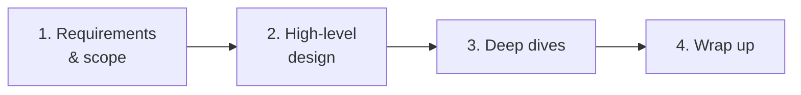
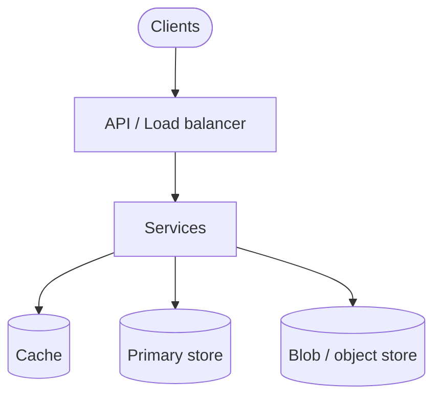

Notes tirées de *System Design Interview*, chapitre 3. Le processus du livre pour toute question de design — réutiliser ce squelette jusqu'à ce qu'il soit un réflexe.

## Le framework en 4 étapes



```text
1. Understand the problem and establish design scope
2. Propose high-level design and get buy-in
3. Design deep dives (the hard parts)
4. Wrap up
```

Time-box approximatif : ~5 min exigences, ~10–15 min haut niveau, le reste sur deep dives + trade-offs.

## Étape 1 — Exigences et périmètre

Ne **pas** sauter directement aux boîtes et flèches.

Demander :

- **Fonctionnel :** Quelles fonctionnalités exactes ? Qui sont les utilisateurs ? Mobile/web ? Upload ? Recherche ? Temps réel ?
- **Non-fonctionnel :** Échelle (DAU, QPS), latence, cohérence, disponibilité, durabilité
- **Hors scope :** Détails d'auth ? GDPR ? UI exacte ? Confirmer ce qu'on skip

Traduire les demandes floues en chiffres :

```text
"Design Twitter"
→ post tweets, follow, home timeline
→ 100M DAU, read-heavy, eventual OK for fan-out, strong-ish for posting?
```

Écrire les contraintes au tableau. Y revenir lors des trade-offs.

## Étape 2 — Design haut niveau

Esquisser l'architecture **minimale** qui satisfait les exigences fonctionnelles :

- Clients → API / load balancer → services
- Choix de stockage (SQL vs NoSQL, blob store)
- Flux majeurs (write path, read path)

Obtenir l'accord de l'interviewer avant de plonger dans les internals du consistent hashing.



Bonnes habitudes :

- Labelliser les APIs (`POST /tweets`, `GET /feed`)
- Séparer read path vs write path s'ils diffèrent
- Citer 1–2 hypothèses d'échelle qui façonnent l'architecture

## Étape 3 — Deep dives

C'est là que les seniors se distinguent des juniors. Choisir les goulots que l'échelle implique :

- Hot keys / celebrity fan-out
- Cohérence sous partition
- Invalidation de cache
- Rate limiting, backpressure
- Stratégie de shard, rebalancing
- Garanties de livraison pour les queues

Approfondir **2–3** domaines qui intéressent l'interviewer — pas chaque composant à égalité.

Parler en trade-offs :

```text
"Push fan-out is great for active users, expensive for celebrities —
 so hybrid: push for normal, pull for mega-followers."
```

## Étape 4 — Conclusion

Dans les dernières minutes :

- Récapituler le design par rapport aux exigences initiales
- Citer les goulots et ce qu'on monitorerait
- Mentionner ce qu'on ferait avec plus de temps (multi-région, cohérence plus stricte, coût)
- Demander si l'interviewer veut un autre deep dive

## Ce que les interviewers regardent

Pas un diagramme parfait. Ils évaluent :

| Signal | À quoi ça ressemble |
|--------|---------------------|
| Communication | Questions de clarification, narration structurée |
| Contrôle du périmètre | In/out of scope explicite |
| Pensée trade-off | « Option A vs B, je choisis A parce que… » |
| Fondamentaux | Caching, sharding, réplication, queues utilisés correctement |
| Adaptation | Ajuster quand l'interviewer pousse en retour |

## Anti-patterns

- Plonger dans la config Kafka avant que les APIs existent
- Ignorer les chiffres d'échelle qu'on vient d'estimer
- Dessiner au tableau en silence pendant 10 minutes
- Traiter CAP / « on utilisera des microservices » comme des mots magiques
- Ne jamais énoncer les hypothèses

## À retenir pour l'entretien

Le framework est un **protocole de conversation**. Exigences → forme → parties difficiles → récap. Chaque chapitre suivant du livre est une instance de cette boucle sur un problème concret.
