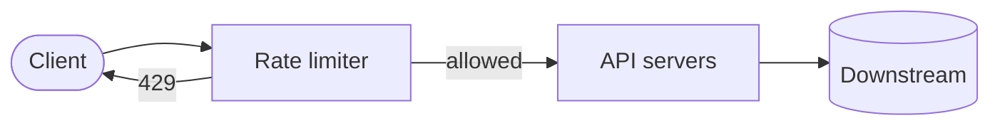
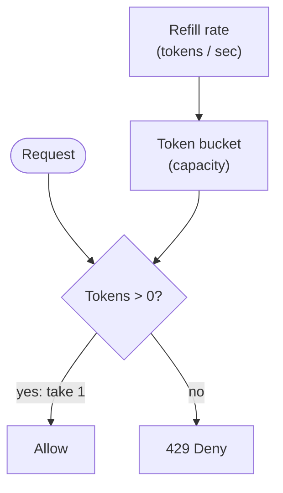
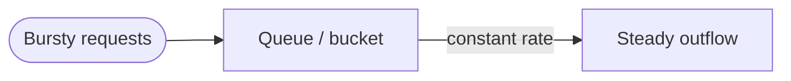
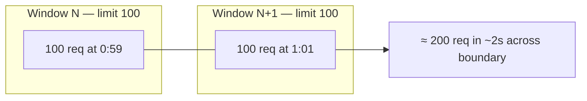
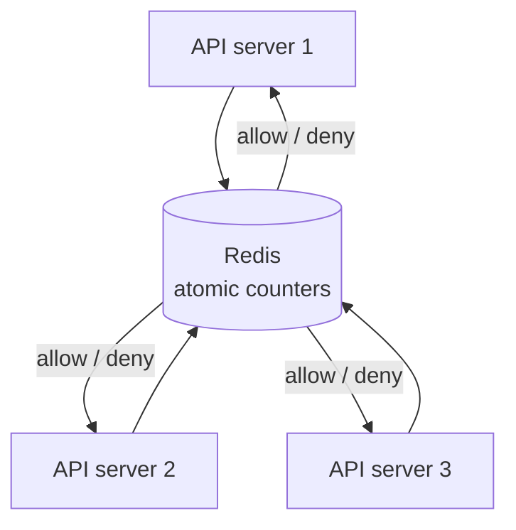

Notes tirées de *System Design Interview*, chapitre 4 — concevoir un **rate limiter** : contrôler combien de requêtes un client peut envoyer dans une fenêtre temporelle.

## Pourquoi rate limiter ?

- Protéger les APIs des abus et des floods accidentels
- Appliquer les tiers business (QPS free vs paid)
- Réduire les coûts (DB downstream / APIs tierces)
- Améliorer l'équité entre tenants

Réponse typique quand la limite est dépassée : `429 Too Many Requests` (+ `Retry-After` optionnel).

## Exigences à clarifier

- Qui est limité ? IP, user ID, API key, endpoint ?
- Limites : ex. 1000 req/min soft, 10k/jour hard ?
- Distribué sur plusieurs serveurs API ?
- Approximatif OK, ou doit être exact ?
- Où le placer : gateway, middleware, service mesh ?

## Placement haut niveau



Souvent à l'**API gateway** pour que chaque service ne réinvente pas la roue. Les règles peuvent être pilotées par config (par route, par tenant).

## Algorithmes

### Token bucket

- Le bucket contient jusqu'à `capacity` tokens
- Se remplit à `rate` tokens/sec
- Chaque requête coûte 1 token ; rejeter si vide



**Avantages :** autorise des bursts courts ; modèle mental simple  
**Inconvénients :** la burstiness peut encore blesser les backends si capacity est grande

Largement utilisé en pratique (y compris les API gateways cloud).

### Leaking bucket

- Les requêtes entrent dans une queue ; traitées à débit fixe
- Lisse le trafic vers un débit de sortie constant



**Avantages :** débit de sortie prévisible  
**Inconvénients :** les clients bursty attendent ou sont droppés ; la taille de queue est un paramètre de tuning

### Fixed window counter

- Compter les requêtes dans la fenêtre `[0:00–1:00)`, reset à la frontière
- Bon marché (un compteur par clé par fenêtre)

**Problème :** pic à la frontière — 100 à `0:59` + 100 à `1:01` ≈ 200 en deux secondes avec une limite « 100/min ».



### Sliding window log

- Stocker le timestamp de chaque requête
- À chaque nouvelle requête, supprimer les timestamps hors fenêtre, compter le reste

**Avantages :** précis  
**Inconvénients :** gourmand en mémoire à fort QPS

### Sliding window counter

- Hybride : comptage pondéré de la fenêtre précédente + fenêtre courante
- Adoucit les pics de frontière du fixed window avec moins de mémoire qu'un log complet

Bon choix par défaut en entretien quand on veut de la précision sans listes de timestamps illimitées.

## Rate limiting distribué

Plusieurs serveurs API → les compteurs locaux en mémoire **divergent**. Centraliser les compteurs :



Trade-offs :

| Approche | Notes |
|----------|--------|
| Redis central store | Simple ; Redis devient critical path |
| Sticky sessions + local | Fragile ; à éviter |
| Approximatif / eventual | Plus de débit, overshoot occasionnel |

Utiliser des ops atomiques ou Lua pour que check-and-decrement soit race-safe.

## Headers HTTP (détail sympa en entretien)

```text
X-RateLimit-Limit: 1000
X-RateLimit-Remaining: 42
X-RateLimit-Reset: 1700000000
```

Plus `Retry-After` sur 429. Les clients peuvent backoff intelligemment.

## Limites soft vs hard, multi-couche

Les systèmes réels combinent souvent :

- Limites edge / WAF (floods IP)
- Limites gateway par API key
- Limites par service pour les endpoints coûteux

## Points de deep dive à mentionner

- Race conditions sans ops Redis atomiques
- Hot keys (une API key célébrité) → shard des clés ou local + sync
- Règles stockées dans un config service, hot-reloaded
- Monitoring : taux de rejet, latence du limiter lui-même
- Fail-open vs fail-closed si Redis est down (décision produit)

## À retenir pour l'entretien

Nommer l'**algorithme**, placer le limiter à l'**edge**, stocker les compteurs dans un **store partagé atomique** pour la correction multi-nœuds, et retourner **429 + headers**. Puis discuter burstiness vs précision vs coût — c'est le vrai design.
