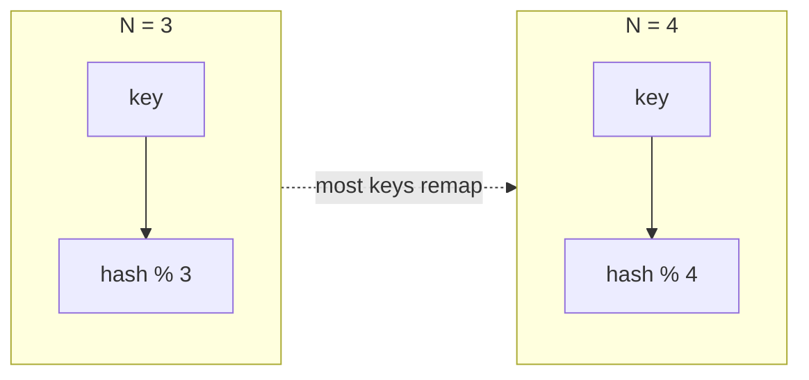
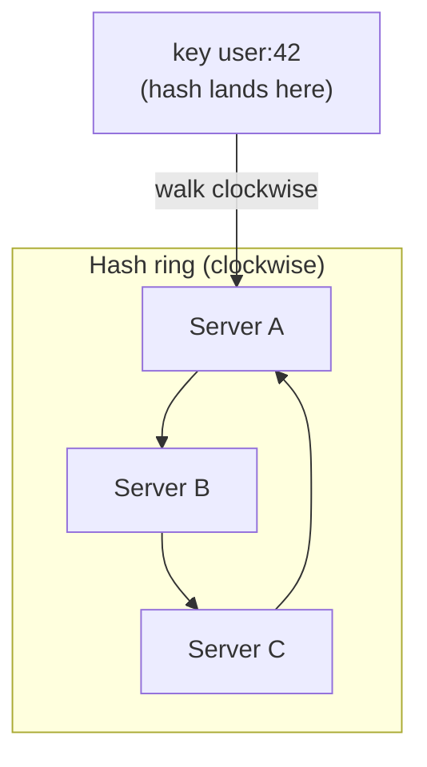
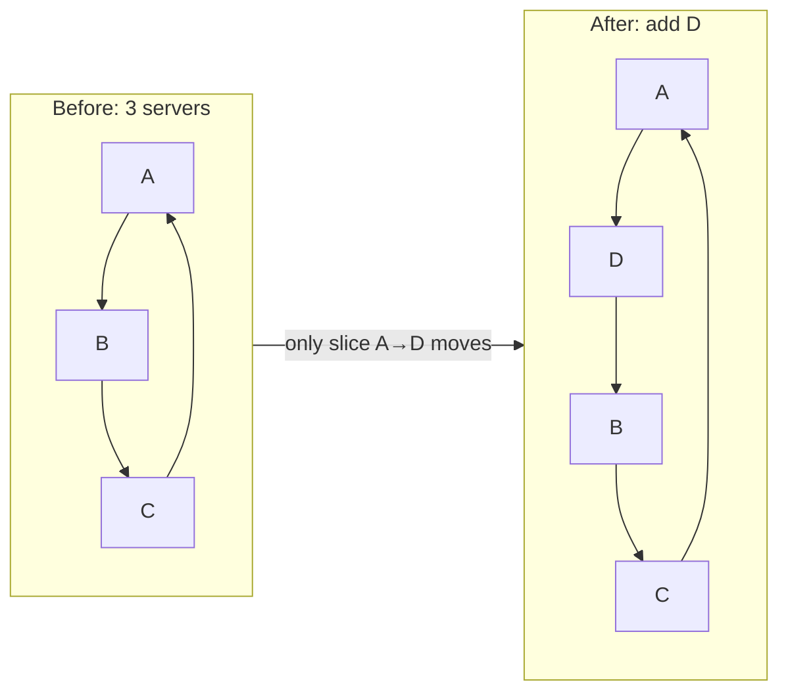
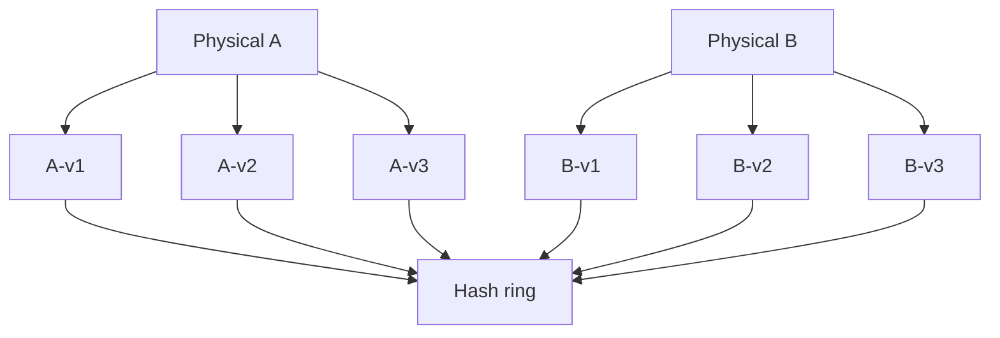
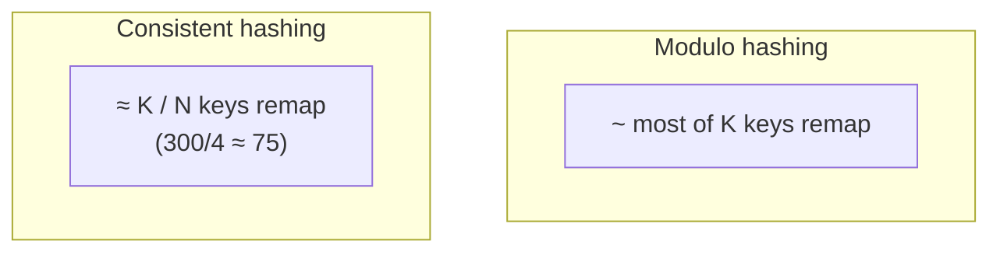

Notes tirées de *System Design Interview*, chapitre 5 — **consistent hashing** : mapper les clés vers les serveurs de sorte qu'ajouter/supprimer un nœud ne déplace qu'une petite fraction des clés.

## L'approche naïve : `hash(key) % N`

```text
server = hash(key) % N
```

Fonctionne jusqu'à ce que `N` change.

Quand on passe de 3 serveurs à 4, **presque chaque clé** est remappée. Le cache hit ratio s'effondre ; les bases de données reshufflent presque toutes les partitions. C'est la douleur que le consistent hashing corrige.



## Objectif

Quand les nœuds changent :

```text
keys remapped ≈ K / N
```

- `K` = nombre de clés
- `N` = nombre de nœuds (après le changement)

Seulement environ **1/N** des clés devraient bouger — pas la plupart.

## Le hash ring

1. Hasher **serveurs** et **clés** sur un anneau fixe (ex. `0 … 2^32-1`)
2. Pour placer une clé : la hasher, parcourir dans le sens horaire, assigner au **premier serveur** rencontré
3. Ajouter un serveur : il prend les clés de la plage de son voisin horaire — seule cette tranche bouge
4. Supprimer un serveur : ses clés tombent sur le serveur horaire suivant



```text
Ring positions (simplified):

  0 ── A ──────── B ──────── C ── 2^32
           ↑
      hash(user:42)  →  next clockwise server = A
```

Quand **Server D** est ajouté entre A et B, seulement les clés dans `(A → D]` migrent vers D. Tout le reste reste en place.



## Virtual nodes (la partie qui le rend production-ready)

Un serveur physique → plusieurs positions sur l'anneau (« virtual nodes » / vnodes).

Pourquoi :

- Avec peu de nœuds physiques, une seule position sur l'anneau crée des plages de clés **inégales**
- Beaucoup de vnodes par serveur → la charge se répartit plus uniformément
- Matériel hétérogène : donner plus de vnodes aux grosses machines



Trade-off : plus de métadonnées à stocker/répliquer sur l'appartenance à l'anneau.

## Intuition de rebalancing

Exemple du récit pédagogique habituel :

- 300 clés, 3 nœuds, ajout d'un 4e
- **Sans** consistent hashing : une grande fraction des clés reshuffle sur plusieurs nœuds
- **Avec** consistent hashing : environ `300/4 ≈ 75` clés migrent vers le nouveau nœud



Cette borne `K/N` est le punchline de l'entretien.

## Où ça apparaît

- Caches distribués (clients Memcached, certains modes Redis cluster conceptuellement)
- Stores partitionnés style Dynamo
- Load balancing avec affinité sticky (parfois)
- Variantes d'assignation CDN / edge

Partout où on partitionne par clé et où on attend une appartenance **élastique**.

## Problèmes à mentionner

| Problème | Atténuation |
|----------|-------------|
| Hot keys | Traitement séparé ; pas résolu par le hashing seul |
| Charge inégale | Virtual nodes ; monitorer les tailles de plages |
| Changements d'appartenance à l'anneau | Gossip / coordination pour que tous les clients voient le même anneau |
| Requête pendant rebalance | Souvent dual-read / copier les plages avec soin |

## À retenir pour l'entretien

Contraster **`% N` (tout bouge)** avec **anneau + virtual nodes (~K/N bougent)**. Dessiner l'anneau, placer une clé horaire, puis montrer l'ajout d'un nœud qui vole une tranche. Ce diagramme fait généralement la différence.
