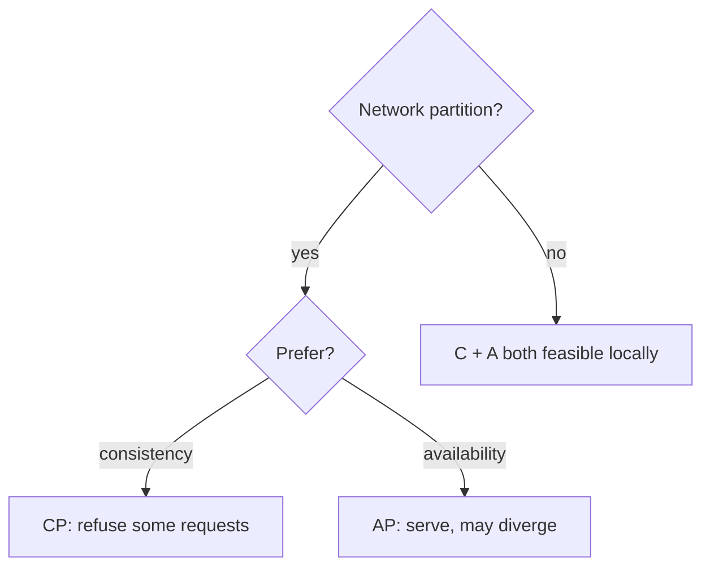
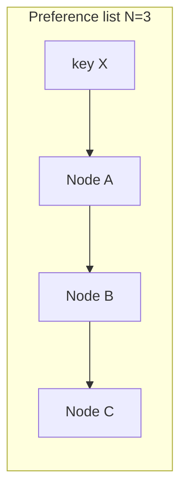
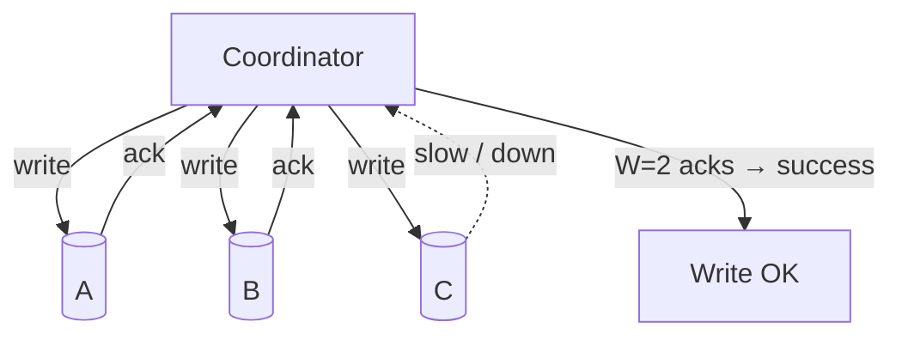
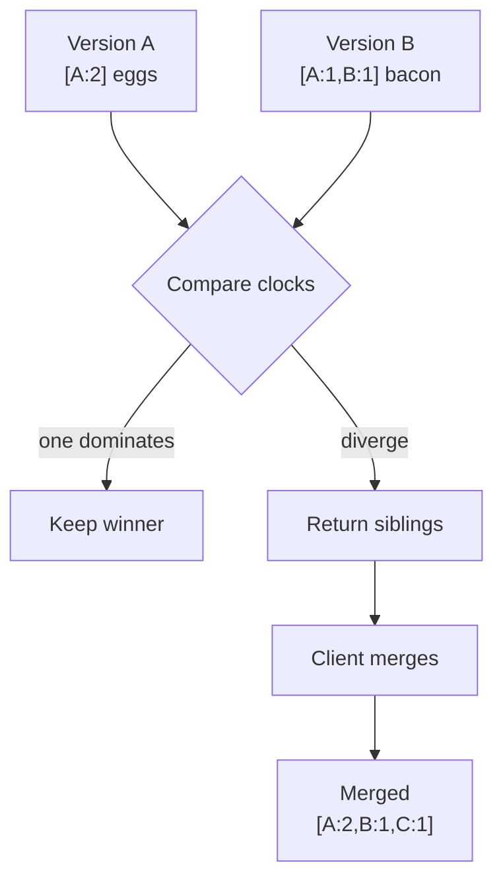
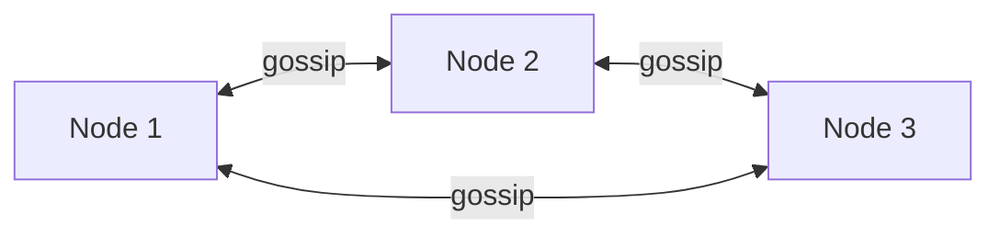
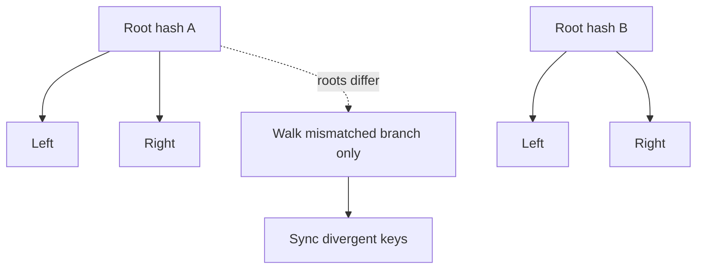
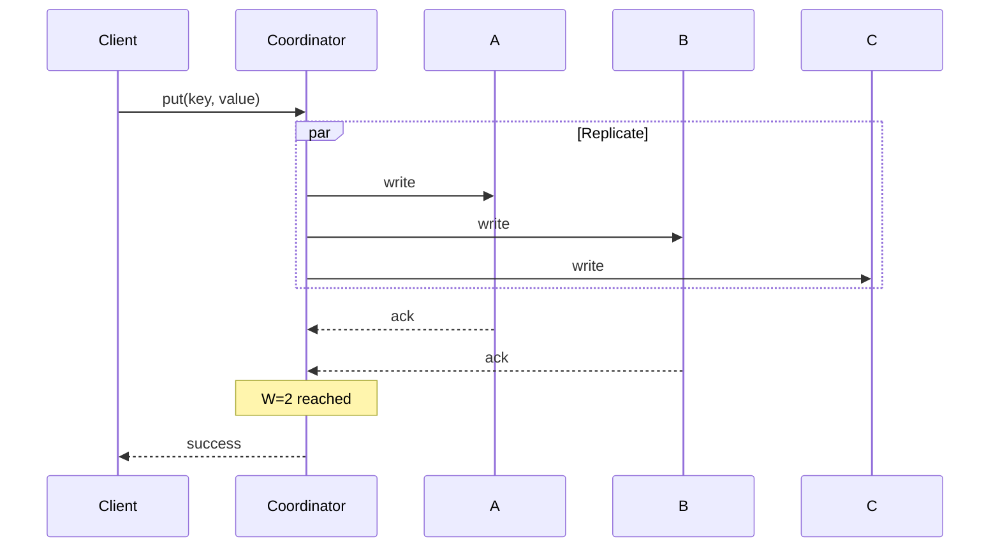
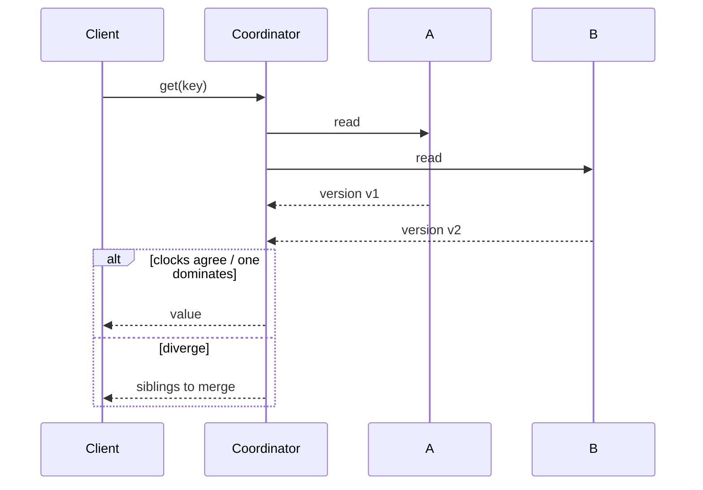

Notes tirées de *System Design Interview*, chapitre 6 — concevoir un **key-value store** distribué (inspiré Dynamo) : `put(key, value)` / `get(key)` à très grande échelle avec haute disponibilité.

Approfondissement sur la détection de conflits : [Vector clocks et résolution d'incohérences](/fr/posts/vector-clocks-and-inconsistency-resolution). Contexte modèle de données associé : [NoSQL en quatre catégories](/fr/posts/nosql-four-categories-key-value-document-column-graph).

## Exigences (typiques)

- Put / get par clé
- Millions de clés, QPS élevé
- Haute disponibilité (orienté AP dans le récit Dynamo classique)
- Cohérence ajustable
- Gérer la panne de nœud et les partitions réseau

## Théorème CAP (cadrage entretien)

Sous une **partition réseau**, on choisit :

| Choix | Signification |
|-------|---------------|
| **CP** | Refuser certaines requêtes pour garder une valeur à jour unique |
| **AP** | Continuer à servir ; les réplicas peuvent diverger temporairement |

**CA** sans partition tolerance n'est pas une option réelle pour les stores distribués — les partitions arrivent. Concevoir pour elles.



Ce chapitre penche **AP + eventual consistency**, avec des curseurs (quorum) pour trader latence vs fraîcheur.

## Briques de construction

### 1. Disposition des données

Clés hashées sur un anneau ([consistent hashing](/fr/posts/system-design-interview-chapter-5-design-consistent-hashing)), souvent avec des **virtual nodes**. Chaque clé vit sur une **preference list** de N réplicas (les N prochains nœuds distincts dans le sens horaire).



### 2. Réplication

Écrire sur plusieurs réplicas pour durabilité/disponibilité. Le facteur de réplication `N` est une config (souvent 3 dans les exemples).

### 3. Quorum

```text
N = replica count
W = write quorum (acks needed for a successful write)
R = read quorum (responses needed for a successful read)
```

Règle empirique :

```text
W + R > N  →  read and write quorums overlap → strong-ish consistency for that key
W + R ≤ N  →  possible stale reads; higher availability / lower latency
```

Exemple classique : `N=3, W=2, R=2`.



### 4. Modèles de cohérence

| Modèle | Signification |
|--------|---------------|
| Strong | Après une écriture réussie, chaque lecture suivante la voit |
| Weak | Pas de garantie dure sur quand les lecteurs voient les mises à jour |
| Eventual | Si les écritures s'arrêtent, les réplicas convergent vers la même valeur |

Les stores AP visent généralement la cohérence **eventual** et laissent les clients réconcilier les conflits.

## Gérer les conflits : versioning

Les écritures concurrentes sur différents réplicas créent des **siblings**. Le « last write wins » à l'horloge murale peut **perdre des données en silence** quand les horloges dérivent.

Les **vector clocks** suivent l'historique causal par nœud (`[A:2, B:1]`). À la lecture :

- L'horloge d'une version domine → on peut garder cette version en sécurité
- Les horloges divergent → renvoyer **les deux** versions au client pour fusion (ex. union de panier e-commerce)

Voir la [note sur les vector clocks](/fr/posts/vector-clocks-and-inconsistency-resolution) pour le walkthrough complet du panier.



## Appartenance et détection de pannes

- Les nœuds apprennent les uns des autres via **gossip**
- Détection de panne via heartbeats / suspicion (pas toujours parfait — distinguer ralentissement temporaire et mort)
- Preference lists et hinted handoff gardent les écritures disponibles quand un réplica cible est down



## Anti-entropy : Merkle trees

Le gossip détecte « qui est vivant ». Les **Merkle trees** détectent « dont les données ont dérivé ».

- Chaque réplica construit un arbre de hashes sur des plages de clés
- Comparer les racines → ne parcourir que les branches en désaccord
- Synchroniser seulement les plages divergentes au lieu de tout scanner



Utilisé pour la réparation en arrière-plan après partitions ou isolement prolongé.

## Read/write path (esquisse)

**Écriture** (`N=3`, `W=2`)



**Lecture** (`R=2`)



## Autres éléments à nommer

- **Sloppy quorum + hinted handoff** — écrire temporairement sur des nœuds sains ; renvoyer les hints quand le réplica prévu revient
- **Cohérence ajustable** — clients ou APIs choisissent `R`/`W` par appel
- **Persistance locale** — commit log + memtable / stockage style SSTable sur chaque nœud (détail d'implémentation ; mentionner brièvement)

## À retenir pour l'entretien

Un KV store style Dynamo est une **pile de techniques**, pas un seul truc :

```text
consistent hashing
  + N-way replication
  + quorum (R, W)
  + vector clocks for concurrency
  + gossip for membership
  + Merkle trees for repair
```

Commencer par CAP et l'API, puis approfondir quorum + résolution de conflits — c'est là que la plupart des discussions d'entretien atterrissent.
