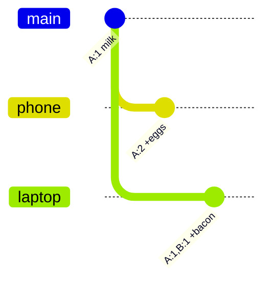

Dans un système distribué, deux écritures peuvent arriver « en même temps » sur des machines différentes — et si tu les départages avec un timestamp classique, tu jettes silencieusement l'une des deux. Les **vector clocks** existent pour distinguer **happened-before** de **vraiment concurrent**, et renvoyer les vrais conflits à l'application au lieu de deviner.

## Le problème : l'heure murale ment

Approche naïve pour les écritures concurrentes :

1. Chaque réplica horodate avec `now()`
2. En conflit, on garde la version au timestamp le plus récent
3. On jette l'autre (« last write wins »)

Ça casse en prod pour une raison banale : **les horloges serveur dérivent**.

- La sync NTP est imparfaite ; les machines peuvent diverger de millisecondes ou de secondes
- Une écriture *logiquement* antérieure peut recevoir un timestamp *plus tardif*
- Le système garde alors la mauvaise version et **perd des données en silence**

Exemple de perte silencieuse :

- Réplica A (horloge un peu en avance) sauve le panier `{ eggs }` à `T=100`
- Réplica B (horloge un peu en retard) sauve `{ bacon }` à `T=99`
- Règle de merge : garder A → bacon disparaît
- Aucune erreur. L'article a juste disparu.

On ne peut pas ordonner sainement des événements cross-machines avec l'heure murale seule. Il faut suivre la **causalité** — quelles écritures connaissaient déjà quelles autres.

## La solution : vector clocks (« Git pour les données »)

Un **vector clock** ne demande pas « quelle heure est-il au mur ? ». Il demande : **« quelle version de l'historique chaque nœud a-t-il vue ? »**

Modèle mental : **Git pour les données**.

- Chaque réplica = un contributeur de branche
- Chaque écriture incrémente le compteur de ce nœud
- Comparer les clocks = comparer des historiques de commits :
  - Un historique contient l'autre → fast-forward
  - Les historiques ont divergé → conflit de merge

### Format

Un vector clock est une map `NomDuNœud → NuméroDeVersion` :

```text
[A: 1, B: 2, C: 1]
```

Règles de base :

- Sur une écriture gérée par le nœud `X`, incrémenter le compteur de `X`
- Quand les réplicas se sync, prendre le **max élément par élément**
- On omet souvent les nœuds à `0` (même signification)

On suit l'historique causal, pas l'UTC.

## Scénario concret : le panier e-commerce

Exemple classique façon Dynamo. Un utilisateur a un panier. Le réseau est instable. Les écritures atterrissent sur des réplicas différents avant sync.

Réplicas : **A**, **B**, **C**.

### Étape 1 — Créer le panier (sur A)

L'utilisateur crée le panier. Le réplica **A** gère l'écriture.

```text
Panier: { milk }
Clock:  [A: 1]
```

Seul A a écrit. Les autres sont à zéro pour cette clé.

### Étape 2 — Ajouter eggs depuis le téléphone (sur A)

Toujours sur A. L'utilisateur ajoute eggs.

```text
Panier: { milk, eggs }
Clock:  [A: 2]
```

`[A: 2]` **descend de** `[A: 1]`. Écrasement sûr — A connaissait déjà la version précédente.

### Étape 3 — Mise à jour concurrente : bacon depuis le laptop (sur B)

Le laptop frappe le réplica **B** avant que B ait vu le dernier panier de A. B n'a vu que l'état plus ancien. Pour le récit d'entretien : l'écriture de B est concurrente avec l'ajout eggs sur A.

B ajoute bacon sur ce qu'il croit courant :

```text
# Ce que B écrit (concurrent avec [A: 2])
Panier: { milk, bacon }
Clock:  [A: 1, B: 1]
```

Pourquoi `[A: 1, B: 1]` ?

- B connaissait le panier après la première écriture de A (`A: 1`)
- B n'avait **pas** vu l'écriture eggs (`A: 2`)
- B incrémente son compteur → `B: 1`

Deux versions coexistent :

| Version | Panier | Vector clock |
|---------|--------|----------------|
| V2 (depuis A) | `{ milk, eggs }` | `[A: 2]` |
| V3 (depuis B) | `{ milk, bacon }` | `[A: 1, B: 1]` |

Aucune clock n'est descendante de l'autre. L'historique a **bifurqué** — comme deux branches Git depuis le même commit.



### Étape 4 — Sync / lecture cross-réplicas

À la lecture (ou au gossip), le système compare les clocks, pas les timestamps.

## Résoudre le conflit

Quand deux versions se rencontrent, comparer les vector clocks composante par composante.

### Cas 1 — Descendant direct (écrasement sûr)

La clock `X` **domine** `Y` si chaque compteur de `X` est ≥ celui de `Y` pour le même nœud, et qu'au moins un est strictement supérieur.

Exemple :

```text
Ancienne: [A: 1]
Nouvelle: [A: 2]
```

`[A: 2]` domine `[A: 1]` → la nouvelle est un **descendant direct**. Garder la nouvelle. Jeter l'ancienne. Pas de conflit.

Autre :

```text
Ancienne: [A: 2, B: 1]
Nouvelle: [A: 2, B: 2]
```

Même logique — la nouvelle a vu tout ce que l'ancienne avait vu, plus une écriture sur B.

### Cas 2 — Divergence (renvoyer les siblings)

Aucune clock ne domine l'autre :

```text
[A: 2]          vs  [A: 1, B: 1]
```

- A est en avance sur lui-même (`2 > 1`)
- B est en avance sur lui-même (`1 > 0`)

Les historiques ont **divergé**. La base **ne doit pas** inventer le merge :

- Pas de last-write-wins sur l'heure murale
- Pas de choix silencieux entre eggs *ou* bacon
- Renvoyer **les deux versions** (siblings) au client

L'application merge avec des règles métier. Pour un panier, l'union est souvent correcte :

```text
# Merge côté client / app
Version A: { milk, eggs }     clock [A: 2]
Version B: { milk, bacon }    clock [A: 1, B: 1]

Fusion:    { milk, eggs, bacon }
```

Réécrire le merge via un coordinateur (disons C), qui avance la clock : max élément par élément, puis incrément de C :

```text
Panier: { milk, eggs, bacon }
Clock:  [A: 2, B: 1, C: 1]
```

Cette nouvelle clock domine les deux parents. Les lectures suivantes peuvent la traiter comme tip résolu — jusqu'à la prochaine fourche concurrente.

### Aide-mémoire de comparaison

```text
Comparer X et Y élément par élément sur tous les nœuds :

1. X ≥ Y sur chaque nœud, et X > Y sur au moins un
   → X descend de Y → garder X

2. Y ≥ X sur chaque nœud, et Y > X sur au moins un
   → Y descend de X → garder Y

3. Sinon
   → concurrent / divergent → renvoyer les deux à l'app
```

## Pourquoi ça compte en vrai

Les vector clocks (et cousins proches comme les dotted version vectors) apparaissent dès qu'on accepte la **cohérence éventuelle** et les updates concurrentes :

- Stores clé-valeur façon Dynamo / Riak
- Paniers, compteurs, présence, éditions multi-appareils
- Tout design proche CRDT où la DB détecte le conflit et l'app (ou une fonction de merge) le résout

À retenir :

- **Les timestamps ordonnent sur une machine ; ils ne prouvent pas la causalité cross-machines**
- **Les vector clocks détectent la concurrence ; ils ne fusionnent pas le métier**
- **La résolution de conflit est un souci applicatif** — union pour un panier, « garder les deux et demander à l'utilisateur » pour un doc, règles custom pour l'argent (souvent : éviter ce modèle pour l'argent)

## Récap

| Approche | Ce qu'elle suit | Risque en écriture concurrente |
|----------|-----------------|--------------------------------|
| LWW timestamp mural | `now()` | Perte silencieuse sous skew d'horloge |
| Vector clocks | Historique causal par nœud | Détecte les fourches ; le client merge les siblings |

Une phrase pour l'entretien : **les vector clocks, c'est de l'historique de versions, pas de l'heure** — et quand les historiques bifurquent, la base renvoie les deux versions au lieu de deviner.
