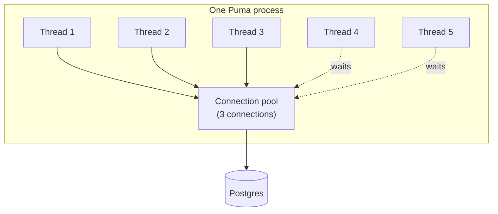

Un modèle mental simple pour comprendre comment **threads**, **workers**, **processes** et le **DB connection pool** s’emboîtent dans Rails (Puma + ActiveRecord).

## Les pièces

Imagine un **restaurant**.

| Mot | Sens bébé | Restaurant |
|------|----------------|------------|
| **Process** | Un bâtiment cuisine entier | Le restaurant |
| **Worker** | Une cuisine dans ce bâtiment (Puma en lance souvent plusieurs) | Un poste de cuisine |
| **Thread** | Un cuisinier qui peut prendre une commande | Un cuisinier |
| **DB connection** | Une ligne téléphonique vers l’entrepôt (Postgres) | Un téléphone vers les fournisseurs |
| **Connection pool** | La boîte de lignes que cette cuisine a le droit d’utiliser | Des téléphones en nombre limité |

ActiveRecord ne partage pas un téléphone entre deux cuisiniers en même temps.  
**Chaque cuisinier qui parle à la DB a besoin de son propre téléphone.**

## Schéma

```text
One Puma process (one kitchen)
├── Worker / thread pool: cook 1, cook 2, cook 3, cook 4, cook 5
└── DB connection pool:   phone, phone, phone   ← only 3 phones!

If 5 cooks all need the warehouse at once → 2 cooks wait (or explode with timeout)
```



## Petite histoire

1. Un utilisateur tape ton app Rails → un **thread** (cuisinier) gère la requête.
2. Le code fait `User.find(1)` → ce cuisinier doit prendre une **connection** (téléphone) dans le **pool**.
3. La requête tourne → le cuisinier **remet le téléphone** dans la boîte.
4. La requête suivante peut réutiliser ce téléphone.

Si tu as **5 threads** qui peuvent tous interroger la DB en même temps, il te faut environ **5 connections** dans le pool de ce process (un peu de marge, c’est bien).

## Pourquoi « pas seulement workers/processes » ?

Les gens pensent parfois :

> « J’ai 2 processes, donc pool = 2 suffisent. »

Faux.

Chaque **process** a son **propre** pool.

```text
2 processes × 5 threads each × need DB
= you may need ~5 connections PER process
= ~10 connections on Postgres total
```

Formule courante :

```text
DB max connections ≳  (processes × threads_per_process)  +  extras
                      (Sidekiq, console, migrations, …)
```

Et dans `database.yml` :

```yaml
pool: <%= ENV.fetch("RAILS_MAX_THREADS") { 5 } %>
```

Ce `pool` est **par process** : « combien de téléphones cette cuisine peut tenir ».

Il doit être **≥ nombre de threads dans ce process** qui pourraient utiliser ActiveRecord en même temps.

## Une phrase à retenir

**Process = cuisine. Threads = cuisiniers. Pool = téléphones. Chaque cuisinier qui parle à la DB a besoin d’un téléphone ; dimensionne le pool pour les cuisiniers concurrents, puis multiplie par le nombre de cuisines (processes).**

---

> 🌐 *Traduit par Claude*
