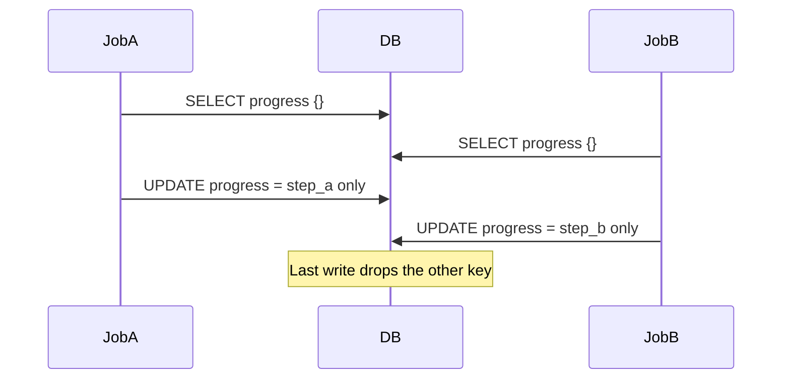

こんにちは、**Tony Duong** です。[Spacely](https://corp.spacely.co.jp/) で Rails バックエンドエンジニアをしています。日々 Spacely プラットフォームを開発しています。本記事では、`spacely_web` Rails アプリケーションで遭遇した **lost update** 問題を取り上げます。それが何で、どのようにコードに現れ、どう直し、RSpec でどうカバーしたか — そして失敗時と成功時の実行結果がどう見えるかまでを順に説明します。

例として、1 行（`WorkflowRun` + **`progress`**）の **`json` / `jsonb` カラム** を使います。2 つのジョブがそれぞれ **異なるキー** を同じオブジェクトに追加します。Spacely では `spacely_web` のメインデータベースに **MySQL** を使っているため、ここで議論する分離レベルの挙動は MySQL InnoDB に基づいています。

---

## Lost update とは？

**Lost update** とは、2 つのトランザクションが同じ行を **読み**、それぞれが読んだ値から新しい値を **計算** し、両方とも **書き戻す** ときに発生する並行性の異常です。MySQL InnoDB のデフォルト分離レベルは **REPEATABLE READ** ([docs](https://dev.mysql.com/doc/refman/8.4/en/innodb-transaction-isolation-levels.html#isolevel_repeatable-read))、PostgreSQL のデフォルトは **READ COMMITTED** です。どちらの場合でも、コードが non-locking の read-modify-write を行ってフルバリューを保存すると、**最後に書いたほうが勝ち**、もう一方の変更を上書きしてしまう可能性があります。

### なぜ REPEATABLE READ でも lost update が起きるのか

`REPEATABLE READ` は **non-locking 読み取り** に対して各トランザクションに安定したスナップショットを与えます。これは繰り返しクエリには役立ちますが、ロック付き読み取り (`FOR UPDATE`) や別の並行性制御戦略を使わない限り、**アプリケーションレベルの read-modify-write を自動的にシリアライズしてはくれません**。

### いつ起きるか？

私たちにとって典型的なのは、**並行ジョブ** がそれぞれ **read → Ruby で Hash を merge → `update!(json_column: …)`** を **同じ** 行に **ロックなしで** 行うケースです — 特にカラムが **構造化された JSON** で、各ジョブが「自分のキーだけを追加」する場合です。

### どんな影響があるか？

- JSON の **キーが欠損** する：あるジョブの merge が保存ドキュメントから消える。
- **断続的なバグ**：タイミング依存のため再現が難しい。
- **デフォルトではエラーが出ない**：optimistic locking の競合と違い、明示的にチェックを足さない限り何も raise しない — つまりデータが壊れていてもモニタリングは緑のままになりうる。

---

## 実際の発生状況：2 つのジョブ、1 つの JSON カラム、異なるキー

`WorkflowRun` に **`progress`** カラム（MySQL では Rails の **`json`**、PostgreSQL では **`jsonb`**）があるとします。2 つのジョブが異なる作業ブランチを終えて、それぞれが **別々の** キー `"step_a"` と `"step_b"` を記録します。

ナイーブなパターンは **Hash を読む → 1 つキーを merge → JSON 全体を書き戻す** です：

```ruby
class WorkflowRun < ApplicationRecord
  # progress: json / jsonb — Ruby では Hash としてシリアライズされる
end

# job A から呼ばれる — 自分のキーを追加する
def record_step_done!(workflow_run_id, key, value)
  run = WorkflowRun.find(workflow_run_id)
  data = run.progress.presence || {}
  run.update!(progress: data.merge(key => value))
end
```

**`progress == {}`** の状態から始めます。Job A は `{"step_a" => "done"}` をマージし、Job B は `{"step_b" => "done"}` をマージします。ドキュメントは **両方** のキーを含んで **いるべき** です。

Lost update が起きると：

1. Job A が **`{}`** を読む。
2. Job B が **`{}`** を読む。
3. Job A が **`{"step_a" => "done"}`** を書く。
4. Job B が古いコピーから **`{"step_b" => "done"}`** を書き、`step_a` を **drop してしまう**。

最終的な行には **2 つのうち 1 つ** のキーしか入りません（どちらが勝つかはコミット順による）。



---

## 修正方法

| アプローチ | Rails での発想 | 向いているケース |
|----------|----------------|-----------|
| **行の悲観ロック** | `WorkflowRun.find(id).with_lock { reload; merge; save }` | Ruby で merge を続けたい／更新が短い |
| **楽観ロック** | `lock_version` + `StaleObjectError` を rescue + 新しい read で **retry** | 排他ロックを減らしたい／ジョブが retry できる |
| **DB ネイティブな JSON merge** | 例：PostgreSQL `UPDATE … SET progress = COALESCE(progress, '{}')::jsonb \|\| $fragment::jsonb` | 各ジョブの変更を **1 本** の SQL で表現できる（DB 依存。設計は慎重に） |

Rails の楽観ロックの参考：[ActiveRecord::Locking::Optimistic](https://api.rubyonrails.org/classes/ActiveRecord/Locking/Optimistic.html)。

本番修正では、このコードパスに対して `with_lock` による **悲観ロック** を採用しました。

**アプリケーション側で最も小さい修正** — 親行で merge をシリアライズします：

```ruby
def record_step_done!(workflow_run_id, key, value)
  WorkflowRun.find(workflow_run_id).with_lock do |run|
    data = run.progress.presence || {}
    run.update!(progress: data.merge(key => value))
  end
end
```

（`with_lock` は内部で `SELECT … FOR UPDATE` を使うので、一度に 1 つのジョブだけが `progress` を変更します。Rails のドキュメント：[ActiveRecord::Locking::Pessimistic](https://api.rubyonrails.org/classes/ActiveRecord/Locking/Pessimistic.html)。）

---

## RSpec でどうテストするか

次のようなテストが欲しいです：

1. 2 つのスレッドが **`with_lock`** **なし** のナイーブな read-merge-save を使うときに **失敗** する：両ジョブが走ったのに最終 JSON で **キーが 1 つ欠けている**。
2. **`with_lock`**（またはそれに相当するもの）で merge を包んだら **成功** する。

### 2 本の `Queue` でタイミングを制御する

- 各スレッドが行を **`WorkflowRun.find`** し、**`ready`** に signal してから **`go.pop`** でブロックする。
- **`2.times { go << true }`** で両方を解放し、両方の merge を競合させる。
- **`threads.each(&:value)`** で待機し、例外を表面化する。

### スレッド付きの例（あくまで例示）

```ruby
context "when two workers add different keys to the same JSON column concurrently" do
  it "keeps both keys" do
    workflow_run = create(:workflow_run, progress: {})
    id = workflow_run.id
    ready = Queue.new
    go = Queue.new

    threads = [
      Thread.new do
        run = WorkflowRun.find(id)
        ready << true
        go.pop
        data = run.progress.presence || {}
        run.update!(progress: data.merge("step_a" => "done"))
      end,
      Thread.new do
        run = WorkflowRun.find(id)
        ready << true
        go.pop
        data = run.progress.presence || {}
        run.update!(progress: data.merge("step_b" => "done"))
      end
    ]
    2.times { ready.pop }
    2.times { go << true }
    threads.each(&:value)

    final = WorkflowRun.find(id).progress
    expect(final).to include("step_a" => "done", "step_b" => "done")
  end
end
```

上の **バグ入り** パターンでは、**`include("step_a" => …, "step_b" => …)`** はキーが片方しか残らないことが多いため **失敗** します。`record_step_done!` 内で **`with_lock`**（または同等のもの）を使うと、**同じ expectation が成功** するようになります。

スレッド付き spec が互いのデータを見られない場合、トランザクショナルフィクスチャだけではなく、**example ごとの truncation**（または同様の方法）が必要かもしれません。

---

## RSpec 出力：バグがまだ存在しているとき（失敗）

```
Failures:

  1) WorkflowRun when two workers add different keys ... keeps both keys
     Failure/Error: expect(final).to include("step_a" => "done", "step_b" => "done")

       expected {"step_b" => "done"} to include {"step_a" => "done", "step_b" => "done"}
```

（実際に **欠ける** キーは、順序によって `step_a` のことも `step_b` のこともあります — 重要なのは **どちらか一方** の merge が失われたという事実です。）

---

## RSpec 出力：修正がきいたとき（成功）

merge を **`with_lock`** で囲む（あるいは optimistic retry / 安全な DB レベル merge を使う）と、example は通ります：

```
WorkflowRun
  when two workers add different keys to the same JSON column concurrently
    keeps both keys

Finished in 0.42 seconds (files took 2.1 seconds to load)
1 example, 0 failures
```

---

## まとめ

- **Read → Ruby で Hash を merge → `update!`** を **JSON カラム** に対して行うと、2 つのジョブが古いスナップショットからそれぞれ **異なるキー** を追加するときに並行更新を取りこぼす。
- これは `increment_counter` では直らない；**`with_lock`**、**stale row での retry**、または並行下で動作確認した **DB 固有** のシングルステートメント merge を使うこと。
- **2 本の `Queue`** と **`threads.each(&:value)`** で spec 内に競合を再現できる；スレッドが互いのコミットを見られない場合は **fixture** を調整すること。

---

Spacely ではエンジニアを募集しています。こうしたバックエンドの仕事に興味があれば、[採用ページ](https://corp.spacely.co.jp/recruit/) をご覧ください。

---
*Claudeによる翻訳*
