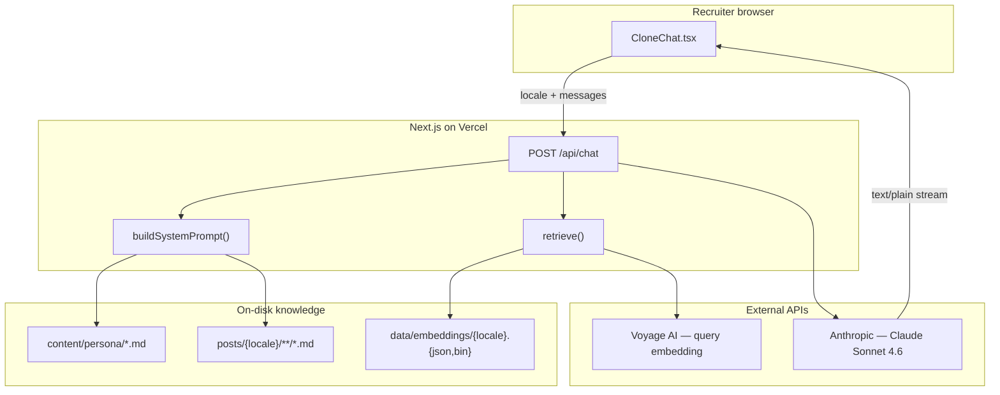
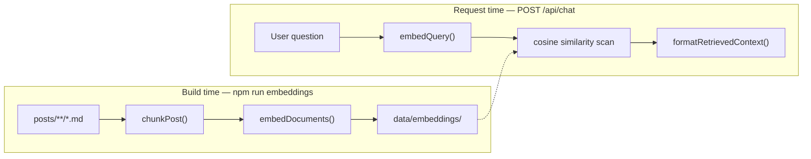
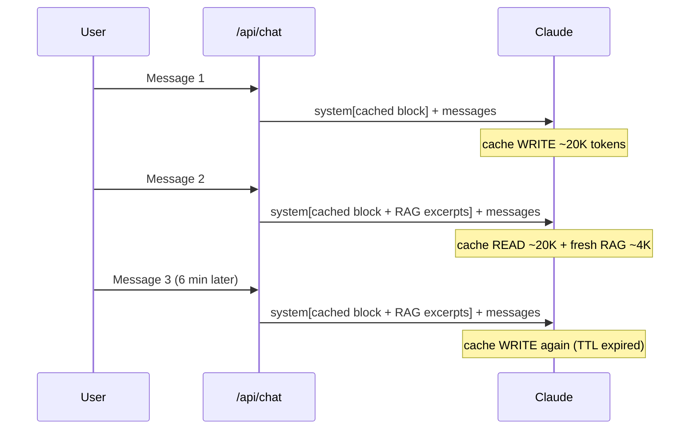

> 🤖 **ライブで試す:** [About ページ](/ja/about#ask-my-clone) を開き、サイドバーで AI Clone とチャットしてみてください。スタック、求めている条件、Kafka について書いた記事などを聞いてから、仕組みの詳細を読み進めてください。

このブログにたどり着く採用担当者は、よくこう聞きたがります。*どんなポジションを探している？ スタックは？ X について書いたことはある？* メールでもいいけれど、遅い。フランス語・英語・日本語で、自分らしく話してくれるチャットウィジェットは、ちょうどいい UX だと感じました。

この記事は、そのチャットボットの作り方を深掘りするものです — 汎用的な「チャットボットの作り方」チュートリアルではなく、Next.js アプリ内だけで動き、Markdown をソース・オブ・トゥルースとする機能の背後にあるアーキテクチャ、ライブラリ、トレードオフを率直に書いたものです。

## 何をするものか（何ではないか）

**AI Clone** は About ページ（`/[locale]/about#ask-my-clone`）上のストリーミングチャットです。Tony 本人の一人称で、次の情報を使って答えます:

1. 手作りの **persona ファイル**（`content/persona/{locale}.md`） — 履歴書の事実、連絡先、求めている条件。
2. **ブログ投稿ダイジェスト** — 現在のロケールの全投稿について、タイトル、日付、カテゴリ、タグ、抜粋。
3. **RAG 検索** — ユーザーの質問に最も関連する投稿セクションの全文。

これは**リアルタイム訪問者チャット**（右下のフローティングバブル）**ではありません**。あちらは人と人のメッセージング用の、別の Rails + ActionCable WebSocket システムです。AI Clone はステートレスで、LLM 駆動、ディスク上のファイルを読みます。



機能全体は、Markdown コンテンツに加えておおよそ 6 つのソースファイルに収まります。Redis も、チャット履歴用の Postgres も、リクエスト時のバックグラウンドワーカーもありません。

## リクエストのライフサイクル

誰かが Enter を押すと、こうなります:

```
Browser                    Next.js API route              Anthropic / Voyage
-------                    -----------------              -----------------
CloneChat posts
{ locale, messages }
        ─────────────────► Zod validates body
                           retrieve(locale, lastUserMsg) ──► embed query (Voyage)
                           buildSystemPrompt(locale)
                             ├─ readPersona (fs)
                             ├─ formatPostsDigest (blog.ts)
                             └─ formatTodos (data/todos.json)
                           formatRetrievedContext(top-k chunks)
                           messages.stream({
                             system: [cached block, RAG block],
                             messages
                           }) ─────────────────────────────►
                           ◄────────────────────────────── text deltas
        ◄───────────────── ReadableStream (text/plain)
TextDecoder + setState
ReactMarkdown re-renders
```

押さえておきたい 3 つの性質:

- **API キーはブラウザに届かない。** クライアントは `/api/chat` だけと通信し、Anthropic と Voyage の認証情報はサーバーの環境変数に置かれます。
- **コンテキストはリクエストごとに組み立てられる。** persona とダイジェストは毎回ディスクから読み込まれます（`content/persona/en.md` を編集しても再起動は不要）。
- **応答はストリーミング。** UI は fetch ボディを逐次読み、トークンが届くたびにアシスタントの吹き出しを再レンダリングします。

## レイヤー 1: Persona ファイル — ブログでは書かない事実

ブログ投稿は*何を考えていたか*を記録します。「メールは X」「ヨーロッパのリモートポジションを探している」といったことは、ほとんど書きません。採用担当者は事実を聞きます。persona ファイルがそれに答えます。

各ロケールに、`content/persona/{fr,en,ja}.md` に Markdown の概要があります:

```markdown
## Quick facts

- **Name**: Tony Duong
- **Location**: Toulouse, France
- **Email**: tony.duong.102@gmail.com
- **Languages spoken**: French (native), English (fluent), Japanese (business)
```

サーバーは同期的に読み込みます:

```typescript
function readPersona(locale: Locale): string {
  const file = path.join(personaDir, `${locale}.md`);
  if (fs.existsSync(file)) return fs.readFileSync(file, 'utf8');
  return fs.readFileSync(path.join(personaDir, `${defaultLocale}.md`), 'utf8');
}
```

**なぜ Markdown で、DB の行ではないのか？** このリポジトリではすでにコンテンツを Markdown でバージョン管理しています。ファイルを編集するのは摩擦ゼロで、diff にも向き、オフラインでも動きます。著者 1 人の個人サイトなら、CMS のテーブルはメリットのないインフラです。

**なぜブログ投稿と分けるのか？** 採用向けの事実を日記メモに混ぜると、両方が薄まります。persona は契約です — *ボットが事実として述べてよいことはここに書いてある。*

## レイヤー 2: 投稿ダイジェスト — コンテキストウィンドウを膨らませずに幅をカバー

*最近何に取り組んでいる？ どんなトピックを書いている？* といった「雰囲気」の質問には、記事全文ではなくブログ全体の地図が必要です。

`formatPostsDigest()` は `src/lib/blog.ts` の `getAllPosts(locale)` を呼び出し、`posts/{locale}/` を走査して **gray-matter** で YAML frontmatter をパースし、メタデータを返します。各投稿は 1 行になります:

```
- 2026-06-11 ・ note/tech ・ Kafka vs RabbitMQ [system-design, kafka, rabbitmq] — Hello Interview on choosing between Kafka and RabbitMQ…
```

ロケールあたり約 300 投稿で、このダイジェストはおおよそ 15〜20K トークン — 大きいが、プロンプトキャッシュ（後述）で管理可能です。

| 方式 | トークン数（300 投稿） | トピック列挙 | 段落の引用 |
|---|---|---|---|
| プロンプトに投稿全文 | 200K+ | 可 | 可 |
| ダイジェスト（タイトル + 抜粋のみ） | ~20K | 可 | 不可 — 抜粋の言い換えのみ |
| ダイジェスト + RAG（本プロジェクト） | ~20K 固定 + ~4K 取得 | 可 | 可（一致セクション） |

ダイジェストは*幅*に答えます。RAG は*深さ*に答えます。両方を残したのは意図的です — 検索は「データベースについて書いたことを全部列挙して」には向きません。

## レイヤー 3: RAG — 関連するときだけ投稿全文

ブログが 80 投稿を超えてから、ダイジェストだけでは限界が見えました。*「メッセージキューについて何と結論づけた？」* と聞かれても、タイトルと 1 文の抜粋は返せても、実際の分析は返せません。

RAG（retrieval-augmented generation）は、毎リクエスト全投稿本文を詰め込まずにそれを解決します。

### 2 つの時計: オフラインでビルド、オンラインで提供



**ビルド時**（`npm run embeddings`）:

1. 各投稿の Markdown 本文を読む（`getRawPostBody`）。
2. `##` 見出しでチャンクに分割（`src/lib/rag-chunk.ts`）。
3. 大きすぎるセクションをウィンドウ分割（約 4000 文字、400 文字オーバーラップ）。
4. 各チャンクを **Voyage AI**（`voyage-3.5`、多言語）で embed。
5. `data/embeddings/{locale}.json`（メタデータ + チャンクテキスト）と `{locale}.bin`（パックされた Float32 ベクトル）を書き出す。

**リクエスト時**:

1. ユーザーの最新メッセージを embed（`embedQuery`）。
2. 事前構築したインデックスに対してコサイン類似度を総当たり。
3. 上位 8 チャンクを取り、2 つ目の system プロンプトブロックに整形。

インデックスファイルは**リポジトリにコミット**されます。デプロイでベクトルを*読む*ために Voyage キーは不要 — ランタイムで新しいクエリを embed するときだけ（メッセージあたり約 1 回の安い API 呼び出し）。

### チャンク分割の戦略

このブログの投稿は `## Section` ブロックで書かれています。h2 見出しで分割すると、意味的にまとまったチャンク — セクション 1 つに 1 アイデア — になります。最初の見出しより前の内容は「intro」チャンクになります。

embedding 用には、各チャンクの先頭にタイトルと見出しを付け、箇条書きだけのセクションにもトピックの手がかりを持たせます:

```
Kafka vs RabbitMQ › The technical trade-offs

### Ordering
- RabbitMQ queues are strictly ordered…
```

### なぜ総当たり検索で、pgvector ではないのか

約 300 投稿 → 数千チャンク規模では、正規化された Float32 ベクトルへの線形スキャンは Node 上で 1 ミリ秒未満です。ホスト型ベクトル DB を足すと:

- デプロイと監視が増える
- コネクションプールと認証
- デプロイに紐づく再インデックスパイプライン

`retrieve()` は意図的に差し替え可能です — コーパスが数万チャンクに達したら、sqlite-vec や ANN インデックスを同じインターフェースの裏に置けます。個人ブログなら YAGNI が勝ちます。

### グレースフルデグラデーション

`data/embeddings/` が無い、または Voyage が失敗した場合、`retrieve()` は `[]` を返し、チャットは persona + ダイジェストだけにフォールバックします。壊れはしません。答えがやや粗くなるだけです。CI で最初のインデックスが生成される前に RAG をマージしても安全でした。

## システムプロンプトの組み立て

`src/lib/clone-context.ts` の `buildSystemPrompt(locale)` がすべてを 1 つの文字列に融合します:

```
[role line — in target language]
[reply language instruction — in target language]

# Style
- Talk in first person…
- Never invent employment history…

# Recruiter brief (English)
{persona markdown}

# Goals & learning list (optional, from data/todos.json)
{todo items}

# Blog posts index
{digest — one line per post}
```

ロケールごとの role 行は、対象言語*で*書かれます。`"Respond in ja"` ではなく、言語指示自体をフランス語・日本語にしたほうが、モデルは指示に従いやすいです。

RAG の後、**2 つ目**の system ブロックが付く場合があります:

```
# Relevant excerpts (full text, retrieved for this question)
### Kafka vs RabbitMQ — The technical trade-offs
(source: /posts/kafka-vs-rabbitmq)

{full section markdown}
```

API ルートは 2 つの system ブロックを Claude に送ります:

```typescript
const system = [
  { type: 'text', text: stableSystem, cache_control: { type: 'ephemeral' } },
  ...(retrievedContext ? [{ type: 'text', text: retrievedContext }] : []),
];
```

安定ブロックはキャッシュされます。RAG ブロックは質問ごとに変わり、キャッシュブレークポイントの*後*に置かれます。

## ストリーミング API ルート

`src/app/api/chat/route.ts` は Next.js Route Handler です — Server Action ではありません。

| 方式 | ストリーミング | ファイルシステム | curl から呼べる |
|---|---|---|---|
| Server Action | 扱いにくい（単一ペイロード） | 回避策で可能 | 不可 |
| Route Handler | ネイティブ `ReadableStream` | 可（Node runtime の `fs`） | 可 |

入力検証は **Zod** を使います:

```typescript
const BodySchema = z.object({
  locale: z.string().refine(hasLocale),
  messages: z.array(z.object({
    role: z.enum(['user', 'assistant']),  // no client-supplied system role
    content: z.string().min(1).max(4000),
  })).min(1).max(40),
});
```

注目すべきは、クライアントメッセージに **`system` ロールがない**ことです。ブラウザに system プロンプトを送らせるのはプロンプトインジェクションの入口になります。

ハンドラーは Anthropic のテキストデルタをプレーンテキスト応答にストリームします:

```typescript
for await (const event of messageStream) {
  if (event.type === 'content_block_delta' && event.delta.type === 'text_delta') {
    controller.enqueue(encoder.encode(event.delta.text));
  }
}
```

Server-Sent Events ではなくプレーン `text/plain` — デバッグするプロトコルが 1 つ減り、デルタはもともとプレーンテキストです。

`export const runtime = 'nodejs'` は明示的です。`clone-context.ts` が `fs.readFileSync` を使うためです。Edge runtime にはファイルシステムがありません。

## チャット UI

`CloneChat.tsx` は About ページ上のクライアントコンポーネントです。次を行います:

1. `messages` を React state で保持（ステートレスサーバー — 毎リクエスト全文履歴を送信）。
2. `{ locale, messages }` で `/api/chat` に POST。
3. `res.body.getReader()` を読み、デコードしたチャンクをアシスタントメッセージに追記。
4. アシスタントの返答を **react-markdown** + **remark-gfm**（表、取り消し線、タスクリスト）でレンダリング。

クライアントで Markdown をストリーミングするということは、デルタのたびに部分的な文字列を再パースすることになります。短いチャット返答なら問題ありません。長文なら段落境界までバッファしたほうがよいでしょう。

ユーザーの吹き出しはプレーンテキスト。アシスタントの吹き出しは Markdown スタイル一式（リンクは新しいタブ、コードブロック、リスト）。

## ライブラリと、それぞれを選んだ理由

| ライブラリ | 役割 | 他ではなくこれを選んだ理由 |
|---|---|---|
| **@anthropic-ai/sdk** | Claude 応答のストリーム | ネイティブストリーミングイテレータとプロンプトキャッシュ対応の公式 SDK |
| **zod** | POST ボディの検証 | 既存スタック。API 到達前に不正・巨大ペイロードを捕捉 |
| **gray-matter** | 投稿 frontmatter のパース | ブログレンダラーと同じパーサー — メタデータの単一ソース |
| **react-markdown** + **remark-gfm** | アシスタント返答のレンダリング | 安全な React レンダリング（チャットで `dangerouslySetInnerHTML` なし）。GFM はブログ執筆と一致 |
| **Voyage AI**（fetch、SDK なし） | ビルド時 + クエリ時の embedding | Anthropic 推奨パートナー。`voyage-3.5` は多言語（fr/en/ja コーパス、クロスロケール検索） |
| **tsx** | `scripts/build-embeddings.ts` の実行 | Next.js ランタイム外の TypeScript 取り込みスクリプト |
| **server-only** | `clone-context.ts`、`rag.ts` のガード | `fs` 使用モジュールの誤ったクライアント import を防止 |

LangChain も、Vercel AI SDK も、ベクトル DB クライアントもありません。検索ループは内積が約 30 行。ストリーミングループは約 15 行。import しない依存関係は、夜 11 時にデバッグしない依存関係です。

## 設計判断と代替案

この表は率直な「なぜ X ではないのか」のまとめです。制約が違えば答えも変わります — 1 日 1 万ユーザー規模のプロダクトなら、いくつかは逆転します。

| 判断 | 選んだもの | 見送ったもの | 理由 |
|---|---|---|---|
| **Backend** | Next.js API route | 別 Rails/Python サービス | Vercel に 1 デプロイ、CORS なし、認証境界も 1 つ |
| **Knowledge store** | Markdown ファイル + コミット済み embedding インデックス | Postgres + pgvector | コンテンツはすでに git に。~3K チャンクに DB は不要 |
| **Retrieval** | Float32 バイナリへの総当たりコサイン | Pinecone、Weaviate、OpenSearch | この規模では sub-ms。運用ゼロ |
| **Context strategy** | ハイブリッド: ダイジェスト（幅）+ RAG（深さ）+ persona（事実） | 全コーパスプロンプト OR 純 RAG | ダイジェストは RAG が列挙できないトピック用。persona は投稿にない事実 |
| **Response transport** | `text/plain` の `ReadableStream` | SSE、WebSocket | Anthropic デルタから fetch reader への最短経路 |
| **Conversation state** | クライアントが毎ターン全文履歴を送信 | サーバー側セッション DB | ステートレス API、DB 書き込みなし、リフレッシュ = 新規開始 |
| **Markdown rendering** | クライアント側 `react-markdown` | サーバー生成 HTML チャンク | HTML の安全なストリーミングは面倒。チャット返答は短い |
| **Model** | Claude Sonnet 4.6 | Haiku（安い）、Opus（賢い） | 採用向け回答の品質とコストのバランス |
| **Prompt caching** | 安定 system ブロックに `cache_control: ephemeral` | 毎ターン全文プロンプトを定価で再送 | ~20K トークンの system プロンプトはキャッシュなしでは高い |

## プロンプトキャッシュ — 大きなダイジェストを手頃にする仕組み

安定した system プロンプトは約 15〜20K トークンです。キャッシュがなければ、マルチターン会話の各メッセージで、そのプレフィックスの入力コストを毎回フルで払うことになります。

Anthropic のプロンプトキャッシュは、system ブロックをキャッシュ可能なプレフィックスとして扱います:

- セッションの**最初のメッセージ**: キャッシュ**書き込み**（キャッシュされたトークンは入力単価の約 1.25 倍）。
- **約 5 分以内**のフォローアップ: キャッシュ**読み取り**（約 0.1 倍）。
- **RAG ブロック**はキャッシュマーカーの後 — 質問ごとに変わるのでキャッシュされません。

重要な落とし穴: キャッシュは**プレフィックス一致**です。安定ブロックが 1 バイトでもずれるとキャッシュは無効になります。`buildSystemPrompt()` に `new Date()` やセッション ID を補間しないでください。



個人ブログの低い採用トラフィックなら、実質無料に近いです。ボリュームが増えれば Haiku 4.5 でさらにコストを下げられます。

## 多言語の挙動

3 ロケール: `fr`、`en`、`ja`。それぞれに:

- 専用の persona ファイル
- 専用の投稿ディレクトリ（`posts/{locale}/`）
- 専用の embedding インデックス

UI のロケールが**返答言語**を制御します（system プロンプト内の指示）。ダイジェストはそのロケールの投稿だけを引きます。Voyage の多言語 embedding により、フランス語の質問でも関連する英語投稿セクションを検索できます — ただし今日はロケールごとで、ブログの構造（翻訳はあるが常に 1:1 ではない）に合わせています。

4 つ目のロケールを足すには: `i18n-config.ts` を拡張し、`content/persona/es.md`、辞書文字列、必要なら `posts/es/` を追加して `npm run embeddings -- es` を実行。

## コストと運用の形

| タイミング | 課金対象 | おおよそのトリガー |
|---|---|---|
| Build | Voyage document embeddings | 新規/編集投稿 → `npm run embeddings` |
| Serve | Voyage query embedding | ユーザーメッセージごと |
| Serve | Anthropic input + output | ユーザーメッセージごと |
| Serve | Prompt cache write | アイドル後 / TTL 切れ後の最初のメッセージ |
| Serve | Prompt cache read | ~5 分以内のフォローアップメッセージ |

常時オン GPU も、ベクトル DB 課金も、デプロイごとの embedding 再実行もありません（インデックスは git にあります）。

増分 embedding キャッシュ（`data/embeddings/.cache.json`、gitignore）がコンテンツハッシュで変更のない投稿をスキップ — 日々の Voyage コストは、書いていなければほぼゼロに近いです。

## ボットのカスタマイズ

| 目的 | 編集場所 |
|---|---|
| 履歴書の事実、連絡先、求めている条件の更新 | `content/persona/{locale}.md` |
| トーン、拒否ルール、長さのルール変更 | `src/lib/clone-context.ts` の `# Style` ブロック |
| モデルまたは max tokens の変更 | `src/app/api/chat/route.ts` |
| UI 文字列、例示プロンプト | `src/dictionaries/{fr,en,ja}.json` の `chat` ブロック |
| 新規投稿後の検索インデックス再構築 | `npm run embeddings` |
| チャンクサイズ / オーバーラップの調整 | `src/lib/rag-chunk.ts` |
| 取得セクション数の変更 | `src/lib/rag.ts` の `retrieve(locale, query, k)` デフォルト |

persona とダイジェストの変更は次のリクエストから反映 — 再ビルド不要。新しい投稿はダイジェストを自動更新（ランタイム読み込み）し、RAG の深さのために embedding の再ビルドが必要。

## スケールしたら変えること

このアーキテクチャは、低トラフィックで Markdown ネイティブなコンテンツの個人ブログ向けに調整されています。限界が見えてくるサイン:

- **500+ 投稿、ダイジェストだけで ~50K トークン超** → ダイジェストを「直近 N 投稿」やタグフィルタに絞る。RAG 依存を増やす。
- **同時セッションが数千** → サーバー側会話ストア、レート制限、不正検知。
- **チャンクが数万** → 総当たりスキャンを sqlite-vec やホスト ANN インデックスに差し替え、`retrieve()` の裏に置く。
- **厳密な引用要件** → 取得チャンクに明示的なソース URL（`/posts/{slug}` は部分的に既存）を足し、チャンクだけに基づく主張を後処理で検証。

今のこのサイト — 数百投稿、週に数件の採用会話 — では、Markdown イン、ストリームアウト、ファイルバック RAG は、ちょうどいい機械の量です。

## ファイルマップ

```
content/persona/
  en.md, fr.md, ja.md          ← recruiter brief (edit this)

posts/{locale}/**/*.md         ← blog source (frontmatter + body)

data/embeddings/
  {locale}.json                ← chunk metadata + text
  {locale}.bin                 ← packed Float32 vectors

src/
  app/api/chat/route.ts        ← streaming POST handler
  app/[locale]/about/page.tsx  ← embeds CloneChat
  components/CloneChat.tsx     ← client UI
  lib/
    clone-context.ts           ← system prompt assembly
    rag.ts                     ← retrieval
    rag-chunk.ts               ← Markdown chunking
    voyage.ts                  ← embeddings client
    blog.ts                    ← getAllPosts, getRawPostBody

scripts/build-embeddings.ts    ← offline ingestion
```

## 自分で試す

このリポジトリをローカルで動かす場合:

```bash
cp .env.local.example .env.local
# Add ANTHROPIC_API_KEY (required)
# Add VOYAGE_API_KEY (optional — needed for RAG query embedding + building index)

npm run dev
# Open http://localhost:3000/ja/about#ask-my-clone
```

`ANTHROPIC_API_KEY` がなければ UI は表示されますが API は 500 を返します。`VOYAGE_API_KEY` またはインデックスファイルがなければ、persona + ダイジェストだけでチャットは動きます。

Claude が実際に何を見ているか確認するには:

```typescript
// scripts/dump-prompt.ts
import { buildSystemPrompt } from '@/lib/clone-context';
console.log(buildSystemPrompt('en'));
```

`npx tsx scripts/dump-prompt.ts` で実行。組み立てたプロンプトを読むのは、プロンプト駆動システムのデバッグで最もレバレッジの高い一手です。

---

AI Clone は形のはっきりした小さな機能です: **Markdown イン、途中で取得コンテキスト、ストリームアウト。** ベクトル DB も、第 2 バックエンドも、会話 DB もなし — ファイル、事前構築インデックス、メッセージあたり 2 回の API 呼び出しだけ。すでにコンテンツをコードとして扱うブログにとって、これはチャットボットプロジェクトというより、同じリポジトリを読む別の方法に感じました。

---

> 🌐 *Claudeによる翻訳*
