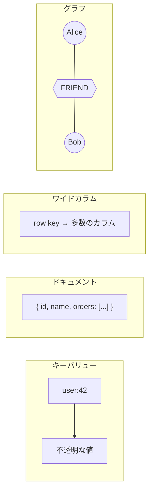
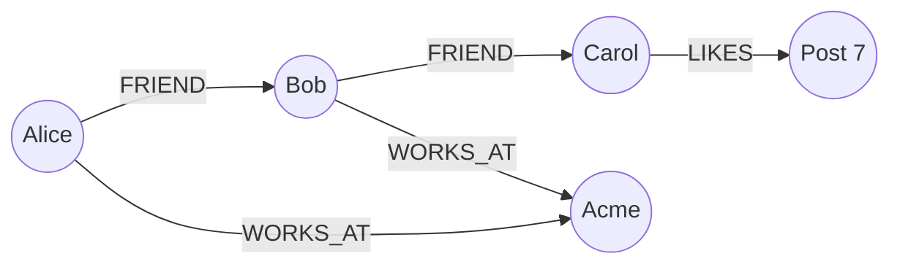

*System Design Interview* のメモ — NoSQLはよく **4分類** に分けられる：キーバリュー、ドキュメント、カラム（ワイドカラム）、グラフ。同じ「非リレーショナル」でも、アクセスパターンは大きく違う。



## 1. キーバリューストア

**考え方：** 巨大な辞書。キーを渡すと値が出る。それが主API。

| | |
|---|---|
| **強み** | 高速ルックアップ、スケールが単純、キャッシュ/セッション向き |
| **弱み** | 値の中身フィールドでのクエリがほぼできない |
| **例** | Redis、DynamoDB（単純PK）、Memcached、etcd |

```python
# Redis風のメンタルモデル
SET session:abc123 '{"userId":42,"cart":["sku-9"]}'
GET session:abc123
# → {"userId":42,"cart":["sku-9"]}

# 普通はこうは聞かない：
# 「cart に sku-9 を含む全セッションを探せ」
```

**向いている用途：** セッション、feature flag、レート制限、キャッシュ、IDキーのカート。

## 2. ドキュメントストア

**考え方：** 値は構造化ドキュメント（多くはJSON/BSON）。*中身*をクエリできる。

| | |
|---|---|
| **強み** | 柔軟なスキーマ、ネストデータ、豊富なクエリ/インデックス |
| **弱み** | ドキュメント横断のJOINが苦手；放置するとスキーマドリフト |
| **例** | MongoDB、CouchDB、Firestore |

```javascript
// MongoDB
db.users.insertOne({
  _id: "u42",
  name: "Tony",
  address: { city: "Paris", country: "FR" },
  tags: ["backend", "systems"]
})

db.users.find({ "address.city": "Paris", tags: "systems" })
```

**キーバリューとの違い：** どちらもJSONを置けても、ドキュメントはフィールドをインデックスして絞り込みできる。キーバリューは値をほぼ不透明な塊として扱う。

**向いている用途：** ユーザープロフィール、CMS、商品カタログ、フィールドが進化するイベントペイロード。

## 3. カラムストア（ワイドカラム）

**考え方：** **row key + カラム** で整理。スパース・高書き込み・時間軸アクセスに強い。（ClickHouseのような分析用「カラムナ」OLAPとは別物 — 同じ言葉でも役割が違う。）

| | |
|---|---|
| **強み** | 巨大な書き込みスループット、スパース表、キー範囲スキャン |
| **弱み** | アクセスパス起点のモデリング；アドホッククエリは苦手 |
| **例** | Cassandra、HBase、ScyllaDB、Bigtable |

```text
Row key: user:42
  profile:name     → "Tony"
  profile:email    → "tony@example.com"
  metrics:2026-08-01 → 120   # スパース：多くの日は欠ける
  metrics:2026-08-02 → 95
```

```cql
-- Cassandra: 必要なクエリに合わせてテーブルを設計する
CREATE TABLE page_views (
  page_id text,
  day date,
  views counter,
  PRIMARY KEY (page_id, day)
);

SELECT views FROM page_views
WHERE page_id = '/blog/nosql'
  AND day >= '2026-07-01';
```

**ドキュメントとの違い：** ドキュメントは「エンティティごとに1つのネストオブジェクト」。ワイドカラムは「キー配下の名前付きセル群」で、書き込みとキー範囲に最適化されることが多い。

**向いている用途：** IoTメトリクス、activity feed、メッセージタイムライン、高書き込みのマルチテナントログ。

## 4. グラフストア

**考え方：** **ノード**と**リレーション**が第一級。クエリはエッジを辿る — 友達の友達、不正リング、レコメンド。

| | |
|---|---|
| **強み** | 多段ホップの関係クエリが自然で速い |
| **弱み** | 単純CRUDには過剰；グラフ全体のシャーディングが難しい |
| **例** | Neo4j、Amazon Neptune、JanusGraph |



```cypher
-- Neo4j: Alice の友達の友達は誰？
MATCH (a:Person {name:'Alice'})-[:FRIEND*2]->(fof)
WHERE NOT (a)-[:FRIEND]->(fof) AND a <> fof
RETURN DISTINCT fof.name
```

ドキュメントDBでは友達IDを埋め込んでN回クエリしがち。グラフは*関係*そのものをデータモデルにする。

**向いている用途：** SNSグラフ、ナレッジグラフ、レコメンド、権限階層、不正検知。

## 早見表

| 分類 | ルックアップ単位 | 得意な問い | 苦手 |
|---|---|---|---|
| **キーバリュー** | `key → value` | 「このIDを取れ」 | 「属性で探せ」 |
| **ドキュメント** | JSONドキュメント | 「Paris在住でtag Xのユーザー」 | 深い多段JOIN |
| **ワイドカラム** | row key + カラム | 「エンティティの時系列メトリクスをスキャン」 | 柔軟なアドホック分析 |
| **グラフ** | ノード + エッジ | 「AとBはどう繋がっている？」 | キー取得だけが要件の場合 |

## 使い分けの目安

**主アクセスパス**に合わせる：

1. **IDだけ** → キーバリュー
2. **ネストフィールド / 柔軟なドキュメント** → ドキュメント
3. **パーティションキー + 時間/範囲、巨大書き込み** → ワイドカラム
4. **関係 / 多段パス** → グラフ

本番ではよく混ぜる（Redisキャッシュ + MongoDBドキュメント + レコメンド用Neo4j）。分類は設計のレンズであり、排他的な宗教ではない。
