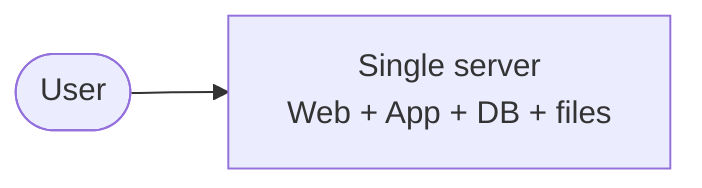
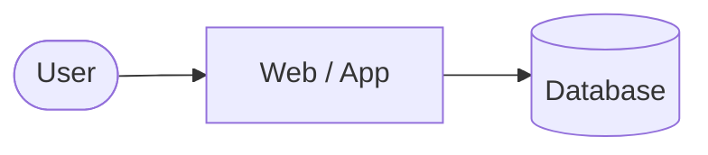
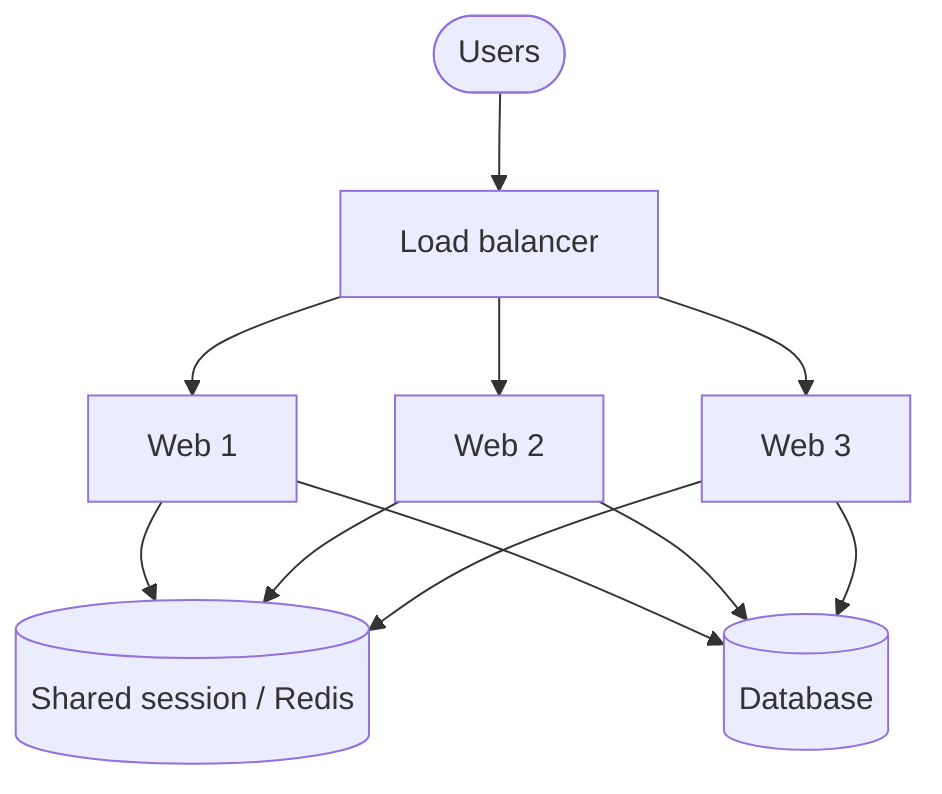
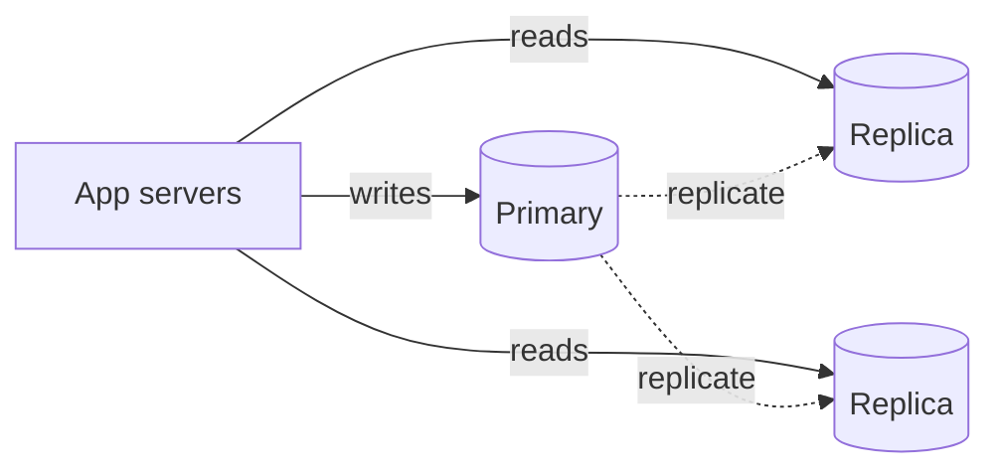
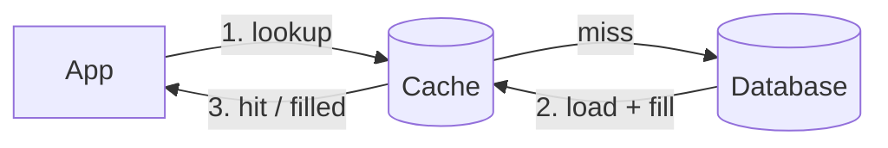
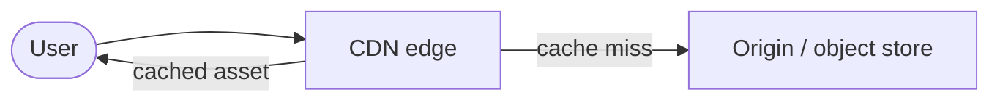
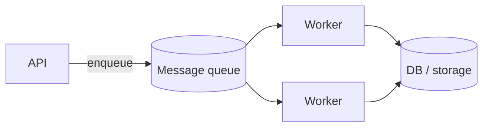
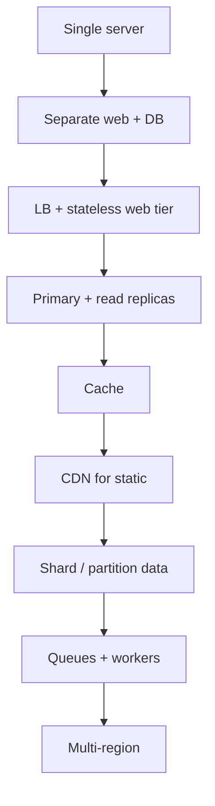

*System Design Interview – An Insider's Guide*（Alex Xu）第1章のメモ。本章は **垂直スケール → 水平スケール** のツアー：1台のマシンから始め、トラフィックが増えるにつれて必要な部品を足していく。

## シンプルに始める：1台のサーバー

Web、アプリ、データベース、静的ファイルをすべて1台に載せる。

プロトタイプなら十分。ただし次のときに破綻する：

- CPU / メモリ / ディスクが上限に達する
- 1プロセスのクラッシュでプロダクト全体が落ちる
- ダウンタイムなしではデプロイできない

## Web 層とデータ層の分離

最初の本格的な分割：

- **Web / アプリサーバー** — ステートレスなリクエスト処理
- **データベース** — 永続的な状態

なぜ重要か：各層を独立してスケール・障害分離できる。アプリはネットワーク経由で DB に接続し、DB はもはや「同じマシン上のフォルダ」ではない。

## 垂直スケール vs 水平スケール

| アプローチ | 考え方 | 限界 |
|----------|------|--------|
| **垂直**（scale up） | 1台のマシンに CPU / RAM / ディスクを増強 | ハードウェアの上限、単一障害点、コスト高 |
| **水平**（scale out） | マシンを増やす | ロードバランシング、shared-nothing 設計、運用の複雑さが必要 |

インターネット規模のインタビューではデフォルトは **scale out**、サーバーは **ステートレス** に保つ。

## ロードバランサー

複数の Web サーバーの前にロードバランサーを置く。

- クライアントは単一の VIP / ホスト名にアクセス
- LB がトラフィックを分散（round-robin、least connections など）
- 1台の Web サーバーが落ちても → LB はそこへトラフィックを送らない

Web 層は **特定マシンのディスクにセッションを保存してはいけない**。セッションは共有ストア（Redis、DB）へ置き、どのサーバーでもどのリクエストも処理できるようにする。

## データベースレプリケーション

典型的なパターン：**1つの primary（書き込み）+ read replica**。

- 書き込み → primary
- 読み取り → replica
- レプリケーションラグは現実にある — 設計で考慮する（必要なら read-your-writes）

primary のフェイルオーバーは運用課題；フル HA 設計をしなくてもインタビューでは触れておく。

## キャッシュ

ホットな読み取りに DB は高コスト。遅いクエリや計算結果の前にキャッシュ（Redis / Memcached）を置く。

実践的なルール：

- **ホット** なデータを明確な TTL / 無効化戦略でキャッシュ
- **cache stampede** と **thundering herd** に注意
- 理由がなければ write-through より cache-aside を優先

## 静的コンテンツの CDN

画像、JS、CSS、動画 → ユーザーに近い CDN エッジノードへ。

- レイテンシ低減
- origin への負荷軽減
- アセット変更時はキャッシュ無効化 / バージョン付き URL

## ステートレス Web 層（もう一度、大きく）

リクエストが特定マシンに紐づく sticky session を要求すると、自由にオートスケールやノード交換ができない。セッション / 状態は Redis か DB へ。Web サーバーは cattle として扱う。

## マルチデータセンター / 地理的分散

より大きな規模では：

- 地域ごとのユーザー → geo-DNS またはグローバル LB
- データレジデンシーと DC 間レプリケーション
- 一貫性とフェイルオーバーの複雑さが増す

プロンプトが世界中のトラフィックを示唆するときは言及する。

## メッセージキューと非同期処理

すべてのリクエストが重い処理をインラインで行う必要はない。

- API が仕事を受け付ける → enqueue → worker が処理
- スパイクと処理能力を切り離す
- リトライ、DLQ、冪等性が設計の一部になる

例：画像処理、メール、フィード fan-out、課金ジョブ。

## ログ、メトリクス、自動化

可観測性なしのスケールは盲目飛行：

- 集中ログ
- メトリクス + アラート（レイテンシ、エラー率、飽和度）
- デプロイ、スケーリング、フェイルオーバードリルの自動化

## 進化の道筋（チートシート）

## インタビューの要点

第1章は1つの設計ではなく、**スケーリングのレバーのメニュー**。実際のインタビューではボトルネック（CPU、DB 読み取り、静的コンテンツのレイテンシ、書き込みスループット、非同期 fan-out）が現れたときに次のレバーを選び、*なぜ* そのレバーがそのボトルネックに合うかを説明する。
