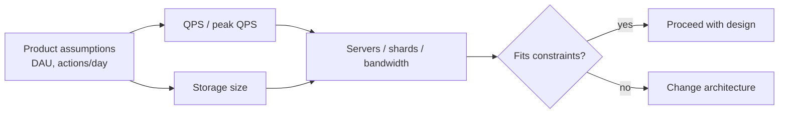

*System Design Interview* 第2章のメモ。インタビュアーが重視するのは正確な計算より、**システムのサイズ感** を大まかだが筋の通った数字で示せるかどうか。

## なぜ見積もるのか？

バックオブザエンベロープの計算が答えること：

- サーバー / シャードは何台必要か？
- ボトルネックは DB かネットワークか？
- この設計は RAM / ディスク / 予算に収まるか？

2〜3倍の誤差はよくある。100倍の誤差はアーキテクチャが間違っているサイン。



## 2の累乗（メモリ / ストレージ）

おおよそのサイズを覚えておく：

| 累乗 | おおよその値 | ざっくりした意味 |
|-------|--------------|---------------|
| 10 | ~1 thousand | |
| 20 | ~1 million | |
| 30 | ~1 billion | |
| 40 | ~1 trillion | |

バイト：

```text
1 KB  ≈ 10^3 bytes
1 MB  ≈ 10^6 bytes
1 GB  ≈ 10^9 bytes
1 TB  ≈ 10^12 bytes
1 PB  ≈ 10^15 bytes
```

覚えておくと便利：`2^10 ≈ 10^3` なので、バイナリ接頭辞はインタビューでは十進と十分近い。

## 頭に入れておくべきレイテンシの目安

オーダー感の直感（Jeff Dean 系の定番テーブル — 全桁ではなく *形* を覚える）：

```text
L1 cache reference          ~   1 ns
Branch mispredict           ~   3 ns
L2 cache reference          ~   4 ns
Mutex lock/unlock           ~  17 ns
Main memory reference       ~ 100 ns
Compress 1KB with Zippy     ~  2 µs
Send 2KB over 1 Gbps        ~ 20 µs
Read 1MB sequentially RAM   ~250 µs
Round trip same datacenter  ~500 µs
Disk seek                   ~ 10 ms
Read 1MB sequential disk    ~ 20 ms
Send packet CA → Netherlands ~150 ms
```

実務への翻訳：

- ランダムアクセスではメモリ ≫ ディスク
- 同一 DC 内の RPC はリージョン間より安い
- ホットパスでディスク seek を避ける；シーケンシャル / SSD / メモリを優先

## トラフィック見積もり（QPS）

典型的なインタビューの流れ：

1. DAU / MAU を聞く（または面接官と仮定を合わせる）
2. ユーザーあたりの1日リクエスト数を見積もる
3. QPS に換算し、ピーク QPS を出す

```text
QPS ≈ (DAU × actions_per_user_per_day) / 86400

Peak QPS ≈ QPS × peak_factor   # よく 2×–5×、面接官と確認
```

例：

```text
10M DAU
各ユーザーが1日20回読み取り
→ 200M reads/day
→ ~2,300 QPS average
→ ~5,000–10,000 QPS at peak (if 2–4×)
```

仮定は必ず声に出す。

## ストレージ見積もり

```text
storage ≈ users × data_per_user × retention × replication_factor
```

オブジェクトをフィールドに分解：

```text
Tweet ≈ 300 bytes metadata + media pointers
Photo ≈ 200 KB average
5 years × 3 replicas → multiply carefully
```

大胆に丸める。式を示してから、丸めた結果を出す。

## 帯域幅

```text
bandwidth ≈ QPS × average_payload_size
```

CDN vs origin の判断や、1枚の NIC が負荷に対して非現実的かどうかの判断に使える。

## シニアっぽく聞こえるコツ

- 計算の前に **仮定を明示**
- 早い段階で **丸める**（`3.14 → 3`、`86400 → 10^5`）
- 既知のプロダクトと **sanity check**（「Instagram 規模？」）
- 見積もりを装飾ではなく **設計選択を導く**（シャード数、キャッシュサイズ）
- 面接官が数字を出したら **それを使う**

## チートシート

| 質問 | ざっくりしたアプローチ |
|----------|----------------|
| QPS | DAU × actions/day / 86,400 × peak factor |
| Storage | records × size × retention × replicas |
| Cache size | working set（しばしば ≪ 全データ） |
| Shards | write QPS または data size / per-node capacity |

## インタビューの要点

見積もりは **コミュニケーションツール**。プロダクトの規模をマシン制約に翻訳でき、そもそも成立しない設計を早期に見抜けることを示す。
