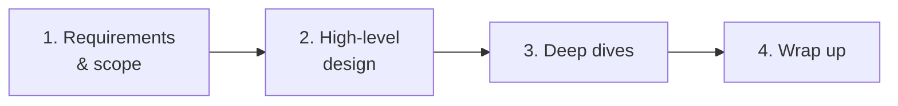
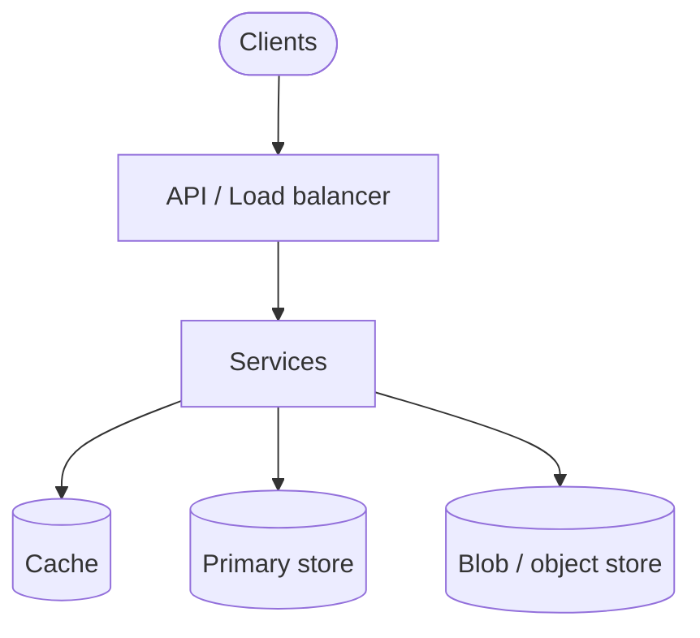

*System Design Interview* 第3章のメモ。本のどの設計問題にも使えるプロセス — 筋肉記憶になるまでこの骨格を使い回す。

## 4ステップのフレームワーク



```text
1. 問題を理解し、設計スコープを確定する
2. ハイレベル設計を提案し、合意を得る
3. 深掘り（難しい部分）を設計する
4. まとめる
```

おおよその時間配分：要件 ~5分、ハイレベル ~10–15分、残りは深掘り + トレードオフ。

## ステップ1 — 要件とスコープ

箱と矢印に飛び込まない。

聞くこと：

- **機能要件：** 正確にどの機能か？ユーザーは誰か？モバイル / Web？アップロード？検索？リアルタイム？
- **非機能要件：** 規模（DAU、QPS）、レイテンシ、一貫性、可用性、耐久性
- **スコープ外：** 認証の詳細？GDPR？UI の細部？スキップするものを確認

曖昧な依頼を数字に翻訳：

```text
"Design Twitter"
→ ツイート投稿、フォロー、ホームタイムライン
→ 100M DAU、読み取り中心、fan-out は eventual OK、投稿は strong-ish？
```

制約をホワイトボードに書く。トレードオフするときに戻って確認する。

## ステップ2 — ハイレベル設計

機能要件を満たす **最小限** のアーキテクチャをスケッチ：

- クライアント → API / ロードバランサー → サービス
- ストレージの選択（SQL vs NoSQL、blob store）
- 主要フロー（書き込みパス、読み取りパス）

consistent hashing の内部に入る前に、面接官のうなずきを得る。



良い習慣：

- API にラベル（`POST /tweets`、`GET /feed`）
- 読み取りパスと書き込みパスが異なるなら分離
- 形を決めるスケール仮定を1〜2個明示

## ステップ3 — 深掘り

ここでシニアとジュニアが分かれる。規模が示唆するボトルネックを選ぶ：

- ホットキー / セレブリティ fan-out
- パーティション下の一貫性
- キャッシュ無効化
- レート制限、バックプレッシャー
- シャード戦略、リバランス
- キューの配信保証

面接官が気にする **2〜3** 領域を深く — すべてのコンポーネントを均等には扱わない。

トレードオフで話す：

```text
"Push fan-out はアクティブユーザーに有利だがセレブリティには高コスト —
 だからハイブリッド：通常は push、メガフォロワーは pull。"
```

## ステップ4 — まとめ

最後の数分で：

- 元の要件に対して設計を要約
- ボトルネックと監視すべきものを述べる
- 時間があればやること（マルチリージョン、より厳しい一貫性、コスト）を言及
- 別の深掘りを希望するか聞く

## 面接官が見るもの

完璧な図ではない。評価されるのは：

| シグナル | 見え方 |
|--------|---------------------|
| Communication | 明確化の質問、構造化された説明 |
| Scope control | スコープ内 / 外の明示 |
| Trade-off thinking | 「選択肢 A vs B、A を選ぶ理由は…」 |
| Fundamentals | キャッシュ、シャーディング、レプリケーション、キューの正しい使用 |
| Adaptation | 面接官の指摘に合わせて調整 |

## アンチパターン

- API がないのに Kafka 設定に飛び込む
- さっき見積もった規模の数字を無視する
- 10分間黙ってホワイトボードに描く
- CAP / 「マイクロサービスを使う」を魔法の言葉として扱う
- 仮定を一度も述べない

## インタビューの要点

フレームワークは **会話のプロトコル**。要件 → 形 → 難所 → 要約。本の以降の章はすべて、このループを具体問題に当てはめた例。
