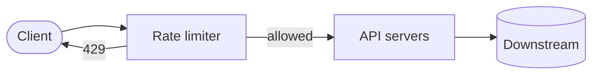
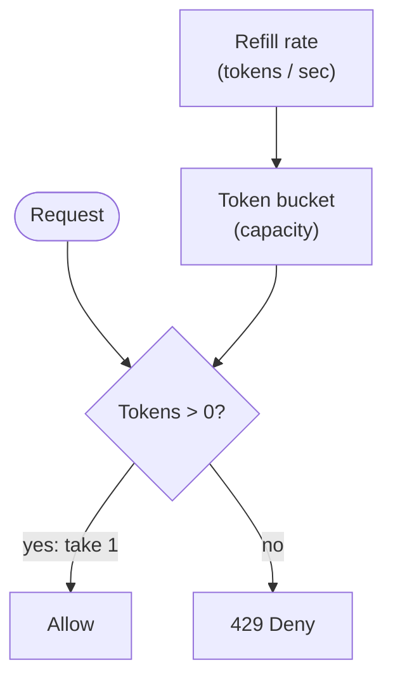
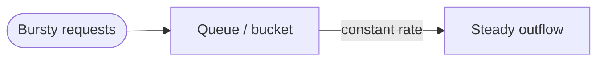
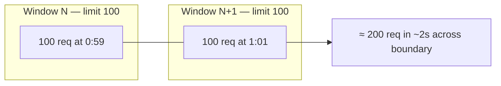
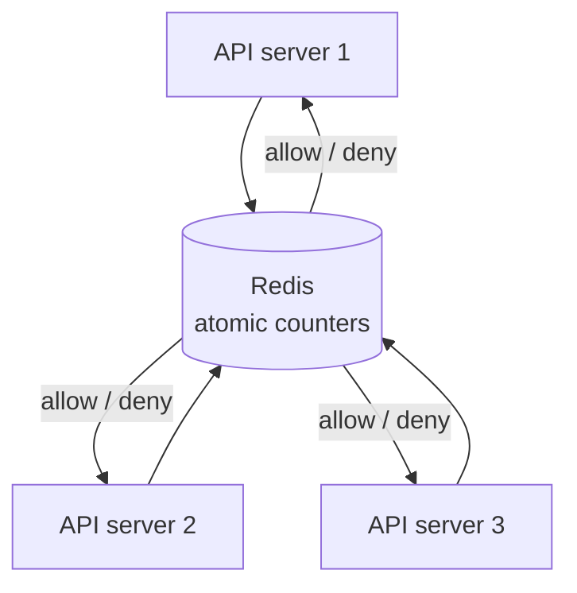

*System Design Interview* 第4章のメモ — **レートリミッター** の設計：クライアントが一定時間内に送れるリクエスト数を制御する。

## なぜレート制限するのか？

- API を悪用や偶発的な洪水から守る
- ビジネスティアを強制（無料 vs 有料 QPS）
- コスト削減（下流の DB / サードパーティ API）
- テナント間の公平性向上

上限超過時の典型的な応答：`429 Too Many Requests`（+ 任意で `Retry-After`）。

## 明確にすべき要件

- 誰を制限するか？IP、ユーザー ID、API キー、エンドポイント？
- 制限：例 1000 req/min ソフト、10k/day ハード？
- 複数の API サーバーにまたがる分散か？
- 近似でよいか、厳密である必要があるか？
- どこに置くか：gateway、middleware、service mesh？

## ハイレベルな配置



多くの場合 **API gateway** に置き、各サービスが再発明しないようにする。ルールは設定駆動（ルートごと、テナントごと）。

## アルゴリズム

### Token bucket

- バケットは最大 `capacity` 個のトークンを保持
- `rate` トークン/秒で補充
- リクエスト1つにつきトークン1個消費；空なら拒否



**長所：** 短いバーストを許容；理解しやすい  
**短所：** capacity が大きいとバーストがバックエンドを傷つける可能性

実務で広く使われる（クラウド API gateway も含む）。

### Leaking bucket

- リクエストはキューに入り、固定レートで処理
- トラフィックを一定の流出に平滑化



**長所：** 予測可能な送出レート  
**短所：** バースト的なクライアントは待つかドロップ；キューサイズはチューニングノブ

### Fixed window counter

- ウィンドウ `[0:00–1:00)` 内のリクエストをカウント、境界でリセット
- 安価（キーごと・ウィンドウごとにカウンタ1つ）

**問題：** 境界スパイク — `0:59` に100 + `1:01` に100 ≈ 「100/min」制限で2秒に200。



### Sliding window log

- 各リクエストのタイムスタンプを保存
- 新規リクエスト時、ウィンドウ外のタイムスタンプを捨て、残りをカウント

**長所：** 正確  
**短所：** 高 QPS ではメモリ消費が大きい

### Sliding window counter

- ハイブリッド：前ウィンドウの加重カウント + 現ウィンドウ
- 固定ウィンドウの境界スパイクを和らげつつ、フルログよりメモリが少ない

正確さが欲しく、無制限のタイムスタンプリストを避けたいときのインタビューでのデフォルト候補。

## 分散レート制限

API サーバーが複数 → ローカルのインメモリカウンタは **乖離** する。カウンタを集中管理：



トレードオフ：

| アプローチ | 備考 |
|----------|--------|
| Redis central store | シンプル；Redis がクリティカルパスになる |
| Sticky sessions + local | 脆い；避ける |
| Approximate / eventual | スループット高い、たまにオーバーシュート |

check-and-decrement をレースセーフにするため atomic ops か Lua を使う。

## HTTP ヘッダー（インタビューで加点される詳細）

```text
X-RateLimit-Limit: 1000
X-RateLimit-Remaining: 42
X-RateLimit-Reset: 1700000000
```

429 には `Retry-After` も。クライアントが賢くバックオフできる。

## ソフト vs ハード制限、多層構成

実システムではよく組み合わせる：

- エッジ / WAF 制限（IP 洪水）
- Gateway の API キーごと制限
- 高コストエンドポイントのサービスごと制限

## 深掘りのトークポイント

- atomic Redis ops なしのレースコンディション
- ホットキー（1つのセレブリティ API キー）→ キーシャードまたは local + sync
- ルールは config service に保存、ホットリロード
- 監視：拒否率、リミッター自体のレイテンシ
- Redis ダウン時の fail-open vs fail-closed（プロダクト判断）

## インタビューの要点

**アルゴリズム** を名指し、リミッターを **エッジ** に置き、マルチノード正確性のためカウンタは **共有 atomic store** に、**429 + ヘッダー** を返す。そこからバースト性 vs 正確性 vs コストを議論する — それが本当の設計。
