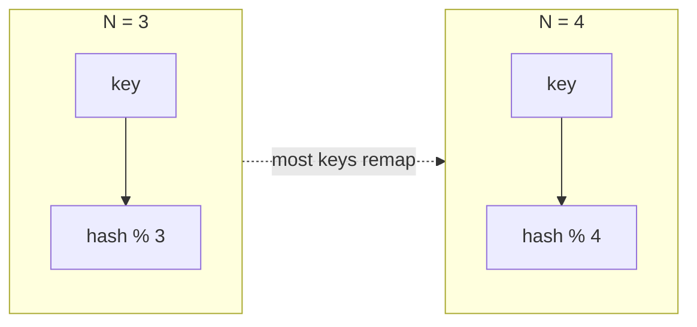
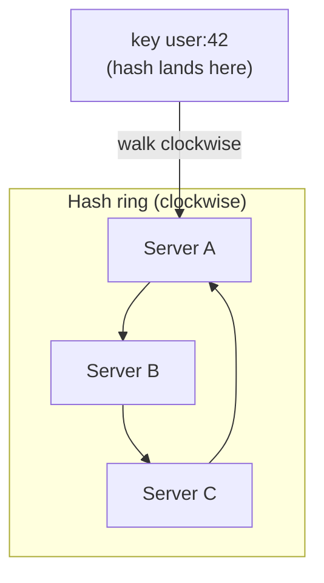
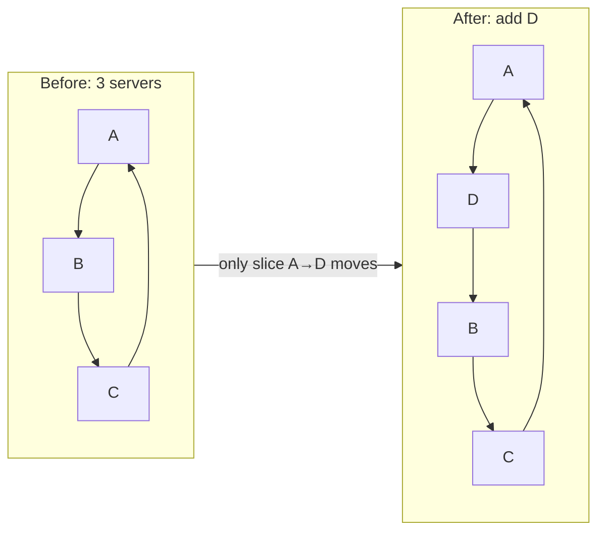
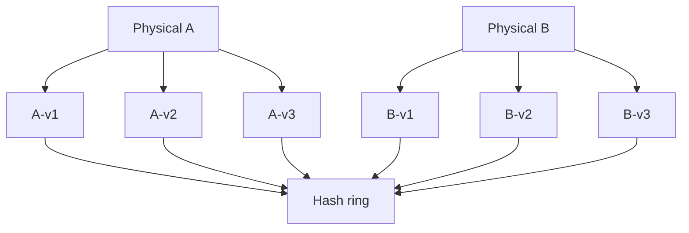
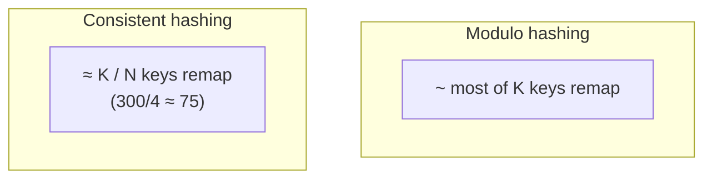

*System Design Interview* 第5章のメモ — **consistent hashing**：ノードの追加 / 削除時に、キーのごく一部だけが移動するようキーをサーバーにマッピングする。

## 素朴なアプローチ：`hash(key) % N`

```text
server = hash(key) % N
```

`N` が変わるまでは動く。

3台から4台に増やすと、**ほぼすべてのキー** が再マッピングされる。キャッシュヒット率が崩壊；DB はほぼ全パーティションを再配置。consistent hashing が解く痛みはこれ。



## 目標

ノードが変わったとき：

```text
keys remapped ≈ K / N
```

- `K` = キー数
- `N` = 変更後のノード数

移動するのはキーの **約 1/N** だけ — 大部分ではない。

## ハッシュリング

1. **サーバー** と **キー** の両方を固定リング（例 `0 … 2^32-1`）上にハッシュ
2. キーの配置：ハッシュし、時計回りに進み、最初に遭遇した **サーバー** に割り当て
3. サーバー追加：時計回りの隣のレンジからキーを受け取る — そのスライスだけ移動
4. サーバー削除：そのキーは次の時計回りサーバーへ



```text
Ring positions (simplified):

  0 ── A ──────── B ──────── C ── 2^32
           ↑
      hash(user:42)  →  next clockwise server = A
```

**Server D** が A と B の間に追加されると、`(A → D]` のキーだけが D へ移動する。それ以外はそのまま。



## 仮想ノード（本番対応にする部分）

1台の物理サーバー → リング上の複数位置（「仮想ノード」/ vnodes）。

理由：

- 物理ノードが少ないと、リング上の1位置ではキーレンジが **不均等**
- サーバーあたり多数の vnode → 負荷がより均等に
- 異種ハードウェア：大きいマシンにより多くの vnode



トレードオフ：リングメンバーシップについて保存 / 複製するメタデータが増える。

## リバランスの直感

定番の教え話から：

- 300キー、3ノード、4台目を追加
- consistent hashing **なし**：多くのキーが多数ノードに再シャッフル
- consistent hashing **あり**：おおよそ `300/4 ≈ 75` キーが新ノードへ移動



その `K/N` の境界がインタビューのオチ。

## 現れる場所

- 分散キャッシュ（Memcached クライアント、一部 Redis cluster モードの概念）
- Dynamo 系のパーティションストア
- ロードバランシングの sticky affinity（場合による）
- CDN / エッジ割り当ての変種

キーでパーティションし、**弾力的** なメンバーシップを期待するあらゆる場所。

## 触れておくべき課題

| 課題 | 緩和策 |
|-------|------------|
| Hot keys | 別扱い；ハッシュだけでは解決しない |
| Uneven load | 仮想ノード；レンジサイズを監視 |
| Ring membership changes | 全クライアントが同じリングを見るよう gossip / 調整 |
| Request during rebalance | しばしば dual-read / レンジを慎重にコピー |

## インタビューの要点

**`% N`（全部動く）** と **リング + 仮想ノード（~K/N だけ動く）** を対比。リングを描き、キーを時計回りに配置し、1ノード追加でスライスを奪う様子を示す。その図で通常は点が取れる。
