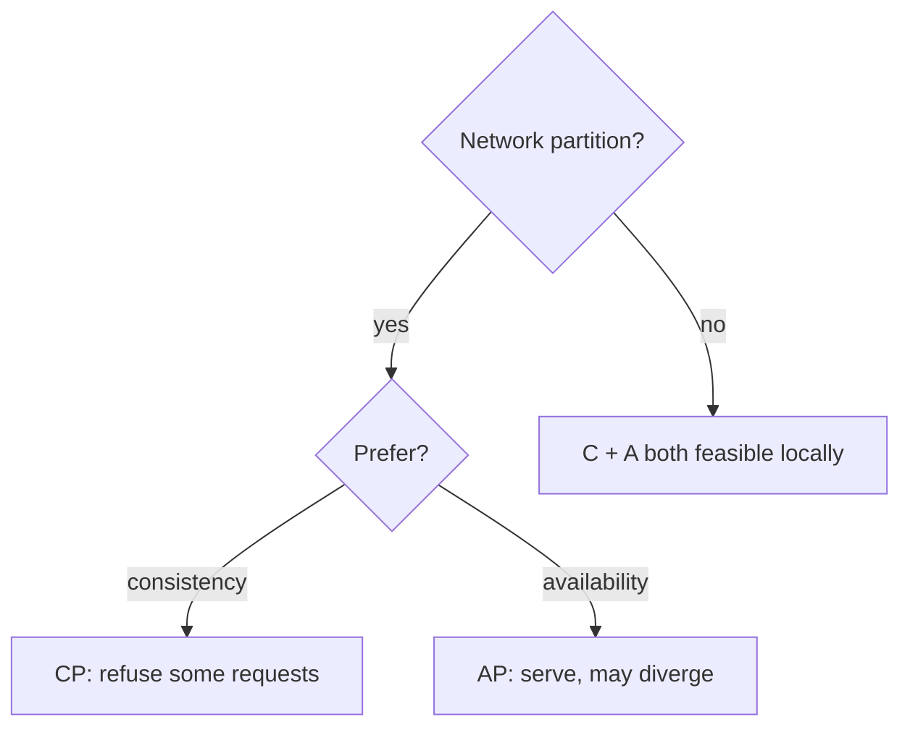
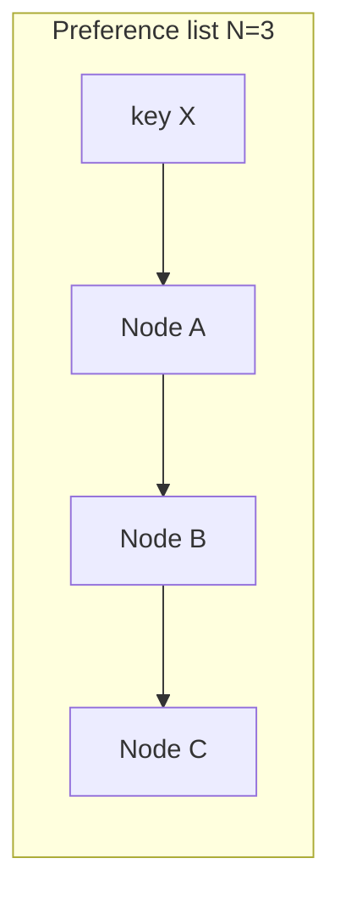
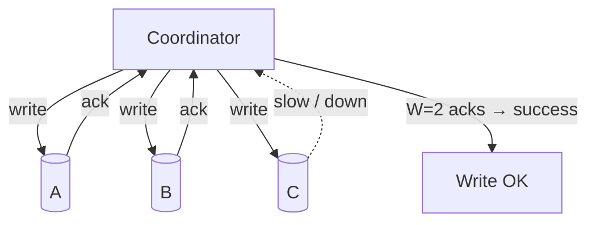
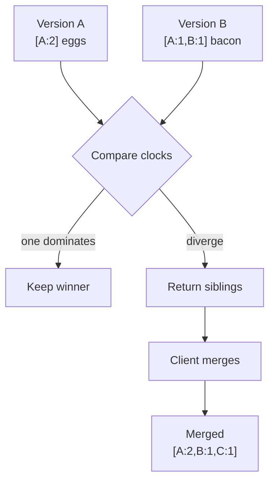
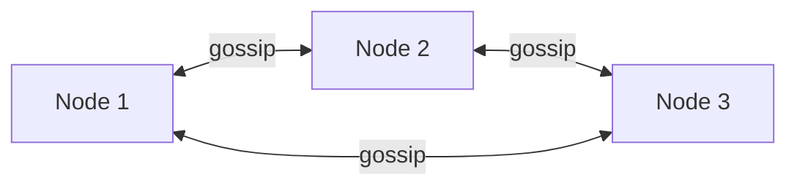
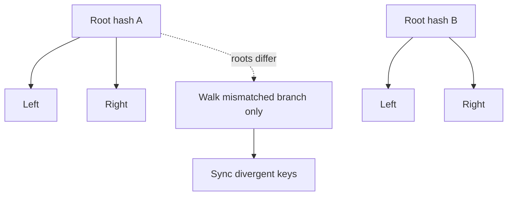
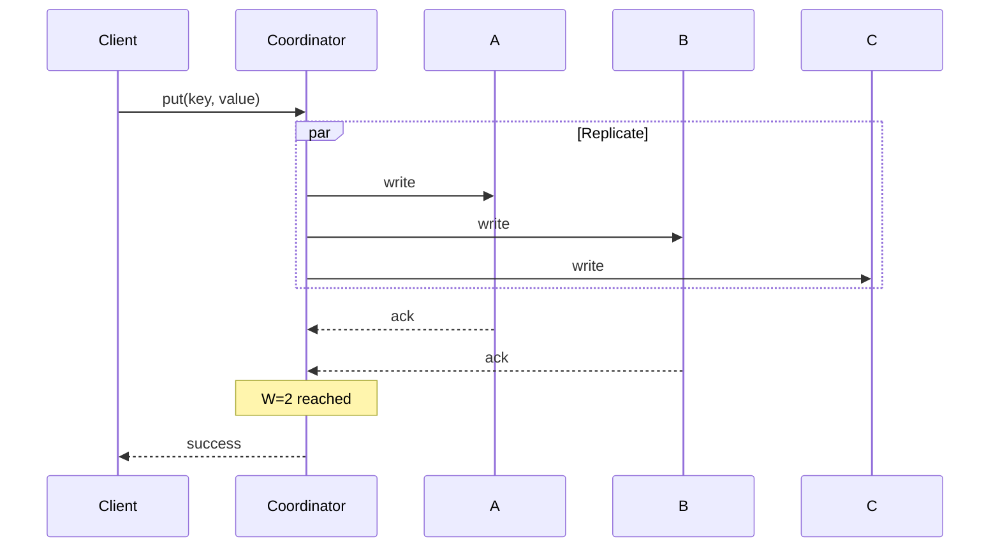
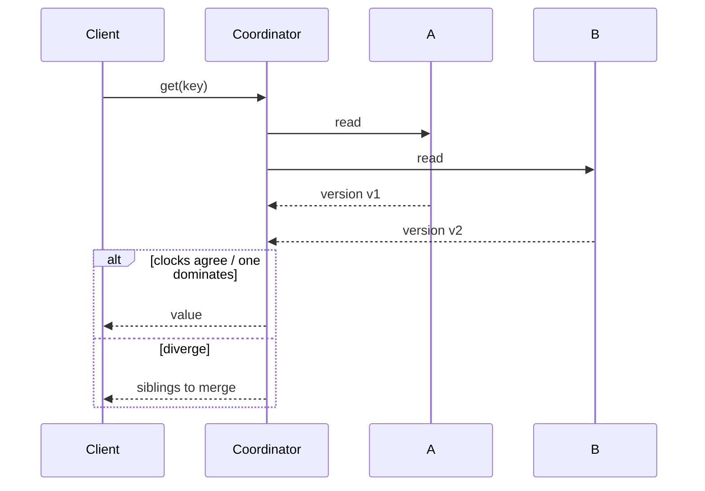

*System Design Interview* 第6章のメモ — 分散 **key-value store**（Dynamo 系）の設計：大規模・高可用で `put(key, value)` / `get(key)`。

衝突検出の深掘り：[ベクタークロックと不整合の解消](/ja/posts/vector-clocks-and-inconsistency-resolution)。関連するデータモデルの文脈：[NoSQL の4カテゴリ](/ja/posts/nosql-four-categories-key-value-document-column-graph)。

## 要件（典型的）

- キーによる put / get
- 数百万キー、高 QPS
- 高可用（古典的な Dynamo 語りでは AP 寄り）
- 調整可能な一貫性
- ノード障害とネットワークパーティションへの対応

## CAP 定理（インタビューでの枠組み）

**ネットワークパーティション** 下では選択が必要：

| 選択 | 意味 |
|--------|---------|
| **CP** | 最新の単一値を保つため一部リクエストを拒否 |
| **AP** | サービスを継続；replica は一時的に乖離しうる |

パーティション耐性なしの **CA** は分散ストアでは現実的でない — パーティションは起きる。それを前提に設計する。



本章は **AP + eventual consistency** 寄りで、（quorum などの）ノブでレイテンシと鮮度をトレードオフする。

## 構成要素

### 1. データレイアウト

キーはリング上にハッシュ（[consistent hashing](/ja/posts/system-design-interview-chapter-5-design-consistent-hashing)）、しばしば **仮想ノード** 付き。各キーは N 個の replica（時計回りの次の N 個の異なるノード）の **preference list** 上に存在。



### 2. レプリケーション

耐久性 / 可用性のため複数 replica へ書き込み。レプリケーション係数 `N` は設定（例ではよく 3）。

### 3. Quorum

```text
N = replica count
W = write quorum (acks needed for a successful write)
R = read quorum (responses needed for a successful read)
```

経験則：

```text
W + R > N  →  read and write quorums overlap → strong-ish consistency for that key
W + R ≤ N  →  possible stale reads; higher availability / lower latency
```

古典例：`N=3, W=2, R=2`。



### 4. 一貫性モデル

| モデル | 意味 |
|-------|---------|
| Strong | 成功した書き込みの後、すべての後続読み取りがそれを見る |
| Weak | 読み手が更新をいつ見るかの厳密な保証なし |
| Eventual | 書き込みが止まれば replica は同じ値に収束 |

AP ストアは通常 **eventual** 一貫性を目指し、クライアントに衝突解消を任せる。

## 衝突の扱い：バージョニング

異なる replica への並行書き込みで **siblings** が生じる。壁時計の「last write wins」はクロックスキューで **データを静かに失う**。

**Vector clocks** はノードごとの因果履歴を追う（`[A:2, B:1]`）。読み取り時：

- 一方の版のクロックが支配 → その版を安全に保持
- クロックが分岐 → **両方** の版をクライアントに返してマージ（例：ショッピングカートの和集合）

カートの完全なウォークスルーは [ベクタークロックのメモ](/ja/posts/vector-clocks-and-inconsistency-resolution) を参照。



## メンバーシップと障害検知

- ノードは **gossip** で互いを知る
- 障害検知は heartbeat / suspicion（常に完璧ではない — 一時的な遅延と死亡を区別）
- preference list と hinted handoff で、対象 replica が落ちていても書き込みを継続



## Anti-entropy：Merkle tree

Gossip は「誰が生きているか」を捉える。**Merkle tree** は「誰のデータがずれたか」を捉える。

- 各 replica がキーレンジ上のハッシュ木を構築
- ルートを比較 → 不一致の枝だけたどる
- 全体スキャンではなく、乖離したレンジだけ同期



パーティション後や長期隔離後のバックグラウンド修復に使われる。

## 読み書きパス（スケッチ）

**Write** (`N=3`, `W=2`)



**Read** (`R=2`)



## 名前を出す価値のあるその他の要素

- **Sloppy quorum + hinted handoff** — 一時的に健全なノードへ書き込み；意図した replica が戻ったら hint を渡す
- **Tunable consistency** — クライアントや API が呼び出しごとに `R` / `W` を選択
- **Local persistence** — 各ノードで commit log + memtable / SSTable 型ストレージ（実装詳細；簡潔に触れる）

## インタビューの要点

Dynamo 型 KV store は1つのトリックではなく **技法のスタック**：

```text
consistent hashing
  + N-way replication
  + quorum (R, W)
  + vector clocks for concurrency
  + gossip for membership
  + Merkle trees for repair
```

CAP と API から入り、quorum + 衝突解消を深掘りする — インタビュー議論の大半はそこに着地する。
