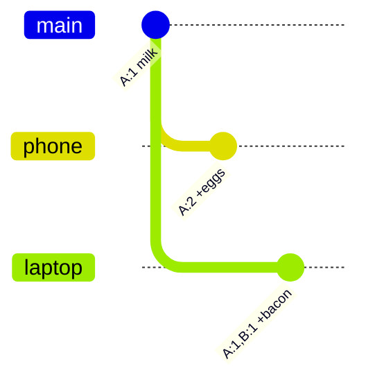

分散システムでは、別マシン上で2つの書き込みが「同時」に起きうる — それを普通のタイムスタンプで決着させると、片方を静かに捨てることになる。**ベクタークロック**は **happened-before** と **本当に並行** を見分け、推測ではなくアプリに本物の衝突を返すために存在する。

## 問題：壁時計は嘘をつく

並行書き込みへの素朴なやり方：

1. 各レプリカが `now()` でスタンプ
2. 衝突時はより新しいタイムスタンプの版を残す
3. もう片方を捨てる（last write wins）

本番で壊れる理由は地味だ：**サーバ時計はドリフトする**。

- NTP同期は不完全で、マシン間でミリ秒〜秒ずれる
- *論理的に*先の書き込みが *より遅い* タイムスタンプを持つことがある
- システムは誤った版を残し、**データを静かに失う**

静かな損失の例：

- レプリカA（時計が少し進んでいる）がカート `{ eggs }` を `T=100` で保存
- レプリカB（時計が少し遅れている）が `{ bacon }` を `T=99` で保存
- マージ規則：Aを残す → baconが消える
- エラーは出ない。アイテムが消えただけ。

壁時計だけではマシン横断のイベント順序を安全に決められない。必要なのは **因果関係** — どの書き込みが、どの他の書き込みを知っていたか — を追う手段だ。

## 解法：ベクタークロック（「データ版Git」）

**ベクタークロック**は「壁に何時か？」を聞かない。聞くのは：**「各ノードは履歴のどの版を見たか？」**

メンタルモデル：**データ版のGit**。

- 各レプリカ = ブランチの貢献者
- 各書き込みでそのノードのカウンタを増やす
- クロック比較 = コミット履歴の比較：
  - 一方の履歴が他方を含む → fast-forward
  - 履歴が分岐 → マージコンフリクト

### 形式

ベクタークロックは `ノード名 → バージョン番号` のマップ：

```text
[A: 1, B: 2, C: 1]
```

基本ルール：

- ノード `X` が書き込みを処理したら `X` のカウンタを増やす
- レプリカ同期時は **要素ごとの max** を取る
- バージョン `0` のノードは読みやすさのため省略してよい（意味は同じ）

追うのは因果履歴であり、UTCではない。

## 実シナリオ：ショッピングカート

Dynamo流の定番例。ユーザーにカートがある。回線が不安定。同期前に別レプリカへ書き込みが着く。

レプリカ：**A**、**B**、**C**。

### ステップ1 — カート作成（A上）

ユーザーがカートを作る。レプリカ **A** が処理。

```text
Cart:  { milk }
Clock: [A: 1]
```

書いたのはAだけ。このキーについて他はゼロ。

### ステップ2 — スマホから eggs を追加（A上）

まだAに話している。eggsを追加。

```text
Cart:  { milk, eggs }
Clock: [A: 2]
```

`[A: 2]` は `[A: 1]` の **子孫**。安全な上書き — Aは前の版を既に知っている。

### ステップ3 — 並行更新：ノートPCから bacon（B上）

ノートPCは、BがAの最新カートを見る前にレプリカ **B** に当たる。面接用のストーリーでは、Bの書き込みをAのeggs更新と並行とみなす。

Bは「今の状態」だと思うものに bacon を足す：

```text
# Bが書くもの（[A: 2] と並行）
Cart:  { milk, bacon }
Clock: [A: 1, B: 1]
```

なぜ `[A: 1, B: 1]` か？

- BはAの最初の書き込み後のカートを知っていた（`A: 1`）
- eggsの書き込み（`A: 2`）は **見ていない**
- B自身のカウンタを増やす → `B: 1`

システム内に2版が並立する：

| 版 | Cart | Vector clock |
|----|------|----------------|
| V2（Aから） | `{ milk, eggs }` | `[A: 2]` |
| V3（Bから） | `{ milk, bacon }` | `[A: 1, B: 1]` |

どちらも他方の子孫ではない。履歴が **分岐** — 同じコミットから伸びた2本のGitブランチと同じ。



### ステップ4 — 同期 / レプリカ横断の読み取り

クライアントが読む（またはgossipする）とき、システムはタイムスタンプではなくクロックを比較する。

## 衝突の解消

2つの版が出会ったら、ベクタークロックを成分ごとに比較する。

### 結果1 — 直接の子孫（安全な上書き）

クロック `X` が `Y` を **支配（dominate）** するとは、すべてのノードで `X` のカウンタ ≥ `Y`、かつ少なくとも1つで厳密に大きいこと。

例：

```text
旧: [A: 1]
新: [A: 2]
```

`[A: 2]` が `[A: 1]` を支配 → 新は **直接の子孫**。新を残し、旧を捨てる。衝突なし。

別例：

```text
旧: [A: 2, B: 1]
新: [A: 2, B: 2]
```

同じ話 — 新は旧が見たすべてに加え、B上のもう1回の書き込みを見ている。

### 結果2 — 分岐（siblingsを返す）

どちらも相手を支配しない：

```text
[A: 2]          vs  [A: 1, B: 1]
```

- Aは自分について進んでいる（`2 > 1`）
- Bは自分について進んでいる（`1 > 0`）

履歴は **分岐した**。DBはマージを **発明してはいけない**：

- 壁時計の last-write-wins をしない
- eggsかbaconかを静かに選ばない
- **両方の版**（siblings）をクライアントに返す

アプリがドメイン規則でマージする。カートなら和集合がだいたい正しい：

```text
# クライアント / アプリ側マージ
Version A: { milk, eggs }     clock [A: 2]
Version B: { milk, bacon }    clock [A: 1, B: 1]

Merged:    { milk, eggs, bacon }
```

マージ結果をコーディネータ（例：C）経由で書き戻す。クロックは要素ごとのmaxを取り、C自身を増やす：

```text
Cart:  { milk, eggs, bacon }
Clock: [A: 2, B: 1, C: 1]
```

この新クロックは両方の親を支配する。次の並行フォークまで、読み取りはこの解決済みtipとして扱える。

### 比較チートシート

```text
すべてのノードについて X と Y を要素ごとに比較：

1. 全ノードで X ≥ Y、かつ少なくとも1つで X > Y
   → X は Y の子孫 → X を残す

2. 全ノードで Y ≥ X、かつ少なくとも1つで Y > X
   → Y は X の子孫 → Y を残す

3. それ以外
   → 並行 / 分岐 → 両方をアプリに返す
```

## 本番でなぜ重要か

ベクタークロック（および dotted version vectors などの近縁）は、**結果整合性**と並行更新を受け入れる場所に出てくる：

- Dynamo / Riak 系キーバリュー
- ショッピングカート、カウンタ、プレゼンス、マルチデバイス編集
- DBが衝突を検知し、アプリ（またはマージ関数）が解消するCRDT寄りの設計

実務の要点：

- **タイムスタンプは1マシン上の順序付け；マシン横断の因果は証明しない**
- **ベクタークロックは並行を検知する；ビジネスデータのマージはしない**
- **衝突解消はアプリの関心事** — カートは和集合、ドキュメントは「両方残してユーザーに聞く」、お金は独自ルール（多くは：お金にこのモデルを避ける）

## まとめ

| アプローチ | 追うもの | 並行書き込み時のリスク |
|------------|----------|------------------------|
| 壁時計 LWW | `now()` | クロックスキューで静かなデータ損失 |
| ベクタークロック | ノードごとの因果履歴 | 分岐を検知；クライアントがsiblingsをマージ |

面接用の一文：**ベクタークロックは時刻ではなく版履歴** — 履歴が分岐したら、DBは推測せず両方の版を返す。
