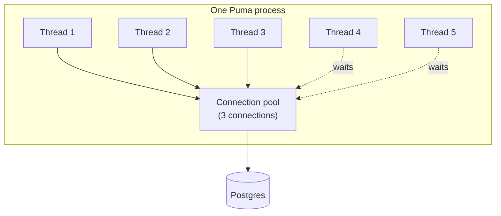

Rails（Puma + ActiveRecord）で **threads**・**workers**・**processes**・**DB connection pool** がどう関係するかの、やさしいメンタルモデル。

## 部品

**レストラン**を想像する。

| 言葉 | やさしい意味 | レストラン |
|------|----------------|------------|
| **Process** | 厨房の建物ひとつ | レストラン本体 |
| **Worker** | その建物の中の厨房ひとつ（Pumaはよく複数起動する） | 厨房ステーション |
| **Thread** | 注文を取れる料理人ひとり | 料理人 |
| **DB connection** | 倉庫（Postgres）への電話回線1本 | 仕入れ先への電話 |
| **Connection pool** | その厨房が使ってよい電話の箱 | 本数が限られた電話 |

ActiveRecordは、2人の料理人が同時に1本の電話を共有しない。  
**DBに話す料理人には、それぞれ自分の電話が必要。**

## 図

```text
One Puma process (one kitchen)
├── Worker / thread pool: cook 1, cook 2, cook 3, cook 4, cook 5
└── DB connection pool:   phone, phone, phone   ← only 3 phones!

If 5 cooks all need the warehouse at once → 2 cooks wait (or explode with timeout)
```



## 小さなストーリー

1. ユーザーがRailsアプリにアクセス → **thread**（料理人）がリクエストを処理する。
2. コードが `User.find(1)` → その料理人は **pool** から **connection**（電話）を取る必要がある。
3. クエリ実行 → 料理人は電話を箱に **戻す**。
4. 次のリクエストがその電話を再利用できる。

DBを同時に叩くかもしれない **5 threads** があるなら、そのprocessのpoolにはだいたい **5 connections** が必要（少し余裕があるとよい）。

## なぜ「workers/processesだけ」では足りない？

こう思いがち：

> 「processが2つだから、pool = 2で足りる。」

違う。

各 **process** は **自分専用** のpoolを持つ。

```text
2 processes × 5 threads each × need DB
= you may need ~5 connections PER process
= ~10 connections on Postgres total
```

よく使う式：

```text
DB max connections ≳  (processes × threads_per_process)  +  extras
                      (Sidekiq, console, migrations, …)
```

`database.yml` では：

```yaml
pool: <%= ENV.fetch("RAILS_MAX_THREADS") { 5 } %>
```

この `pool` は **processごと**：「この厨房が持てる電話の本数」。

そのprocess内でActiveRecordを同時に使うかもしれない **threads数以上** であるべき。

## 覚える一文

**Process = 厨房。Threads = 料理人。Pool = 電話。DBに話す料理人には電話が要る。並行する料理人分でpoolを決め、厨房（process）の数を掛ける。**

---

> 🌐 *Claudeによる翻訳*
